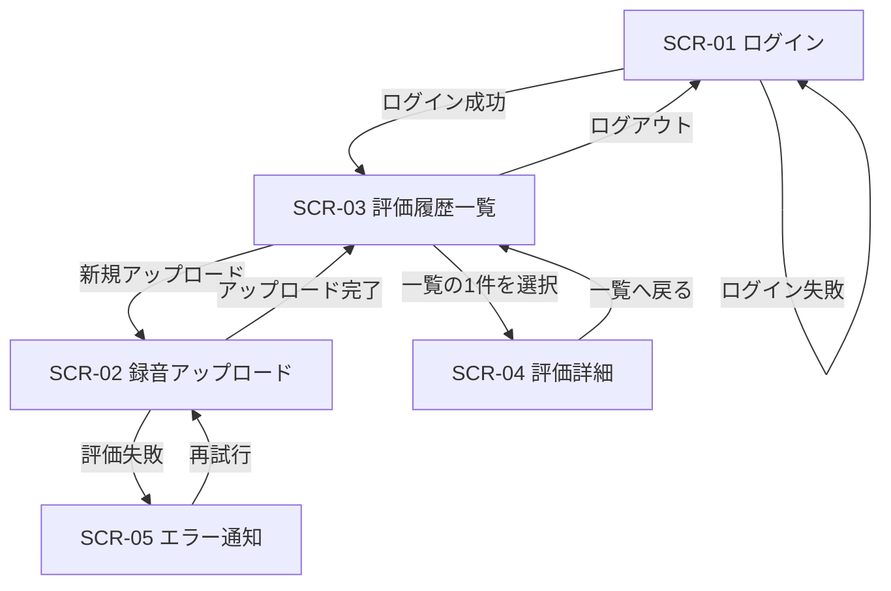

# 録音した歌へのフィードバック機能 基本設計書

## 1. システム構成
- `frontend/`: Next.js アプリ（UI、認証状態管理、評価結果表示）
- `backend/`: FastAPI アプリ（API、音声解析ジョブ、認証、DBアクセス）
- `db`: MySQL（ユーザー、録音、評価結果を保存）
- `docker/`: ローカル開発用のコンテナ設定

## 2. 全体アーキテクチャ
1. フロントエンドから音声ファイルをアップロード
2. バックエンドでファイル保存と解析ジョブ実行
3. 解析結果をDBへ保存
4. フロントエンドで評価履歴と詳細を取得して表示

## 3. 画面設計（MVP）
### 3.0 画面一覧
- `SCR-01`: ログイン画面（`/login`）
- `SCR-02`: 録音アップロード画面（`/recordings/new`）
- `SCR-03`: 評価履歴一覧画面（`/recordings`）
- `SCR-04`: 評価詳細画面（`/recordings/{id}`）

### 3.1 ログイン画面
- メールアドレス
- パスワード
- ログインボタン

### 3.2 録音アップロード画面
- 録音タイトル入力
- メモ入力（任意）
- 音声ファイル選択
- アップロード実行
- 評価失敗時の再試行ボタン

### 3.3 評価履歴一覧画面
- タイトル
- 総合スコア
- 評価日時
- 詳細画面への遷移

### 3.4 評価詳細画面
- 音程/リズム/表現/総合スコア
- ボーカルトレーナー風のコメント
- 録音メタ情報（タイトル、作成日時、メモ）

### 3.5 エラー通知画面（SCR-05）
- エラー種別（認証エラー / 解析エラー / 通信エラー）
- ユーザー向けメッセージ（次に取るべき行動を明示）
- 再試行ボタン（表示条件を満たす場合のみ活性）
- 一覧へ戻るボタン
- サポート連絡導線（問い合わせ先またはヘルプページ）
- エラー発生時刻、対象録音タイトル（特定可能な範囲）

#### SCR-05 メッセージ定義
- 認証エラー（401）: 「セッションの有効期限が切れました。再度ログインしてください。」
- 認可エラー（403）: 「このデータにアクセスする権限がありません。」
- 対象なし（404）: 「対象の録音データが見つかりませんでした。」
- 解析失敗（500）: 「解析処理に失敗しました。時間をおいて再試行してください。」
- 通信失敗（ネットワーク断）: 「通信に失敗しました。接続状態を確認して再試行してください。」

### 3.6 画面遷移図


### 3.7 例外時の画面遷移方針
- 未認証状態で保護画面へアクセスした場合は `SCR-01` にリダイレクト
- APIが401を返した場合はセッション切れとして `SCR-01` に遷移
- APIが500を返した場合はエラートーストを表示し、操作画面に留まる

### 3.8 再試行制御方針
- 再試行対象は `解析失敗（500）` と `通信失敗` のみ
- `401/403/404` は再試行不可とし、ログイン画面または一覧画面への遷移を促す
- 同一録音の再試行は最大3回まで（過負荷防止）
- 再試行間隔は指数バックオフ（例: 5秒 / 15秒 / 30秒）
- 再試行中はボタンをローディング状態にし、二重送信を防止
- 3回失敗時は「時間をおいて再試行」メッセージと問い合わせ導線を表示

## 4. API設計（MVP）
### 4.0 APIエンドポイント一覧
- `POST /api/v1/auth/register`（認証不要）: ユーザー登録
- `POST /api/v1/auth/login`（認証不要）: ログイン
- `POST /api/v1/recordings`（認証必須）: 録音アップロード/評価開始
- `GET /api/v1/recordings`（認証必須）: 自分の録音一覧取得
- `GET /api/v1/recordings/{recording_id}`（認証必須）: 録音詳細と評価結果取得

### 4.1 認証
- `POST /api/v1/auth/register`
  - request: email, password
  - response: user_id
- `POST /api/v1/auth/login`
  - request: email, password
  - response: access_token

### 4.2 録音・評価
- `POST /api/v1/recordings`
  - multipart/form-data: title, note, audio_file
  - response: recording_id, status
- `GET /api/v1/recordings`
  - response: 自分の録音一覧
- `GET /api/v1/recordings/{recording_id}`
  - response: 録音詳細 + 評価結果

### 4.3 エラーレスポンス設計
- 共通レスポンス形式: `code`, `message`, `details`, `request_id`
- 400: 入力不正（ファイル形式/サイズ超過）
- 401: 認証エラー（トークン無効・期限切れ）
- 403: 認可エラー（他ユーザーデータアクセス）
- 404: リソース未存在
- 500: 解析処理失敗または予期せぬ内部エラー

#### 4.3.1 エラーレスポンス例
```json
{
  "code": "EVALUATION_FAILED",
  "message": "解析処理に失敗しました。時間をおいて再試行してください。",
  "details": {
    "recording_id": 123
  },
  "request_id": "9f3a1d0a-xxxx-xxxx-xxxx-4e7f1ab2cdef"
}
```

## 5. DBスキーマ設計
### 5.1 users
- id (PK)
- email (UNIQUE)
- password_hash
- created_at
- updated_at

### 5.2 recordings
- id (PK)
- user_id (FK -> users.id)
- title
- note (NULL可)
- audio_path
- status (`uploaded` / `analyzing` / `completed` / `failed`)
- created_at
- updated_at

### 5.3 evaluations
- id (PK)
- recording_id (FK -> recordings.id, UNIQUE)
- pitch_score (0-100)
- rhythm_score (0-100)
- expression_score (0-100)
- total_score (0-100)
- feedback_text
- created_at

### 5.4 テーブル関連
- `users` 1 : N `recordings`
- `recordings` 1 : 0..1 `evaluations`

### 5.5 インデックス/制約
- `users.email` に UNIQUE 制約
- `recordings.user_id` にインデックス（ユーザー別履歴取得を高速化）
- `evaluations.recording_id` に UNIQUE 制約（録音1件につき評価1件）

## 6. バックエンド実装方針
- FastAPIでREST APIを実装
- SQLAlchemy ORMでDB操作
- Alembicで初期マイグレーション作成
- 音声解析処理はサービス層（`services/evaluation_service.py` など）に分離
- 例外は共通ハンドラでHTTPエラーへ変換

## 7. フロントエンド実装方針
- Next.js App Router構成を採用
- APIクライアントを `lib/api` に集約
- Tailwindでフォーム、一覧、詳細UIを構築
- 認証トークンはHTTP Only Cookieまたは安全な保存方式を採用

## 8. ディレクトリ案
### 8.1 frontend
- `app/(auth)/login/page.tsx`
- `app/recordings/page.tsx`
- `app/recordings/[id]/page.tsx`
- `components/recording/UploadForm.tsx`
- `lib/api/client.ts`

### 8.2 backend
- `app/main.py`
- `app/api/v1/endpoints/auth.py`
- `app/api/v1/endpoints/recordings.py`
- `app/models/user.py`
- `app/models/recording.py`
- `app/models/evaluation.py`
- `app/services/evaluation_service.py`
- `alembic/versions/xxxx_init_tables.py`

## 9. エラーハンドリング方針
- ファイル形式不正: 400
- 認証失敗: 401
- 権限なし: 403
- 対象データなし: 404
- 解析失敗: 500（status を `failed` に更新）

## 10. 今後の拡張
- 波形表示やピッチカーブ可視化
- AIコメントの個別最適化
- 課題曲テンプレートと目標管理
