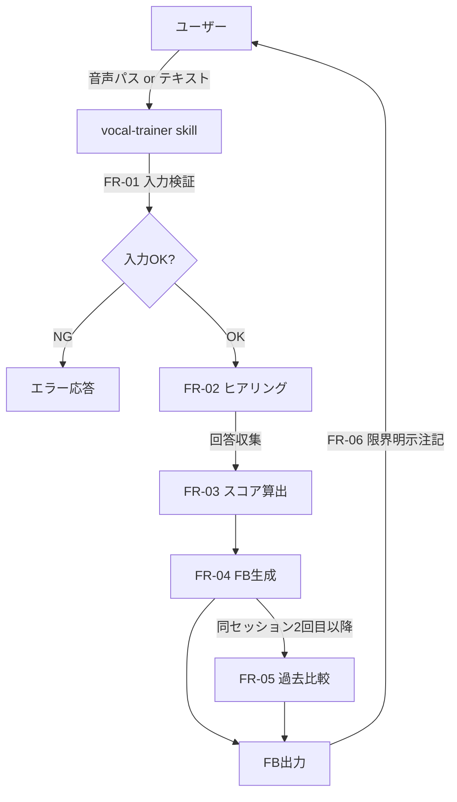
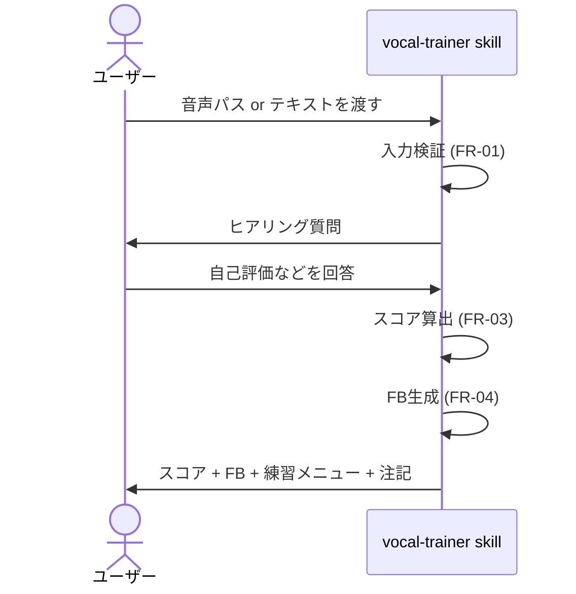
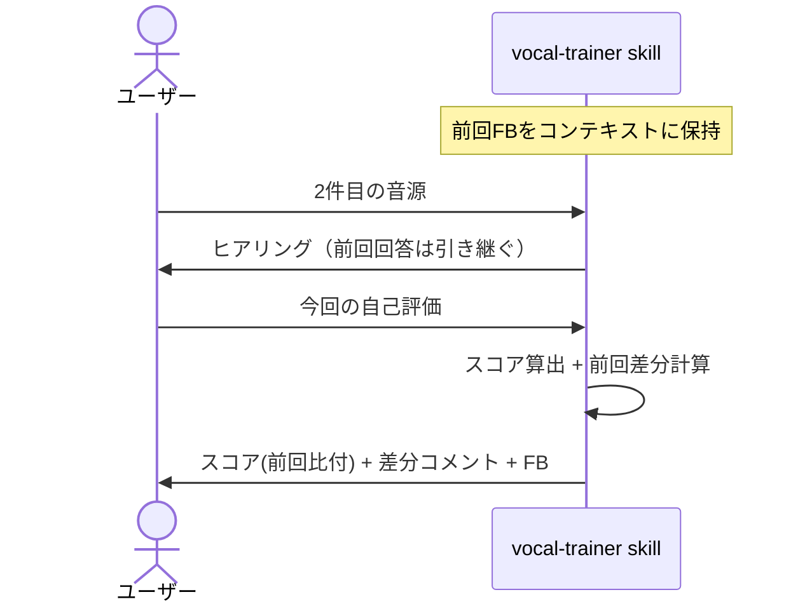

# Claude Code版 ボーカルFB機能 設計書

> アーキテクト作成。`docs/03_機能要件書_ClaudeCode版FB.md` の実装設計。
> Web版設計書 (`docs/02_基本設計.md`) と整合させる。

## 1. システム構成

### 1.1 コンポーネント
| コンポーネント | 役割 | 実体 |
| --- | --- | --- |
| `vocal-trainer` skill | ボーカルFB機能本体 | `.claude/skills/vocal-trainer/SKILL.md` |
| 評価ロジック仕様 | 4軸スコア基準・FB構造 | 本設計書 + 機能要件書 |
| (将来) 波形解析API | Web版バックエンドの `/api/v1/recordings` | `backend/app/services/evaluation_service.py` |

### 1.2 データフロー


## 2. アーキテクチャ判断

### 2.1 主要な技術選定
| 項目 | 選択 | 代替案 | 理由 |
| --- | --- | --- | --- |
| 配布形態 | Claude Code skill | カスタムCLI / Webサービス | ユーザー導線が最短（Claude Code 内で完結） |
| 音声解析 | 行わない（自己申告ベース） | サードパーティライブラリ呼び出し | 追加セットアップを要求すると NFR-02 を満たせない |
| FB品質仕様 | skill本体の SKILL.md に集約 | 外部ファイル参照 | 単一ファイルで完結し、改修が容易 |
| 履歴永続化 | しない（同セッション限り） | ローカルJSON / Web版API | MVPスコープ外。NFR-03（プライバシー）にも適合 |

### 2.2 トレードオフ
- **音声解析しない方針**: 精度は自己申告に左右されるが、導入摩擦ゼロで MVP価値を最速で届けられる。将来は Web版API連携で精度向上の余地を残す（5.2参照）
- **履歴を持たない方針**: 比較機能（FR-05）は同セッション内のみ。長期成長追跡をしたいユーザーは Web版に誘導する

## 3. skill 設計

### 3.1 skill 定義の構造
`.claude/skills/vocal-trainer/SKILL.md` は以下のセクションを持つ：

| セクション | 内容 | 役割 |
| --- | --- | --- |
| frontmatter `description` | スキル起動条件 | Claude が自動起動判定に使う |
| 役割 | 一行で「何者か」 | コンテキスト |
| いつ呼ぶか | トリガー条件 | 起動判定の補助 |
| 入力の受け取り方 | FR-01 / FR-02 の動作 | 実装規範 |
| 評価軸 | FR-03 のスコア定義 | 一貫性担保 |
| 出力フォーマット | FR-04 のテンプレ | 出力の均質化 |
| 原則 | 振る舞いの強制 | 品質ゲート |
| 連携 | 他役職との関係 | ワークフロー定義 |
| 口調 | スタイル指示 | UX一貫性 |

### 3.2 入力検証ロジック
```
入力受領
  ├─ 文字列がローカルパス様式（先頭 / または ~）か？
  │   ├─ Yes → ファイル存在確認 → 拡張子チェック
  │   │         ├─ 拡張子 wav/mp3/m4a → 続行
  │   │         └─ 対象外 → 警告＋ユーザー確認
  │   └─ No  → テキスト入力として扱う
  └─ ヒアリングフェーズへ
```

### 3.3 ヒアリングフェーズの状態
| 必須/任意 | 項目 | 取得方法 |
| --- | --- | --- |
| 必須 | 自己評価（うまく行った点・難しかった点） | ユーザー応答 |
| 任意 | 曲名 | ユーザー応答 |
| 任意 | キー・テンポ | ユーザー応答 |
| 任意 | 苦手フレーズ・音域 | ユーザー応答 |

「必須」が埋まる前に FR-03（スコア算出）に進まない。

### 3.4 スコア算出ルール
- 各軸の出力は 0-100 の整数
- 根拠は以下の優先順位で決まる（**自己申告は4材料のうち1つに過ぎない** ことに注意）
  1. **曲特性・難易度の客観事実**（重み 40%）: 曲名・キー・テンポ・尺・原曲難度
  2. **申告の一貫性チェック由来の情報**（重み 25%）: 例: 「ハーモニーをつけられる」→ 相対音感とリズム精度の下限を推定
  3. **一般的な独学者の典型パターン**（重み 20%）
  4. **ユーザーの自己申告（断定部分のみ）**（重み 15%）: 質問形・疑問形はトレーナー側で判断
- 自己申告と独自判断が乖離する場合は **独自判断側を優先** し、FB本文で両論を提示すること（「ご自身ではX、ただしYの可能性が高い」）
- `total_score` = `pitch * 0.35 + rhythm * 0.30 + expression * 0.35`（小数点以下四捨五入）

### 3.5 FB生成テンプレ（FR-04対応）
出力 Markdown:
```markdown
# ボーカルFB: <曲名 or "今回の録音">

## スコア
- 音程: NN / 100
- リズム: NN / 100
- 表現: NN / 100
- 総合: NN / 100

## 良かった点
- (具体)
- (具体)

## 改善ポイント
1. (具体・優先1)
2. (具体・優先2)

## 次の練習メニュー
- 今日のうちに: ...
- 今週中に: ...

## 一言
...

---
※ 本FBは音声を直接解析せず、お申告いただいた内容を元にしています。
```

### 3.6 過去比較（FR-05）
- セッション内で渡された音源と FB をスキル自身のコンテキストに保持
- 2回目以降の入力時、`スコア` セクションに `(前回比: +5)` のような差分を併記
- 比較は同セッション内のみ。セッション終了とともに破棄

## 4. 既存システムとの整合

### 4.1 Web版との品質統一
| 項目 | Web版 | Claude Code版 | 統一方法 |
| --- | --- | --- | --- |
| 評価軸 | pitch / rhythm / expression / total | 同じ | 機能要件書 FR-03 で固定 |
| FBトーン | 温かく・具体的 | 同じ | skill `口調` セクションで規定 |
| スコア範囲 | 0-100 | 0-100 | 同じ |
| 失敗時の挙動 | `failed` ステータス + エラー文 | エラーメッセージ + 再入力依頼 | 共通の文言指針（次節） |

### 4.2 共通文言指針（再掲）
- 音声形式不正: 「対応形式は wav / mp3 / m4a です」
- ファイル未存在: 「指定パスにファイルが見つかりませんでした」
- ヒアリング途中で十分情報が集まらない: 「もう少し情報をいただけるとより的確なFBができます」

### 4.3 役職スキル間の連携
| 起点 | 連携先 | 内容 |
| --- | --- | --- |
| `vocal-trainer` | `pdm` | FB品質改善要望をPdMへ起票 |
| `vocal-trainer` | `backend-engineer` | Web版 `evaluation_service.py` で同等FBを再現する仕様の渡し |
| `qa-engineer` | `vocal-trainer` | 受け入れ基準（AC-01〜07）でテスト |

## 5. 拡張ポイント

### 5.1 履歴永続化（v1.1候補）
- 保存先案: `~/.vocal-coach/history.jsonl`
- 1行1FB（タイムスタンプ・ファイルパス・スコア・FB本文）
- セッション開始時に直近N件を読み込み、長期比較に使う
- 実装判断は CEO スキルで承認後

### 5.2 Web版API連携（v1.2候補）
- skill 内から Web版 `/api/v1/recordings` を呼び出して波形解析スコアを取得
- 自己申告ベースのスコアと波形解析スコアを併記
- 前提: Web版がローカルで起動していること（`docker compose up`）
- 認証トークンの skill 側保管設計が必要（要 アーキテクト再設計）

### 5.3 楽譜入力（将来）
- MIDI / MusicXML を受け付け、音程比較の基準として利用
- ペルソナの所持率が上がってから検討

## 6. シーケンス図

### 6.1 通常フロー


### 6.2 過去比較フロー（2回目以降）


## 7. エラーハンドリング方針

| 状況 | 動作 | メッセージ例 |
| --- | --- | --- |
| ファイル未存在 | 即座に応答中断、再入力を促す | 「指定パスにファイルが見つかりませんでした: <path>」 |
| 拡張子対象外 | 警告＋続行可否を確認 | 「<ext> は対象外形式です。続行しますか？」 |
| ヒアリング情報不足 | 追加質問または推定値で進めるか確認 | 「もう少し情報をいただけるとより的確なFBができます」 |
| ユーザーが途中離脱 | 状態を保持しないでクリーンに終了 | （明示メッセージ不要） |

## 8. 性能・可用性考慮
- 応答時間は Claude API のレイテンシ依存（NFR-01 で30秒目標）
- ヒアリング段階を分割することで、ユーザーには3秒以内に初回応答が返る
- ローカル動作のため可用性は Claude Code 自体の可用性に従う

## 9. セキュリティ考慮
- 音声ファイルはユーザーローカルから移動しない（読み取りのみ、必要があればメタ情報取得）
- FB内容はセッション外に出ない
- 拡張（5.2）でWeb版API呼び出しを実装する場合は、認証トークンの取り扱いを別途設計

## 10. テスト方針
- QAスキルにて `docs/NN_テスト計画_ClaudeCode版FB.md` を別途作成
- 主要TC: AC-01〜07 をベースに、正常系1 / 異常系3 / 境界系2 を最低構成とする
- 手動テスト中心（音声ファイル提示が必要なため自動化は後回し）

## 11. 移行 / 後方互換性
- 既存Web版に変更なし
- 本機能は新規追加のみ。後方互換性影響なし
- skill 改修時は `.claude/skills/vocal-trainer/SKILL.md` の `description` 変更に注意（自動起動条件に影響）
