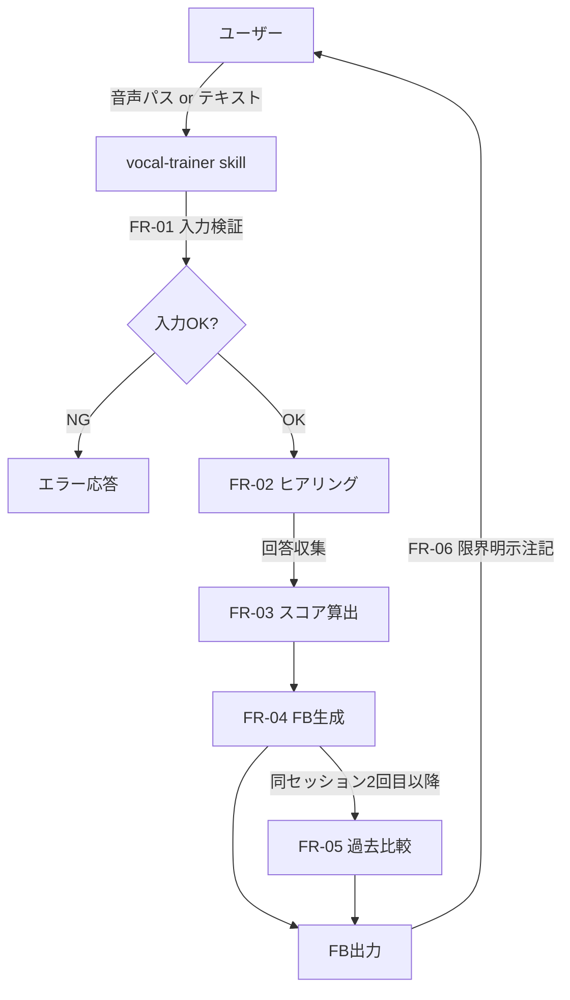
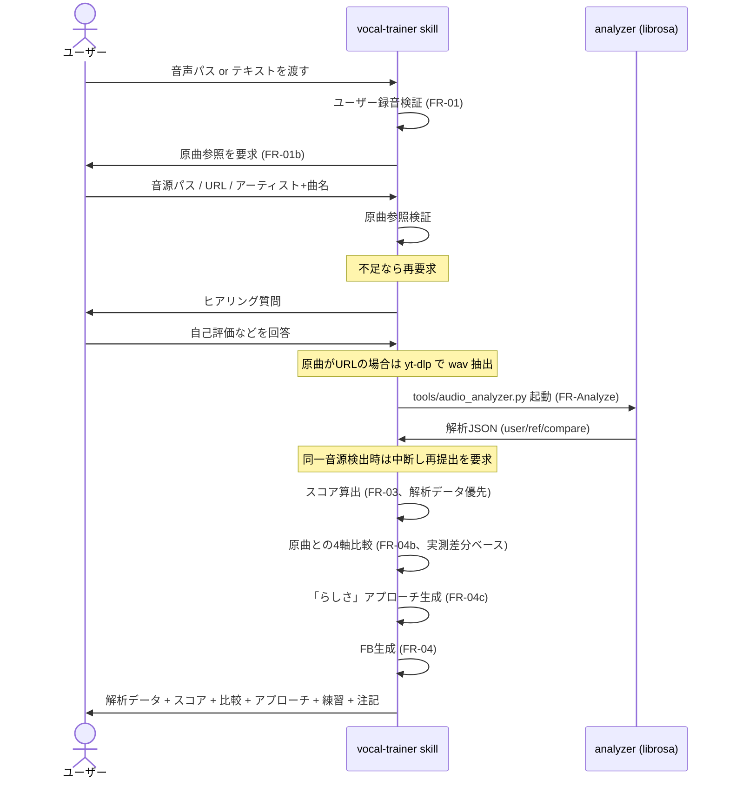
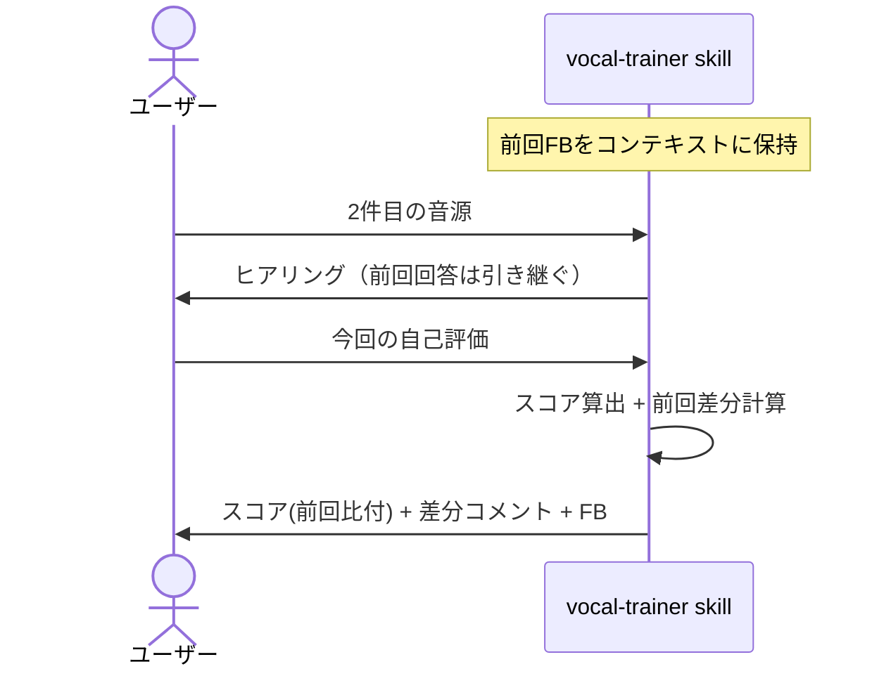

# Claude Code版 ボーカルFB機能 設計書

> アーキテクト作成。`docs/03_機能要件書_ClaudeCode版FB.md` の実装設計。
> Web版設計書 (`docs/02_基本設計.md`) と整合させる。

## 1. システム構成

### 1.1 コンポーネント
| コンポーネント | 役割 | 実体 |
| --- | --- | --- |
| `vocal-trainer` skill | ボーカルFB機能本体 | `.claude/skills/vocal-trainer/SKILL.md` |
| 評価ロジック仕様 | 4軸スコア基準・FB構造 | 本設計書 + 機能要件書 |
| (将来) 波形解析API | Web版バックエンドの `/api/v1/recordings` | `backend/app/services/evaluation_service.py` |

### 1.2 データフロー


## 2. アーキテクチャ判断

### 2.1 主要な技術選定
| 項目 | 選択 | 代替案 | 理由 |
| --- | --- | --- | --- |
| 配布形態 | Claude Code skill | カスタムCLI / Webサービス | ユーザー導線が最短（Claude Code 内で完結） |
| 音声解析 | **librosaベースのPythonツール `tools/audio_analyzer.py`** | 自己申告のみ / Web版API連携 | f0/key/tempo/ビブラート/ロングトーン安定度などを実測でき、FB精度が大幅に向上。Web版バックエンドを起動せずに完結 |
| 音声デコード | `imageio-ffmpeg` のバンドルffmpeg | システムffmpeg / brew導入 | `brew` 利用不可環境でも `pip install` だけでセットアップ完了 |
| 原曲取得 | `yt-dlp` でYouTubeからwav抽出 | 手動DL / 著作物コピー | カバーFBに必要なリファレンスを自動取得。ローカル解析で外部に音声を送らない |
| FB品質仕様 | skill本体の SKILL.md に集約 | 外部ファイル参照 | 単一ファイルで完結し、改修が容易 |
| 履歴永続化 | しない（同セッション限り） | ローカルJSON / Web版API | MVPスコープ外。NFR-03（プライバシー）にも適合 |

### 2.2 トレードオフ
- **解析パイプライン採用**: 初回セットアップで `backend/.venv` への依存導入（~150MB）が必要となるが、それと引き換えに自己申告非依存の客観評価が可能になる。NFR-02（利用容易性）は「初回のみセットアップ要、以降は自然言語呼び出しのみ」へと再定義
- **librosa の推定モデル限界**: f0 (pyin) はモノフォニー前提でアカペラやハモリで誤推定する。chroma によるキー推定は多義になりやすい。tempo は half/double-time の誤判定がある → SKILL.md の「モデル推定の限界」セクションで両論併記原則を規定
- **履歴を持たない方針**: 比較機能（FR-05）は同セッション内のみ。長期成長追跡をしたいユーザーは Web版に誘導する

## 3. skill 設計

### 3.1 skill 定義の構造
`.claude/skills/vocal-trainer/SKILL.md` は以下のセクションを持つ：

| セクション | 内容 | 役割 |
| --- | --- | --- |
| frontmatter `description` | スキル起動条件 | Claude が自動起動判定に使う |
| 役割 | 一行で「何者か」 | コンテキスト |
| いつ呼ぶか | トリガー条件 | 起動判定の補助 |
| 入力の受け取り方 | FR-01 / FR-02 の動作 | 実装規範 |
| 評価軸 | FR-03 のスコア定義 | 一貫性担保 |
| 出力フォーマット | FR-04 のテンプレ | 出力の均質化 |
| 原則 | 振る舞いの強制 | 品質ゲート |
| 連携 | 他役職との関係 | ワークフロー定義 |
| 口調 | スタイル指示 | UX一貫性 |

### 3.2 入力検証ロジック
```
入力受領
  ├─ ユーザー録音の検証
  │   ├─ 文字列がローカルパス様式（先頭 / または ~）か？
  │   │   ├─ Yes → ファイル存在確認 → 拡張子チェック
  │   │   │         ├─ 拡張子 wav/mp3/m4a → 続行
  │   │   │         └─ 対象外 → 警告＋ユーザー確認
  │   │   └─ No  → テキスト入力として扱う
  │   └─ ヒアリングフェーズへ
  └─ 原曲参照の検証（カバー曲時）
      ├─ 形式 (a) 音源パス → 存在確認
      ├─ 形式 (b) URL → 形式チェック
      ├─ 形式 (c) アーティスト+曲名 → 両方揃っているか
      └─ いずれも満たさない → 再提出を求める（FB本体に進まない）
```

### 3.3 ヒアリングフェーズの状態
| 必須/任意 | 項目 | 取得方法 | 備考 |
| --- | --- | --- | --- |
| 必須（カバー時） | 原曲参照（音源/URL/アーティスト+曲名） | ユーザー応答 | FR-01b |
| 必須 | 自己評価（うまく行った点・難しかった点） | ユーザー応答 | |
| 任意 | 曲名（ユーザー側） | ユーザー応答 | |
| 任意 | キー・テンポ | ユーザー応答 | |
| 任意 | 苦手フレーズ・音域 | ユーザー応答 | |
| 任意 | 原曲のどこを真似たか／変えたか | ユーザー応答 | 比較分析の精度向上 |

「必須」が埋まる前に FR-03（スコア算出）／FR-04b（原曲比較）に進まない。

### 3.4 スコア算出ルール
- 各軸の出力は 0-100 の整数
- 根拠は以下の優先順位で決まる（**解析データが取れた場合はそれが主材料**）

| 優先 | 材料 | 重み（解析あり / なし） |
| --- | --- | --- |
| 1 | **実測解析データ**（`tools/audio_analyzer.py`） | 50% / 0% |
| 2 | **曲特性・難易度の客観事実** | 25% / 45% |
| 3 | **申告の一貫性チェック由来の情報** | 15% / 25% |
| 4 | **一般的な独学者の典型パターン** | 5% / 20% |
| 5 | **ユーザーの自己申告（断定部分のみ）** | 5% / 10% |

- 自己申告と独自判断が乖離する場合は **解析データ・独自判断側を優先** し、FB本文で両論を提示すること（「ご自身ではX、ただしYの可能性が高い」）
- `total_score` = `pitch * 0.35 + rhythm * 0.30 + expression * 0.35`（小数点以下四捨五入）

### 3.4.1 解析指標と4軸スコアの対応
| 軸 | 解析指標 | 評価基準（目安） |
| --- | --- | --- |
| 音程 (pitch) | `f0_jitter_cents`, `f0_median_diff_semitones`, `estimated_key` 一致 | jitter 5以下=プロ精度、5-15=安定、15-30=やや揺れ、30+=不安定 |
| リズム (rhythm) | `tempo_bpm` 差分, `onset_rate_per_sec` 差分 | ±2BPM以内=同等、それ以上は逸脱 |
| 表現 (expression) | `rms_db_range`, `rms_crest_db`, `vibrato_rate_hz`, `vibrato_depth_cents` | 動的レンジが原曲より小=平板、ビブラート 4-7Hz / 30-80cents=人間典型 |
| 発声（音程・表現に分散反映） | `voiced_ratio`, `long_tone_stability`, `spectral_centroid_hz` | long_tone 30以下=安定、80+=崩れ |

### 3.5 FB生成テンプレ（FR-04対応）
出力 Markdown:
```markdown
# ボーカルFB: <曲名> / 原曲: <アーティスト> 「<曲名>」

## 参照原曲の確認
- 提出ソース: <パス or URL or アーティスト+曲名>
- 原曲特徴（推定含む）: キー / テンポ / 声質 / 歌唱の癖

## スコア
- 音程: NN / 100
- リズム: NN / 100
- 表現: NN / 100
- 総合: NN / 100

## 良かった点
- (具体)
- (具体)

## 改善ポイント
1. (具体・優先1)
2. (具体・優先2)

## 原曲との比較（4軸）
| 軸 | 原曲の特徴 | あなたの推定再現度 | 差分の正体 |
| --- | --- | --- | --- |
| 発声 | ... | ... | ... |
| リズム | ... | ... | ... |
| 音感 | ... | ... | ... |
| 表現 | ... | ... | ... |

## 原曲の歌手「っぽく」歌うアプローチ
- 「らしさ」の核: <声質 / テクニック / リズム / 解釈>
- 発声面: ...
- リズム面: ...
- 音感面: ...
- 表現面: ...

## 次の練習メニュー（声トレ軸 / 歌唱トレ軸）
### 声トレ軸
- 今週中・毎日5分: ...
### 歌唱トレ軸
- 今日できる: ...

## 一言
...

---
※ 本FBは音声を直接解析せず、お申告いただいた内容を元にしています。
```

### 3.6 過去比較（FR-05）
- セッション内で渡された音源と FB をスキル自身のコンテキストに保持
- 2回目以降の入力時、`スコア` セクションに `(前回比: +5)` のような差分を併記
- 比較は同セッション内のみ。セッション終了とともに破棄

## 4. 既存システムとの整合

### 4.1 Web版との品質統一
| 項目 | Web版 | Claude Code版 | 統一方法 |
| --- | --- | --- | --- |
| 評価軸 | pitch / rhythm / expression / total | 同じ | 機能要件書 FR-03 で固定 |
| FBトーン | 温かく・具体的 | 同じ | skill `口調` セクションで規定 |
| スコア範囲 | 0-100 | 0-100 | 同じ |
| 失敗時の挙動 | `failed` ステータス + エラー文 | エラーメッセージ + 再入力依頼 | 共通の文言指針（次節） |
| 解析実装 | **乱数プレースホルダ（要置換）** | librosa ベース実装済（`tools/audio_analyzer.py`） | 5.2 拡張で Web版 `evaluation_service.py` を本パイプラインに置換予定 |

### 4.2 共通文言指針（再掲）
- 音声形式不正: 「対応形式は wav / mp3 / m4a です」
- ファイル未存在: 「指定パスにファイルが見つかりませんでした」
- ヒアリング途中で十分情報が集まらない: 「もう少し情報をいただけるとより的確なFBができます」

### 4.3 役職スキル間の連携
| 起点 | 連携先 | 内容 |
| --- | --- | --- |
| `vocal-trainer` | `pdm` | FB品質改善要望をPdMへ起票 |
| `vocal-trainer` | `backend-engineer` | Web版 `evaluation_service.py` で同等FBを再現する仕様の渡し |
| `qa-engineer` | `vocal-trainer` | 受け入れ基準（AC-01〜10）でテスト |

### 4.4 原曲比較メソッド（FR-04b/FR-04c の実装規範）

#### 4.4.1 比較4軸の具体観点
| 軸 | 原曲側 | ユーザー側 |
| --- | --- | --- |
| 発声 | 地声/裏声/ミックスの比率、声質、ビブラート（速度・深さ）、息漏れ | 同区間で同じ声種・声質を選択できているか |
| リズム | グルーヴ位置、サビ突入のタメ、フレーズ終端処理、子音タイミング | 同じノリ位置か、タメは再現できているか |
| 音感 | スケール選択、フェイク・しゃくり・こぶし、ハモリ | 音飾りを再現しているか、平板になっていないか |
| 表現 | ダイナミクス曲線、歌詞解釈、感情の乗せ所 | 同じ感情曲線を描けているか |

#### 4.4.2 「らしさの核」の4分類
原曲歌手の魅力の中心が以下のどれかを推定する：
- **声質そのもの**: 完全コピー不可。ユーザーの声で別角度の魅力を出す方針を提案
- **発声テクニック**: 練習で寄せやすい。解剖学的アプローチを提示
- **リズム感覚**: 聴き込みで寄せやすい。反復聴取＋部分模倣を提示
- **歌詞解釈・感情**: 最も寄せやすい。表現意図の言語化と再演技を提示

#### 4.4.3 アプローチ生成ルール
1. 4軸それぞれで **最大の差分を1つだけ** 特定（全部直そうとしない）
2. 差分ごとに「声トレ軸の問題」か「歌唱トレ軸の問題」か判定
3. 寄せ方を1つ提示（解剖学アプローチ または 聴き取り課題）
4. ユーザーが完全コピー不可能な要素（声質）には完全コピーを強制しない

### 4.5 解析パイプライン (`tools/audio_analyzer.py`)

#### 4.5.1 構成
- 単一ファイル Python スクリプト（依存: librosa, numpy, scipy, soundfile）
- 実行: `backend/.venv/bin/python tools/audio_analyzer.py <user.wav> [<ref.wav>]`
- 出力: stdout に JSON、stderr に進捗ログ

#### 4.5.2 解析指標一覧
| カテゴリ | キー | 算出方法 |
| --- | --- | --- |
| 長さ | `duration_sec` | `librosa.get_duration` |
| 発声 | `voiced_ratio` | `librosa.pyin` の voiced_flag 平均 |
| 発声 | `f0_median_hz` | voiced f0 の中央値 |
| 発声 | `f0_jitter_cents` | voiced f0 のフレーム間絶対差中央値（cents） |
| 発声 | `vibrato_rate_hz`, `vibrato_depth_cents` | 最長voiced区間で FFT、3-10Hz 帯のピーク |
| 発声 | `long_tone_stability` | 0.6秒以上のvoiced区間内の f0 std 平均（cents） |
| 発声 | `spectral_centroid_hz` | `librosa.feature.spectral_centroid` 平均 |
| リズム | `tempo_bpm` | `librosa.beat.beat_track` |
| リズム | `onset_rate_per_sec` | onset数 / duration |
| 音感 | `estimated_key`, `estimated_mode` | chroma_cqt + Krumhansl テンプレート相関 |
| 表現 | `rms_mean`, `rms_db_range`, `rms_crest_db` | RMS の平均 / 5-95%レンジ / ピーク dB |

#### 4.5.3 比較セクション (`compare`)
2引数指定時のみ生成。主要指標について差分（ユーザー − リファレンス）を算出：
- `duration_diff_sec`, `tempo_diff_bpm`, `f0_median_diff_semitones`
- `key_match`, `voiced_ratio_diff`, `rms_db_range_diff`
- `long_tone_stability_diff_cents`, `vibrato_rate_diff_hz`, `vibrato_depth_diff_cents`
- `spectral_centroid_diff_hz`, `onset_rate_diff`

#### 4.5.4 同一音源検出（補助スクリプト）
- 主要指標が小数点まで一致した場合は同一音源を疑い、RMS包絡相関（時間ずれ探索つき）でクロスチェックする
- 相関 > 0.95 で同一音源と判定し、ユーザーに本人歌唱の再提出を求める

#### 4.5.5 前処理
- 入力が mp3/m4a/webm の場合、`imageio-ffmpeg` のバンドルffmpegで mono 22050Hz wav に変換
- YouTube URL の場合は `yt-dlp --ffmpeg-location <path> -x --audio-format wav` で取得

## 5. 拡張ポイント

### 5.1 履歴永続化（v1.1候補）
- 保存先案: `~/.vocal-coach/history.jsonl`
- 1行1FB（タイムスタンプ・ファイルパス・スコア・FB本文）
- セッション開始時に直近N件を読み込み、長期比較に使う
- 実装判断は CEO スキルで承認後

### 5.2 解析パイプラインの高度化（v1.2候補）
基本パイプラインは 4.5 で実装済み。今後の高度化候補：
- **DTW アライメント**: ユーザー録音と原曲のフレーム単位対応を取り、フレーズ別の差分FBを可能に
- **声種分離**: ユーザー側の音源が伴奏混入の場合、Demucs等のソースセパレーションで声だけ抽出
- **キー自動判定の精度向上**: 原曲既知時は事前知識を入れる。VAD（音声活動検出）を経た上での chroma で精度を上げる
- **Web版バックエンドへ移植**: `backend/app/services/evaluation_service.py` の乱数プレースホルダを本パイプラインに置き換え、両チャネルでスコア体系を完全統一

### 5.3 楽譜入力（将来）
- MIDI / MusicXML を受け付け、音程比較の基準として利用
- ペルソナの所持率が上がってから検討

## 6. シーケンス図

### 6.1 通常フロー


### 6.2 過去比較フロー（2回目以降）


## 7. エラーハンドリング方針

| 状況 | 動作 | メッセージ例 |
| --- | --- | --- |
| ファイル未存在 | 即座に応答中断、再入力を促す | 「指定パスにファイルが見つかりませんでした: <path>」 |
| 拡張子対象外 | 警告＋続行可否を確認 | 「<ext> は対象外形式です。続行しますか？」 |
| ヒアリング情報不足 | 追加質問または推定値で進めるか確認 | 「もう少し情報をいただけるとより的確なFBができます」 |
| 原曲参照未提出（カバー時） | FB本体に進まず再提出を求める | 「カバー曲のFBには原曲の特定が必須です。音源パス・URL・アーティスト+曲名（両方）のいずれかをご提供ください」 |
| 原曲参照が不完全（アーティスト or 曲名のみ） | 不足部分を明示し再要求 | 「曲名は確認できましたが、アーティスト名もお願いします。同名異曲の取り違えを防ぐためです」 |
| yt-dlp での原曲取得失敗 | 解析を諦め、自己申告ベースFBへフォールバック | 「原曲音源の取得に失敗しました。お申告ベースのFBに切り替えます」 |
| `audio_analyzer.py` の実行失敗 | 解析を諦め、自己申告ベースFBへフォールバック | 「音声解析に失敗しました（理由: ...）。お申告ベースのFBに切り替えます」 |
| 同一音源検出（解析後） | FB中断、本人歌唱の再提出を求める | 「ご提出いただいた録音と原曲が同一音源と推定されました。ご自身の歌唱録音を別途お送りください」 |
| 解析ライブラリ未導入 | 自己申告ベースFBへフォールバック | 「解析環境（backend/.venv）が見つかりません。お申告ベースのFBに切り替えます」 |
| ユーザーが途中離脱 | 状態を保持しないでクリーンに終了 | （明示メッセージ不要） |

## 8. 性能・可用性考慮
- 応答時間は Claude API のレイテンシ依存（NFR-01 で30秒目標）
- ヒアリング段階を分割することで、ユーザーには3秒以内に初回応答が返る
- ローカル動作のため可用性は Claude Code 自体の可用性に従う

## 9. セキュリティ考慮
- ユーザー録音はローカルから外部に送信しない（librosa による完全ローカル解析）
- 原曲取得時の yt-dlp は YouTube への通常リクエストのみ。認証情報は送らない
- 解析結果 JSON はセッション内に閉じる（永続化しない）
- 一時 wav は `tmp/audio/` に保存され `.gitignore` で除外。必要に応じセッション終了時に削除すること（NFR-03 適合のため）
- 拡張（5.2 Web版バックエンド移植）でクラウド送信が発生する場合は、認証・暗号化を別途設計

## 10. テスト方針
- QAスキルにて `docs/NN_テスト計画_ClaudeCode版FB.md` を別途作成
- 主要TC: AC-01〜07 をベースに、正常系1 / 異常系3 / 境界系2 を最低構成とする
- 手動テスト中心（音声ファイル提示が必要なため自動化は後回し）

## 11. 移行 / 後方互換性
- 既存Web版に変更なし
- 本機能は新規追加のみ。後方互換性影響なし
- skill 改修時は `.claude/skills/vocal-trainer/SKILL.md` の `description` 変更に注意（自動起動条件に影響）
