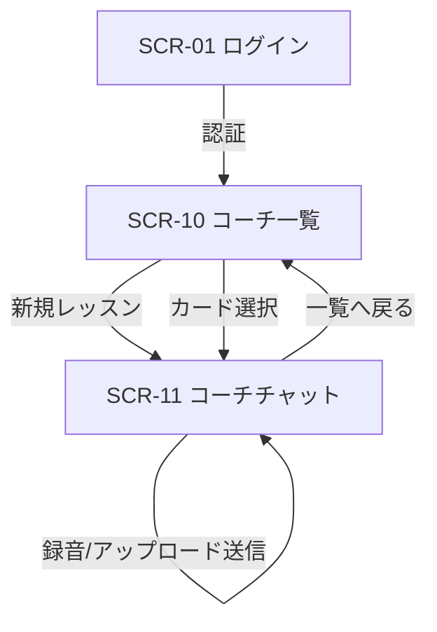

# チャット形式ボイトレWebアプリ デザイン仕様

> UXデザイナー作成。`docs/05_機能要件書_チャットWebアプリ.md` のUI/UX設計。
> 既存 `frontend/src/app/` のトーン（Next.js + Tailwind）に合わせる。

## 1. ユーザーゴール
ユーザーが「録音する → 何を直せばいいか分かる → 練習する → 上達を確認する」を、チャット画面ひとつで迷わず回せること。

## 2. 画面一覧
| ID | 画面名 | パス | 目的 |
| --- | --- | --- | --- |
| SCR-10 | コーチ一覧（セッション一覧） | `/coach` | 過去のコーチングセッション一覧・新規開始 |
| SCR-11 | コーチチャット | `/coach/[sessionId]` | コーチングの会話本体（録音・FB・基礎練） |
| SCR-01 | ログイン（既存） | `/login` | 認証（流用） |

## 3. 画面ごとの仕様

### SCR-10: コーチ一覧
- **目的**: 続きから再開、または新規セッション開始
- **主要要素**:
  - ヘッダー: タイトル「ボイストレーナー」、ログアウト
  - 「+ 新しいレッスンを始める」大ボタン（最上部、目立たせる）
  - セッションカードのリスト: 曲名 / 最終フェーズバッジ（例: Phase C 基礎練中）/ 最終更新日時 / 総合スコア（あれば）
- **状態**:
  - loading: スケルトンカード3枚
  - empty: 「まだレッスンがありません。最初のレッスンを始めましょう」+ 新規ボタン
  - error: 「読み込みに失敗しました」+ 再試行
- **アクション**: カードタップで SCR-11 へ / 新規ボタンで新セッション作成 → SCR-11

### SCR-11: コーチチャット（中核画面）
- **目的**: 会話形式でコーチングを進める
- **レイアウト**（縦3分割）:
  1. **上部: フェーズインジケーター**（固定ヘッダー）
     - `A 曲指定 → B 課題発見 → C 基礎練 → D 練習確認 → E 再録音` を横並びステップ表示
     - 現在フェーズをハイライト、完了フェーズにチェック
     - 曲名を小さく表示
  2. **中央: メッセージリスト**（スクロール領域）
     - コーチ発話: 左寄せ、アバター（🎤）、薄グレー背景バブル
     - ユーザー発話: 右寄せ、ブランドカラー背景バブル
     - メッセージ種別ごとの表示（次節「メッセージタイプ」）
     - 最新メッセージへ自動スクロール
  3. **下部: 入力コンポーザー**（固定フッター）
     - テキスト入力欄（複数行可、Enter送信 / Shift+Enter改行）
     - 🎙 録音ボタン / 📎 アップロードボタン / ▶送信ボタン
- **状態**:
  - loading（コーチ思考中）: 左バブルに「…」タイピングインジケーター
  - 録音中: コンポーザーが録音モードに切替（後述）
  - 解析中: 「解析しています…」プログレス + 推定残り時間
  - error: エラーバブル（赤系）+ 再試行ボタン

### 3.1 メッセージタイプ（バブル内表示）
| type | 表示 |
| --- | --- |
| `text` | プレーンテキスト（コーチ/ユーザー共通） |
| `audio` | 音声プレーヤー（波形 or 再生バー、再生/一時停止、長さ表示） |
| `feedback` | **FBカード**: 4軸スコア（横バー）、良かった点、改善ポイント、秒数つき指摘、声種コメント |
| `practice` | **基礎練カード**: 課題名、手順ステップ、参考動画サムネ+リンク、達成目安 |
| `judge` | **判定カード**: ◯/△/✗ アイコン + 指標テーブル + 次アクション |
| `progress` | **改善カード**: 初回→今回の差分テーブル + 褒めコメント |

### 3.2 録音UI（コンポーザー内）
- 🎙 タップ → 録音モードに切替:
  - 赤い録音インジケーター + 経過秒数カウント
  - 波形リアルタイム表示（任意、無くても可）
  - ■停止ボタン / ✕キャンセルボタン
  - 録音上限（例: 60秒）に達したら自動停止
- 停止後:
  - プレビュー再生 + 「送信」「録り直し」
  - 送信で audio メッセージとして送信 → 解析開始

### 3.3 アップロードUI
- 📎 タップ → ファイル選択（accept: audio/*）
- 選択後はプレビュー + 送信/キャンセル

### 3.4 Phase A の入力ガイド
Phase A では自由テキストだけだと迷うので、コーチ発話に **入力支援チップ/フォーム** を出す:
- 曲URL入力欄
- 区間入力（開始 mm:ss / 終了 mm:ss）スライダー or テキスト
- 「特に気になること」選択チップ（高音の力み / 音程 / リズム / 表現 / ミックス習得 / おまかせ）

## 4. 画面遷移図

## 5. デザイントークン
- **カラー**:
  - ブランド（ユーザーバブル/CTA）: Tailwind `indigo-600`
  - コーチバブル背景: `slate-100`
  - 録音アクティブ: `red-500`
  - 達成◯: `emerald-500` / △: `amber-500` / ✗: `rose-500`
  - スコアバー: 80+=emerald, 60-79=amber, <60=rose
- **スペーシング**: バブル間 `gap-3`、画面パディング `p-4`
- **タイポ**: 本文 `text-sm`/`text-base`、スコア数値 `text-2xl font-bold`
- **角丸**: バブル `rounded-2xl`、カード `rounded-xl`

## 6. アクセシビリティ要件
- 録音ボタンに `aria-label="録音開始/停止"`、録音中は `aria-pressed`
- 音声プレーヤーはキーボード操作可（Space再生/停止）
- スコアバーは色だけでなく数値も併記（色覚多様性対応）
- コーチ/ユーザー発話を `role="log"` `aria-live="polite"` で読み上げ対応
- コントラスト比 4.5:1 以上

## 7. レスポンシブ
- モバイル優先（録音が主にスマホ想定）
- 幅 < 640px: フルスクリーンチャット、コンポーザー下部固定
- 幅 >= 1024px: 中央 720px のチャットカラム + 余白

## 8. マイクロコピー（文言）
- 録音ボタン未許可時: 「マイクの使用を許可してください」
- 解析中: 「あなたの歌を聴いています…（最大15秒）」
- 同一音源検出: 「原曲と同じ音源のようです。あなたが歌った録音を送ってください🎤」
- Phase E 改善時: 「{指標}が{改善幅}良くなりました！この調子です👏」
- エラー: 「うまく処理できませんでした。もう一度試してください」
