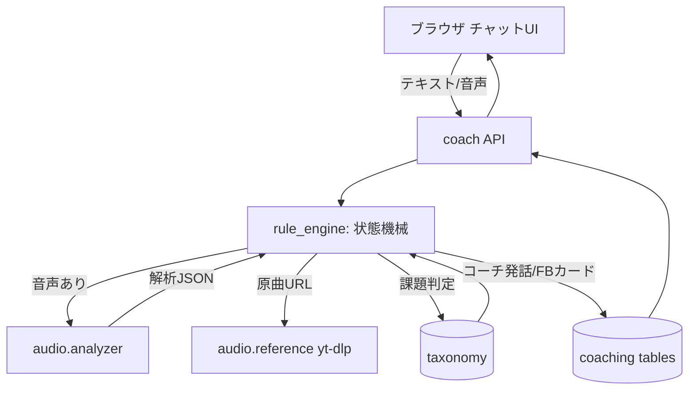
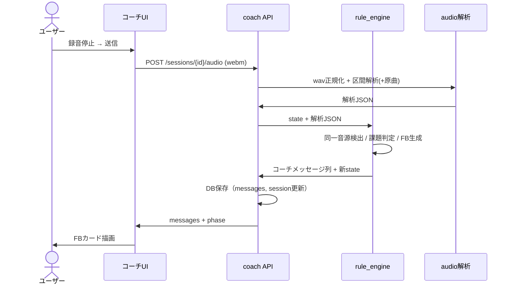

# チャット形式ボイトレWebアプリ 設計書

> アーキテクト作成。`docs/05_機能要件書` `docs/06_デザイン仕様` の実装設計。
> 既存 `frontend/` `backend/`（`docs/02_基本設計.md`）を拡張する。

## 1. システム構成

### 1.1 コンポーネント
| 層 | コンポーネント | 役割 | 実体 |
| --- | --- | --- | --- |
| Frontend | コーチチャットUI | 会話・録音・アップロード | `frontend/src/app/coach/` |
| Backend | チャットAPI | セッション/メッセージ/音声受付 | `backend/app/api/v1/endpoints/coach.py` |
| Backend | ルールエンジン | Phase状態機械・課題判定・FB生成 | `backend/app/coaching/` |
| Backend | 解析サービス | librosa解析・原曲取得 | `backend/app/audio/` |
| Backend | 永続化 | セッション・メッセージ保存 | `backend/app/models/coaching.py` |
| 共有 | 課題タクソノミー | 課題→基礎練→動画→判定基準 | `backend/app/coaching/taxonomy.py` |

### 1.2 データフロー


## 2. アーキテクチャ判断

### 2.1 主要な技術選定
| 項目 | 選択 | 代替案 | 理由 |
| --- | --- | --- | --- |
| コーチ頭脳 | ルールベースエンジン | Claude API | API鍵不要・無料・高速・決定論的でテスト容易 |
| 解析配置 | バックエンドのサービス層 | フロントWASM / 別マイクロサービス | 既存 `backend/.venv` のlibrosaを再利用、単一デプロイ |
| 解析コード共有 | `tools/audio_analyzer.py` のロジックを `app/audio/analyzer.py` に移植（コア関数を共有モジュール化） | コード重複 | Claude Code版とWeb版で同一指標を保証 |
| 状態保持 | DB（ChatSession.state_json） | インメモリ / Redis | 既存DB流用、再訪復元（FR-01）が必要 |
| 音声フォーマット | webm/opus（録音）+ wav/mp3/m4a（アップロード）→ ffmpegでwav正規化 | 単一形式強制 | ブラウザ録音はwebmが標準。サーバーで吸収 |
| 録音 | ブラウザ MediaRecorder | サーバー録音 | Webアプリはクライアント録音が自然 |

### 2.2 トレードオフ
- **ルールベースの限界**: FB文の柔軟性はLLMに劣る。テンプレート + 解析値差し込みで「具体性」は担保するが、文章の多様性は制限される。将来 `docs/05 Q` のとおりLLM併用に拡張可能な層分離にしておく（FB生成を `feedback_builder` として独立させる）
- **同期解析**: 解析は数秒〜十数秒。MVPはHTTPリクエスト内で同期実行（タイムアウトに注意）。将来はジョブキュー化
- **原曲DLの法務**: yt-dlp取得は解析目的の一時利用。原曲音声は永続保存せずキャッシュTTLで削除

## 3. DBスキーマ設計（新規テーブル）

### 3.1 chat_sessions
| カラム | 型 | 説明 |
| --- | --- | --- |
| id | PK | |
| user_id | FK→users.id | 所有者 |
| song_title | varchar | 曲名（任意） |
| song_ref_url | varchar(null) | 原曲URL |
| song_ref_path | varchar(null) | 取得済み原曲wavパス（キャッシュ） |
| user_range | varchar(null) | ユーザー区間 "mm:ss-mm:ss" |
| ref_range | varchar(null) | 原曲区間 |
| phase | enum(A,B,C,D,E,done) | 現在フェーズ |
| current_task | varchar(null) | 課題ID（タクソノミー） |
| baseline_analysis | json(null) | Phase B 初回解析（Phase E比較用） |
| d_retry_count | int default 0 | Phase D 連続未達回数 |
| created_at / updated_at | datetime | |

### 3.2 chat_messages
| カラム | 型 | 説明 |
| --- | --- | --- |
| id | PK | |
| session_id | FK→chat_sessions.id | |
| role | enum(coach, user) | 発話者 |
| type | enum(text, audio, feedback, practice, judge, progress) | メッセージ種別 |
| text | text(null) | 本文（text型用） |
| audio_path | varchar(null) | 音声ファイルパス（audio型用） |
| payload | json(null) | カード型データ（feedback/practice/judge/progress） |
| created_at | datetime | |

### 3.3 関連・制約
- `users` 1:N `chat_sessions` 1:N `chat_messages`
- `chat_sessions.user_id`, `chat_messages.session_id` にインデックス
- マイグレーションは Alembic で追加（既存 `d5126c021cce` に続けて新規revision）

## 4. API設計

### 4.0 エンドポイント一覧（すべて認証必須）
- `POST /api/v1/coach/sessions` — 新規セッション作成
- `GET /api/v1/coach/sessions` — 自分のセッション一覧
- `GET /api/v1/coach/sessions/{id}` — セッション詳細 + メッセージ履歴
- `POST /api/v1/coach/sessions/{id}/messages` — テキストメッセージ送信
- `POST /api/v1/coach/sessions/{id}/audio` — 音声送信（multipart）
- `DELETE /api/v1/coach/sessions/{id}` — セッション削除（任意）

### 4.1 POST /sessions
- request: `{ }`（空でよい、Phase A から開始）
- response: `{ session_id, phase: "A", messages: [coachの初回ガイド発話] }`

### 4.2 POST /sessions/{id}/messages
- request: `{ text: string }`（Phase A の曲URL・区間・観点など自由文 or 構造化フィールド）
- 動作: rule_engine がテキストを解釈し状態遷移、コーチ応答を生成
- response: `{ messages: [新規コーチメッセージ...], phase, current_task }`

### 4.3 POST /sessions/{id}/audio
- request: `multipart/form-data`: `audio_file`, `kind`（"song" | "practice"）
- 動作:
  1. 音声を保存しwav正規化
  2. 現フェーズに応じて解析（Phase B: 原曲と比較 / Phase D: 単体 / Phase E: baselineと比較）
  3. rule_engine がFB/判定/改善カードを生成
- response: `{ messages: [user audio, coach feedback...], phase, current_task }`

### 4.4 エラーレスポンス
- 既存の共通形式（`code`, `message`, `details`, `request_id`, `timestamp`）を踏襲
- 追加コード: `ANALYSIS_FAILED`, `REFERENCE_FETCH_FAILED`, `SAME_SOURCE_DETECTED`, `RANGE_OUT_OF_BOUNDS`

## 5. モジュール構成（backend）

```
backend/app/
  audio/
    __init__.py
    analyzer.py        # librosa解析（tools/audio_analyzer.py のコア移植）
    reference.py       # yt-dlp 原曲取得 + キャッシュ
    convert.py         # ffmpeg で webm/mp3/m4a → wav 正規化
  coaching/
    __init__.py
    taxonomy.py        # 課題定義（診断閾値/基礎練/動画/達成基準）
    scoring.py         # 解析値 → 4軸スコア
    feedback_builder.py# 解析値 → FB文/カード（テンプレート差し込み）
    state_machine.py   # Phase A〜E 遷移ロジック
    rule_engine.py     # 上記を束ねるファサード（入力→状態更新→出力メッセージ）
  api/v1/endpoints/
    coach.py           # チャットAPI
  models/
    coaching.py        # ChatSession, ChatMessage
  schemas/
    coaching.py        # Pydantic（リクエスト/レスポンス/カードpayload）
```

### 5.1 rule_engine の責務
入力（現在のsession状態 + ユーザー入力[text/audio]）→ 出力（追加コーチメッセージ列 + 新state）。副作用なし（DB保存はendpoint側）にしてテスト容易にする。

### 5.2 taxonomy のデータ構造（例）
```python
TASKS = {
  "long_tone_decay": {
    "label": "ロングトーンの後半安定",
    "diagnose": lambda a: a.long_tone_stability and a.long_tone_stability > 80,
    "priority": 2,
    "practices": [
      {"name": "スーッ呼吸", "steps": [...], "video": "https://youtube.com/watch?v=Hp8C8NsvPdc"},
      {"name": "ドッグブレス", "steps": [...], "video": "https://youtube.com/watch?v=FDIGjxdQLwI"},
    ],
    "achieve": lambda a: a.long_tone_stability is not None and a.long_tone_stability <= 30,
    "achieve_label": "ロングトーン安定度 ≤ 30 cents",
  },
  # 喉締め / ビブラート未獲得 / ミックス未習得 / 音程細部揺れ / リズム / 表現平板 / 鼻声 ...
}
```
- 課題判定は `diagnose` を priority 昇順で評価し最初にヒットした1つを採用
- 参考動画は事前キュレーション固定リンク（FR-08）

### 5.3 scoring（解析→4軸）
- `docs/04` の 3.4.1 対応表に従う
  - pitch: f0_jitter_cents, f0_median_diff_semitones, key_match
  - rhythm: tempo差, onset_rate差
  - expression: rms_db_range, rms_crest_db, vibrato
  - total = pitch*0.35 + rhythm*0.30 + expression*0.35
- 解析失敗時はスコアを出さず、テキストFBのみ

## 6. フロントエンド設計

```
frontend/src/
  app/coach/
    page.tsx               # SCR-10 セッション一覧
    [sessionId]/page.tsx   # SCR-11 チャット本体
  components/coach/
    PhaseStepper.tsx       # フェーズインジケーター
    MessageList.tsx        # メッセージ描画（type別）
    bubbles/
      TextBubble.tsx
      AudioBubble.tsx      # 音声プレーヤー
      FeedbackCard.tsx     # 4軸スコア + 指摘
      PracticeCard.tsx     # 基礎練 + 動画
      JudgeCard.tsx        # ◯△✗判定
      ProgressCard.tsx     # 改善差分
    Composer.tsx           # 入力 + 録音 + アップロード
    Recorder.ts            # MediaRecorder ラッパ
    PhaseAForm.tsx         # 曲URL/区間/観点 入力支援
  lib/
    coachApi.ts            # コーチAPIクライアント
```

### 6.1 録音（MediaRecorder）
- `navigator.mediaDevices.getUserMedia({ audio: true })`
- `MediaRecorder` で録音、`ondataavailable` で Blob 収集、停止時に `audio/webm` Blob 生成
- iOS Safari は webm 非対応 → `MediaRecorder.isTypeSupported` で `audio/mp4` フォールバック
- Blob を `FormData` で `POST /audio` に送信

### 6.2 状態管理
- セッション状態（phase, messages）はページローカル state + API再取得で同期
- 送信中・解析中はコンポーザーをロック（二重送信防止）

## 7. シーケンス図（音声送信 → FB）


## 8. エラーハンドリング方針
| 状況 | HTTP | code | UI挙動 |
| --- | --- | --- | --- |
| 原曲取得失敗 | 502 | REFERENCE_FETCH_FAILED | エラーバブル + URL再入力促し |
| 解析失敗 | 500 | ANALYSIS_FAILED | エラーバブル + 再送信ボタン |
| 同一音源検出 | 409 | SAME_SOURCE_DETECTED | 「本人歌唱を送って」案内、フェーズ維持 |
| 区間が音源長超過 | 400 | RANGE_OUT_OF_BOUNDS | 区間再入力 |
| 非対応形式/サイズ超過 | 400 | BAD_REQUEST | 形式・サイズ案内 |
| 未認証 | 401 | UNAUTHORIZED | ログインへ |
| 他人のセッション | 403 | FORBIDDEN | 一覧へ |

## 9. 性能・可用性
- 解析は同期実行。FastAPI のワーカ数とタイムアウト（例: 60s）を設定
- 原曲wavはセッションに紐付けキャッシュ、TTL（例: 24h）で削除するクリーンアップ
- アップロードは20MB上限、ストリーミング保存

## 10. セキュリティ
- 全エンドポイント認証必須（既存 `get_current_user`）
- セッション所有者チェック（user_id一致）。不一致は403
- アップロードMIME/拡張子検証、保存名はサーバー採番（パストラバーサル防止）
- yt-dlp は許可ドメイン（YouTube等）のみ。任意URLの取得を制限

## 11. テスト方針（QA連携）
- ルールエンジンは純関数なので単体テスト容易（解析JSON固定 → 期待メッセージ）
- 主要TC: Phase A〜E 各遷移、同一音源検出、解析失敗フォールバック、認可
- `docs/05` の AC-01〜10 をテストケースに落とす

## 12. 移行 / 既存への影響
- 既存の auth / recordings には影響なし（新規追加のみ）
- `tools/audio_analyzer.py` のコアを `app/audio/analyzer.py` に共有化。Claude Code版skillは引き続き `tools/` 経由で利用（同一ロジック）
- Web版MVP（`docs/02`）の評価機能（乱数プレースホルダ）は本設計の `scoring.py` で置換可能（v1.1）
