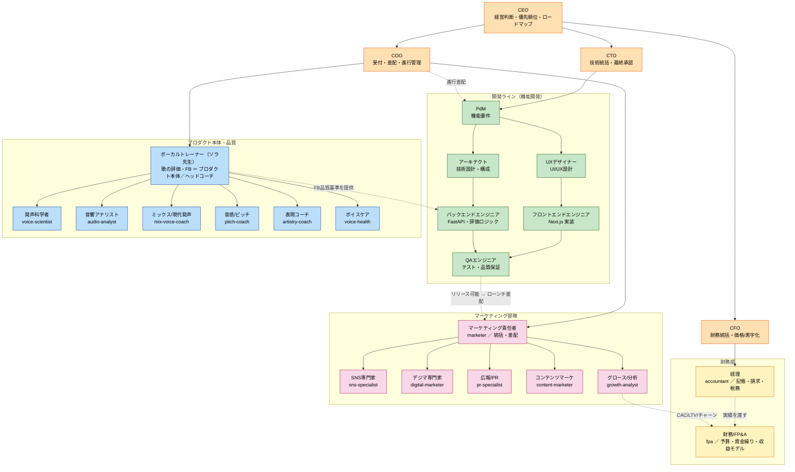
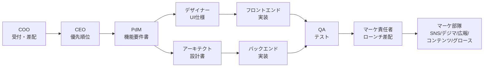

# Vocal Coach Inc. 組織図（現状）

> 作成日: 2026-06-29
> 出典: `claude.md` / `.claude/skills/*` の役職スキル定義
> 形態: **一人会社**（全役職を一人で兼任。各役職は Claude Code の skill として実体化）

## 1. 全体組織図

**経営層（C-suite）** は CEO の下に **COO・CTO・CFO**。その下に **4部門** が並ぶ：
- **開発ライン** — 技術統括は `cto`、進行差配は `coo`
- **プロダクト本体・品質** — ソラ先生（`vocal-trainer`）＋教授陣
- **マーケティング部隊** — `marketer`（責任者）＋専門5役職
- **財務部** — `cfo` 配下に経理・財務/FP&A

**ボーカルトレーナーはエンジニア組織の上位ではない**。部門どうしは横連携する（点線）：
- ソラ先生がFB品質基準を定義 → `pdm` が要件化 → `backend-engineer` の評価ロジック `evaluation_service.py` に反映 → `qa-engineer` で確認
- 開発ラインがリリース可能になったら → マーケティング部隊（`marketer`）がローンチを差配
- 価格/コスト/課金は `cfo`（財務部）が判断 → 関係部門と整合

## 2. 役職一覧

### 経営層（C-suite）
| 役職 | スキル | 主な責務 | 主な成果物 |
| --- | --- | --- | --- |
| CEO | `ceo` | 経営判断・優先順位・ロードマップ | ロードマップ、意思決定メモ |
| COO | `coo` | 案件の受付・役職への差配・進行管理 | 案件カルテ、ディスパッチ計画 |
| CTO | `cto` | 技術統括・技術選定の最終判断・開発ラインの技術品質 | 技術判断メモ、標準/規約 |
| CFO | `cfo` | 財務統括・資金繰り・価格/黒字化の数字面 | 財務判断メモ、収益方針 |

### 開発ライン（`cto` 技術統括 / `coo` 進行差配）
| 役職 | スキル | 主な責務 | 主な成果物 |
| --- | --- | --- | --- |
| PdM | `pdm` | プロダクト戦略・機能要件 | 機能要件書 |
| UXデザイナー | `designer` | UI/UX設計・ワイヤー | デザイン仕様、画面遷移 |
| アーキテクト | `architect` | 技術設計・システム構成 | 設計書 |
| バックエンドエンジニア | `backend-engineer` | FastAPI 実装 | API実装、マイグレーション |
| フロントエンドエンジニア | `frontend-engineer` | Next.js 実装 | UIコード |
| QAエンジニア | `qa-engineer` | テスト計画・品質保証 | テスト計画書、テストケース |

### プロダクト本体・品質
| 役職 | スキル | 主な責務 | 主な成果物 |
| --- | --- | --- | --- |
| ボーカルトレーナー | `vocal-trainer` | 歌の評価とFB（プロダクト本体機能）／ヘッドコーチ | FBテキスト、スコア |
| マーケティング責任者 | `marketer` | マーケ部隊の統括・ローンチ戦略・差配 | ローンチプラン、施策アサイン |

## 3. 財務部（`cfo` 配下）

お金の記録と将来計画を担うチーム。**過去の正確な記録（経理）** と **将来の計画（財務/FP&A）** を分担する。単発の作業は担当役職を直接呼んでよい。

| 役職 | スキル | 担当 | 主な成果物 |
| --- | --- | --- | --- |
| 経理 | `accountant` | 記帳・請求・経費・税務・決算（過去の記録の正確性） | 月次収支、請求書 |
| 財務/FP&A | `fpa` | 予算・資金繰り・収益モデル・ユニットエコノミクス（将来の計画） | 収益モデル、資金繰り表 |

## 4. マーケティング部隊（`marketer` 配下）

集客・ブランドを専門分化して回すチーム。責任者（`marketer`）が戦略と差配を持ち、各専門役職に振り分けて束ねる。単発の成果物は専門役職を直接呼んでよい。

| 専門役職 | スキル | 担当 | 主な成果物 |
| --- | --- | --- | --- |
| SNS専門家 | `sns-specialist` | SNS運用・投稿企画・コミュニティ運営 | 投稿カレンダー、投稿案 |
| デジマ専門家 | `digital-marketer` | 広告運用・SEO・LP最適化・計測 | 獲得チャネル設計、LP改善案 |
| 広報/PR | `pr-specialist` | プレス・メディア露出・ブランド/評判管理 | プレスリリース、PR方針 |
| コンテンツマーケ | `content-marketer` | ブログ・記事・LPコピー・台本 | 記事、LPコピー |
| グロース/アナリティクス | `growth-analyst` | KPI設計・ファネル分析・効果検証 | KPIツリー、検証レポート |

## 5. ボーカル教授陣（プロダクト品質チーム）

ソラ先生（`vocal-trainer`）がヘッドコーチとして統括。生徒には常にソラ先生の一貫した人格で語りかけ、裏で各専門家の知見を統合する。

| 専門家 | スキル | 担当 |
| --- | --- | --- |
| 発声科学者 | `voice-scientist` | 機構→原因→処方の科学的根拠（閉じ・共鳴・声区・支え・アンザッツ） |
| 音響アナリスト | `audio-analyst` | 解析数値の解釈と限界の明示＝事実忠実性の番人 |
| ミックス/現代発声コーチ | `mix-voice-coach` | 高音・換声点・ベルティング（CCM） |
| 音感/ピッチコーチ | `pitch-coach` | 正確さ（原曲ありのみ）と安定度の区別、聴音 |
| 表現コーチ | `artistry-coach` | ダイナミクス・張りどころ・歌詞解釈 |
| ボイスケア/音声医学 | `voice-health` | レッドフラグ→受診の線引き（安全の番人） |

## 6. 標準ワークフロー（新機能）

- 曖昧な依頼・複数役職をまたぐ案件は、まず `coo` が受け付けて役職チェーンに振り分ける。
- 単一役職で明らかに完結する依頼は、COOを挟まず該当役職を直接呼んでよい。
- ボーカルトレーナー（ソラ先生）はプロダクト本体機能のため、いつでも単独で呼べる。

## 7. プロダクト構成（2チャネル）

同じ「録音した歌へのFB機能」を2チャネルで提供する。両チャネルとも共通のFB品質基準（音程・リズム・表現・総合）に従う。

| チャネル | 実体 | 特徴 |
| --- | --- | --- |
| Web版 | `frontend/`（Next.js）＋ `backend/`（FastAPI） | ユーザー登録・履歴保存付き |
| Claude Code版 | `.claude/skills/vocal-trainer` | ローカル音声ファイルを渡すと即FB。アカウント不要 |
