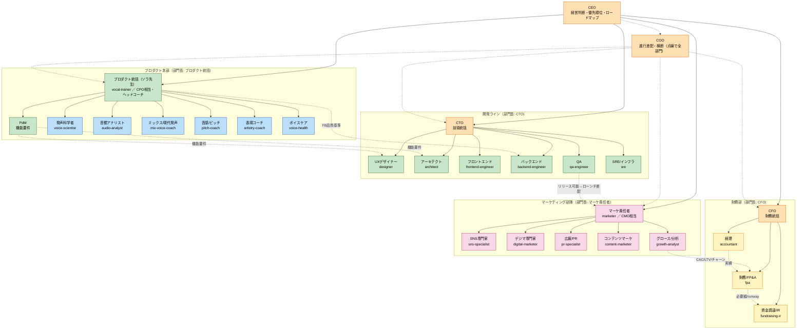
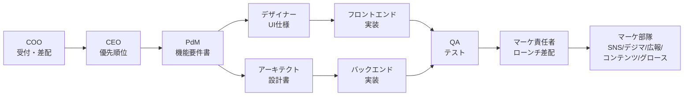

# Vocal Coach Inc. 組織図（現状）

> 作成日: 2026-06-29
> 出典: `claude.md` / `.claude/skills/*` の役職スキル定義
> 形態: **一人会社**（全役職を一人で兼任。各役職は Claude Code の skill として実体化）

## 0. 稼働状態（現フェーズ）

役職は網羅的に定義するが、**常時稼働は現フェーズの最小セットだけ**。残りは休眠（必要時に起動・定義は保持）。重さ（ディスパッチ遅延・境界調停・同期コスト）を抑えつつ、役職カタログの網羅性を保つための運用。

- 🟢 **稼働（常用）**: `vocal-trainer` ／ `pdm` ／ `frontend-engineer` ／ `backend-engineer` ／ `marketer` ／ `sns-specialist`
- ⚪ **休眠（必要時に起動）**: 上記以外すべて（経営層・設計/QA/SRE・教授陣・他マーケ専門・財務部）

> 休眠役職は「あるから」と無理に通さない。その視点が実際に必要になった時だけ起こす（例: 価格決定で `cfo`/`fpa`、障害対応で `sre`）。フェーズが変われば本節と図の凡例を更新する。

## 1. 全体組織図（レポートライン）

**4部門長が CEO 直属（実線）**、**COO は全部門を横断する進行差配（点線）** という構成。

### レポートラインの原則
- **実線（solid）＝人事・成果の責任**：各部門長 → CEO
  - 開発ライン → **CTO**（`cto`）／ プロダクト本部 → **プロダクト統括**（`vocal-trainer`／CPO相当）／ マーケティング部隊 → **マーケ責任者**（`marketer`／CMO相当）／ 財務部 → **CFO**（`cfo`）
- **点線（dotted）＝調整・進行・専門連携**：`coo` の横断進行、および部門をまたぐハンドオフ
  - PdM（プロダクト本部）の機能要件 → 開発ライン（`designer`/`architect`→実装→`qa-engineer`）
  - ソラ先生のFB品質基準 → `backend-engineer` の評価ロジック `evaluation_service.py`
  - 開発ラインがリリース可能 → マーケ部隊（`marketer`）がローンチ差配
  - `growth-analyst` の CAC/LTV/チャーン → `fpa` の収益モデル

> ポイント：**PdM はプロダクト本部所属**（技術組織に従属させない）。**COO は特定部門の上司ではなく横断の進行役**。これで CTO/CFO/プロダクト統括/マーケ責任者の4部門長が対称に CEO 直属となる。

## 2. 経営層（C-suite）

| 役職 | スキル | 主な責務 | 組織上の位置 |
| --- | --- | --- | --- |
| CEO | `ceo` | 経営判断・優先順位・ロードマップ | トップ。4部門長が直属 |
| COO | `coo` | 受付・差配・進行管理 | 全部門を横断（点線）。solidの部下を持たない |
| CTO | `cto` | 技術統括・技術選定の最終判断 | 開発ラインの部門長 |
| CFO | `cfo` | 財務統括・資金繰り・価格/黒字化 | 財務部の部門長 |

## 3. 部門① 開発ライン（部門長: `cto` ／ 進行: `coo` 点線）

| 役職 | スキル | 主な責務 | 主な成果物 |
| --- | --- | --- | --- |
| UXデザイナー | `designer` | UI/UX設計・ワイヤー | デザイン仕様、画面遷移 |
| アーキテクト | `architect` | 技術設計・システム構成 | 設計書 |
| バックエンドエンジニア | `backend-engineer` | FastAPI 実装 | API実装、マイグレーション |
| フロントエンドエンジニア | `frontend-engineer` | Next.js 実装 | UIコード |
| QAエンジニア | `qa-engineer` | テスト計画・品質保証 | テスト計画書、テストケース |
| SRE/インフラ | `sre` | 基盤構築・運用・デプロイ・監視・セキュリティ運用 | インフラ構成、運用手順 |

## 4. 部門② プロダクト本部（部門長: プロダクト統括＝`vocal-trainer`／CPO相当）

プロダクト戦略（PdM）と本体品質（ソラ先生＋教授陣）を持つ。**PdM はここに所属し、機能要件を点線で開発ラインへ渡す**（技術組織に従属させない）。

| 役職 | スキル | 主な責務 | 主な成果物 |
| --- | --- | --- | --- |
| プロダクト統括（ソラ先生） | `vocal-trainer` | 歌の評価とFB（本体機能）／ヘッドコーチ／部門長 | FBテキスト、スコア、FB品質基準 |
| PdM | `pdm` | プロダクト戦略・機能要件 | 機能要件書 |

### ボーカル教授陣（`vocal-trainer` 配下の品質チーム）
ソラ先生がヘッドコーチとして統括。生徒には常にソラ先生の一貫した人格で語りかけ、裏で各専門家の知見を統合する。

| 専門家 | スキル | 担当 |
| --- | --- | --- |
| 発声科学者 | `voice-scientist` | 機構→原因→処方の科学的根拠（閉じ・共鳴・声区・支え・アンザッツ） |
| 音響アナリスト | `audio-analyst` | 解析数値の解釈と限界の明示＝事実忠実性の番人 |
| ミックス/現代発声コーチ | `mix-voice-coach` | 高音・換声点・ベルティング（CCM） |
| 音感/ピッチコーチ | `pitch-coach` | 正確さ（原曲ありのみ）と安定度の区別、聴音 |
| 表現コーチ | `artistry-coach` | ダイナミクス・張りどころ・歌詞解釈 |
| ボイスケア/音声医学 | `voice-health` | レッドフラグ→受診の線引き（安全の番人） |

## 5. 部門③ マーケティング部隊（部門長: マーケ責任者＝`marketer`／CMO相当）

集客・ブランドを専門分化して回すチーム。責任者（`marketer`）が戦略と差配を持ち、各専門役職に振り分けて束ねる。単発の成果物は専門役職を直接呼んでよい。

| 専門役職 | スキル | 担当 | 主な成果物 |
| --- | --- | --- | --- |
| SNS専門家 | `sns-specialist` | SNS運用・投稿企画・コミュニティ運営 | 投稿カレンダー、投稿案 |
| デジマ専門家 | `digital-marketer` | 広告運用・SEO・LP最適化・計測 | 獲得チャネル設計、LP改善案 |
| 広報/PR | `pr-specialist` | プレス・メディア露出・ブランド/評判管理 | プレスリリース、PR方針 |
| コンテンツマーケ | `content-marketer` | ブログ・記事・LPコピー・台本 | 記事、LPコピー |
| グロース/アナリティクス | `growth-analyst` | KPI設計・ファネル分析・効果検証 | KPIツリー、検証レポート |

## 6. 部門④ 財務部（部門長: `cfo`）

お金の記録と将来計画を担うチーム。**過去の正確な記録（経理）** と **将来の計画（財務/FP&A）** を分担する。単発の作業は担当役職を直接呼んでよい。

| 役職 | スキル | 担当 | 主な成果物 |
| --- | --- | --- | --- |
| 経理 | `accountant` | 記帳・請求・経費・税務・決算（過去の記録の正確性） | 月次収支、請求書 |
| 財務/FP&A | `fpa` | 予算・資金繰り・収益モデル・ユニットエコノミクス（将来の計画） | 収益モデル、資金繰り表 |
| 資金調達/IR | `fundraising-ir` | 外部資金（補助金/融資/エクイティ）の獲得・投資家対応・資本政策 | 資金調達方針、投資家資料 |

## 7. 標準ワークフロー（新機能）

- 曖昧な依頼・複数役職をまたぐ案件は、まず `coo` が受け付けて役職チェーンに振り分ける。
- 単一役職で明らかに完結する依頼は、COOを挟まず該当役職を直接呼んでよい。
- ボーカルトレーナー（ソラ先生）はプロダクト本体機能のため、いつでも単独で呼べる。

## 8. プロダクト構成（2チャネル）

同じ「録音した歌へのFB機能」を2チャネルで提供する。両チャネルとも共通のFB品質基準（音程・リズム・表現・総合）に従う。

| チャネル | 実体 | 特徴 |
| --- | --- | --- |
| Web版 | `frontend/`（Next.js）＋ `backend/`（FastAPI） | ユーザー登録・履歴保存付き |
| Claude Code版 | `.claude/skills/vocal-trainer` | ローカル音声ファイルを渡すと即FB。アカウント不要 |
