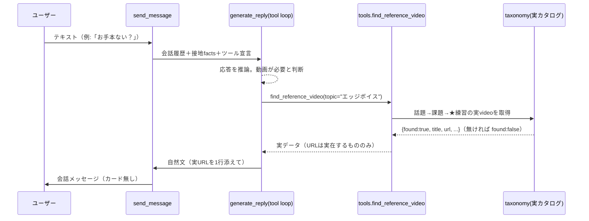

# ソラ先生「AI主導＋ツール呼び出し」設計書

## 0. 背景・目的
現状のチャット応答は、会話文そのものは LLM 生成だが、**動画/お手本の提示だけがルールベースの短絡経路**（`is_video_request` → `handle_video_request`）で処理されている。この決定論的経路が以下の「見当違い／カンペ感」を生んでいる。

- 話題語（`TOPIC_KEYWORDS`）に無い言葉（例: エッジボイス）を拾えず、`current_task` にフォールバックして**無関係な練習動画**を返す。
- 「良い例ある？」のように VIDEO_KW を含まない言い回しは動画経路に乗らない。
- コーチ自身が出した話題（「エッジボイスを混ぜると…」）を指す**照応**（「お手本ない？」だけ）は、`detect_topic_task` が user 発言のみ走査するため復元できない。

一方で、決定論を単純に外して「LLM に自由回答させる」と、**実在しない YouTube URL の捏造**や**測っていない解析数値の捏造**を招く（docs/42 で「無い数値・秒数を作らない＝絶対厳守」と定めた生命線に反する）。

**本設計の目的**: 会話の主導権を LLM に完全に渡して自然文で必ず返せるようにしつつ、"事実"（動画リンク・解析数値）は**ツール呼び出しで実データだけを供給**し、捏造を構造的に不可能にする。

## 1. システム構成

### 関係コンポーネント
| コンポーネント | 変更 | 役割 |
| --- | --- | --- |
| `app/api/v1/endpoints/coach.py` `send_message()` | 改 | `is_video_request` 短絡を撤去。全テキストを LLM 会話経路へ一本化 |
| `app/coaching/llm.py` `generate_reply()` | 改 | function calling ループ化。ツールを宣言し、モデルのツール呼び出しに応答して最終文を得る |
| `app/coaching/tools.py` | 新 | ソラ先生が呼べるツール群（実データ取得）の実装＋Gemini 宣言 |
| `app/coaching/rule_engine.py` `TOPIC_KEYWORDS`/`detect_topic_task` | 流用 | ツール内部の話題→課題マッピングとして再利用（削除しない） |
| `app/coaching/llm.py` 各 scrubber | 増 | 捏造ガードに「カタログ外URL除去」を追加 |

### データフロー（テキスト質問）


## 2. アーキテクチャ判断

### 採用: LLM function calling（AI主導＋ツール）
- **理由**: 「自然文で必ず返す」と「事実の捏造ゼロ」を両立できる唯一の形。会話・意図解釈・話題の照応解決は LLM の得意領域に任せ、"実在する URL / 実測値" だけを決定論のツールが供給する。
- **照応が解ける**: LLM は会話履歴（自分の「エッジボイス」発言含む）を文脈として持つため、「お手本ない？」だけでも topic を推論して `find_reference_video("エッジボイス")` を呼べる。ルールベースでは原理的に無理だった問題が構造的に解消する。
- **キーワード総当たりの撤廃**: `TOPIC_KEYWORDS` はツール内部の lookup として残すが、"入口の分岐" ではなくなるため、語彙漏れが即"見当違い"に直結しなくなる。

### 検討した代替案
| 案 | 却下理由 |
| --- | --- |
| ルール撤廃＋LLM自由回答 | 動画URL・解析数値を捏造する。docs/42 の絶対厳守に反する |
| 語彙拡張だけ（keyword を足し続ける） | 照応・言い換えに無限に負け続ける。対症療法 |
| すべての応答を1回のプロンプトに facts 全部盛り | 現状これ。事実は守るが"意図に応じて実データを引く"制御ができず、テンプレ発火・見当違いが残る |

### トレードオフ
- **レイテンシ/コスト**: ツール往復が入ると LLM 呼び出しが最大2回になる（宣言→ツール→最終文）。雑談は `gemini-flash-lite-latest` で軽く、タイムアウト時は後述フォールバック。ツール呼び出しが無い普通の質問は1回のまま。
- **複雑度**: ツールループの実装が増える。ただしツールは1〜2個から始める MVP とし、宣言と実装を `tools.py` に閉じる。

## 3. ツール仕様（MVP: 1個から）

### `find_reference_video(topic: str) -> dict`
話題文字列から、実在する参考練習動画と練習手順を返す。**捏造しないための唯一の動画ソース**。
- 入力: `topic`（自由文。例 "エッジボイス" "高音" "ビブラート" "声帯の閉じ"）
- 内部: `rule_engine.detect_topic_task(topic)` で課題IDへ写像 → `get_task().practices[0]` の実 `video`（title/url）と手順を取得
- 返り値:
  ```json
  {"found": true, "task_label": "息漏れを減らす（声帯の閉じ・効率）",
   "practice_name": "ストロー発声（SOVT）", "steps": ["…","…"],
   "video_title": "リップロール／ストローのやり方と練習法",
   "video_url": "https://www.youtube.com/watch?v=…"}
  ```
  - 該当が無ければ `{"found": false}` を返す。→ LLM は自然に「今はぴったりの手本が手元に無い」と正直に伝えるか、話題を1つ確認する（**カンペ的な定型フォールバックは廃止**）。
- 制約: `video_url` は必ずカタログ（`taxonomy.py`）に実在するものだけ。ツールが URL を生成することはない。

### 将来ツール（本設計では宣言のみ・任意）
- `get_analysis_metric(name)`: 解析数値を1つ返す（現状は接地 context で供給済みのため MVP では不要。数値質問が増えたら切り出す）。

## 4. `generate_reply` のツールループ

```
1. contents = 会話履歴 ＋ 現在ターン枠（docs 既存の「新しい録音ではない」枠）＋ 接地facts
2. config.tools = [find_reference_video 宣言]
3. resp = generate_content(...)
4. while resp が function_call を含む:
     result = dispatch(function_call)          # tools.py 実装を実行
     contents += [function_call, function_response(result)]
     resp = generate_content(...)              # 最大 N=2 回でループ打ち切り
5. text = resp.text → 既存 scrubber 群 → 返す
```
- **ループ上限 N=2**（暴走・レイテンシ防止）。上限到達時はその時点の text かフォールバック文。
- **タイムアウト/失敗**: 既存どおり None を返し、`rule_engine` 側の正直フォールバック文へ（会話を止めない）。

## 5. 捏造ガード（既存＋追加）
| ガード | 既存/追加 | 内容 |
| --- | --- | --- |
| 秒数スクラブ | 既存 | facts に無い秒数を伏せる |
| 歌詞/母音スクラブ | 既存 | 英字「」や mm:ss の歌詞引用を除去 |
| カード約束スクラブ | 既存 | 「この後のカードに…」を除去 |
| **カタログ外URL除去** | **追加** | 応答中の URL のうち `taxonomy` に無いものを削除（ツール経由で得た実URLのみ許可）。二重の安全網 |

## 6. 移行 / 後方互換性
1. `send_message()` の `if is_video_request(...)` 短絡を**撤去**（全テキストを LLM 経路へ）。
2. `is_video_request` / `handle_video_request` / `TOPIC_KEYWORDS` / `detect_topic_task` は**残す**：
   - `detect_topic_task`/`TOPIC_KEYWORDS` はツール内部で流用。
   - `handle_video_request` は LLM 不可時（`llm_enabled=false`／タイムアウト）の**フォールバック経路**として温存（feature flag `settings.coach_tools_enabled` で切替）。
3. 音声FB経路（`generate_feedback` の2吹き出し診断）は**本設計の対象外**：解析は実測でありツール化不要。会話（チャット）と動画提示のみを対象とする。
4. skill 版（`.claude/skills/vocal-trainer`）は会話ループを持たないため影響なし。FB品質の正本 docs/42 のペルソナ・作法は不変（本設計は"事実供給の配管"の変更でありFB方針は変えない）。

## 7. エラーハンドリング方針
- ツール実行例外 → `{"found": false, "error": "..."}` を function_response に載せ、LLM は正直に「今は出せない」と返す（500 を投げない）。
- ループ上限到達 → 最後の text かフォールバック。
- LLM/ネットワーク失敗 → 既存フォールバック（`handle_text` の正直文）。

## 8. 性能・可用性
- 通常質問（ツール無し）: LLM 1回（現状維持）。
- 動画要求（ツール有り）: LLM 2回。`flash-lite` かつ `thinking_budget=0` で軽量。`llm_coach_wait_sec` 相当の待ち上限を維持。
- feature flag `coach_tools_enabled` で即時ロールバック可能。

## 9. セキュリティ考慮
- ツールは読み取り専用（カタログ参照のみ）。副作用・外部書き込み無し。
- URL は自前カタログ由来のみ許可（カタログ外URL除去ガードで担保）。プロンプトインジェクションで外部URLを吐かせる経路を塞ぐ。

## 10. テスト方針（QA連携）
- 単体（hermetic, LLM無効）:
  - `tools.find_reference_video` が topic→実video を返す／未該当で `found:false`。
  - カタログ外URL除去スクラブが機能する。
  - `send_message` から `is_video_request` 短絡が消え、テキストは会話経路に入る。
- 実Gemini e2e（`GEMINI_API_KEY` を source）:
  - 「エッジボイスのお手本ない？」→ モデルが `find_reference_video` を呼び、**実URL**を含む自然文を返す（見当違いの喉トレ動画にならない）。
  - 照応「お手本ない？」（直前にコーチがエッジボイス言及）→ topic を推論して実URLを返す。
  - 動画不要の質問→ツールを呼ばず1往復で自然文。
  - 捏造テスト: 存在しない話題→でっち上げURLを出さない（found:false→正直文）。

## 11. 実装ハンドオフ
- 担当: `backend-engineer`（`tools.py` 新規、`llm.generate_reply` ループ化、`coach.py` 短絡撤去、scrubber追加、feature flag）。
- 続いて `qa-engineer`（上記テスト計画の実装と実Gemini e2e）。
- FB品質基準（docs/42）変更なし。ペルソナ・観点・作法は不変。
