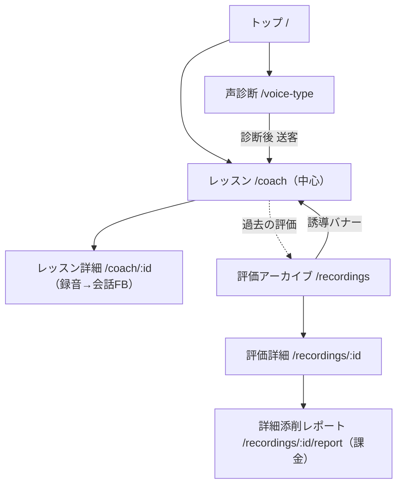

# 49. デザイン仕様 — IA統合（coach中心への一本化）

> docs/48 の論点4裁定「coach を単一の主役に確定し、recordings を段階的に畳む」を、
> 画面遷移とUI仕様に落とす。録音→FBの導線を coach に一本化し、recordings は
> 「過去の評価アーカイブ＋詳細添削レポート（課金面）」に役割を絞る。

- 作成: 2026-06-30 / UXデザイナー
- 関連: docs/48（裁定）, docs/35（課題）, docs/10（会話型FB）, docs/31（課金）, PR #107

## 1. ユーザーゴール
- 「歌を録って・FBをもらって・直して・また録る」を **coach の1本道** で迷わず回す。
- 過去の評価と詳細添削（課金価値）は、coach から地続きで辿れる。

## 2. ターゲットIA（1つの中心＋2つの補助）

```
中心:  coach（会話型レッスン） ← 録音→FBの正規ルート
補助1: voice-type（声診断）    ← 集客の入口。診断後 coach へ送客
補助2: recordings             ← 過去評価のアーカイブ＋詳細添削レポート（課金面）。新規録音入口は持たない
```

## 3. 画面一覧（変更点）

| ID | 画面名 | パス | 変更 |
| --- | --- | --- | --- |
| SCR-IA-1 | 共通ヘッダー | `AppHeader` | ホームリンクを `/recordings` → **`/coach`** に変更 |
| SCR-IA-2 | レッスン一覧 | `/coach` | （変更なし・主役）録音導線の中心。任意で「過去の評価」入口を追加可 |
| SCR-IA-3 | 評価アーカイブ | `/recordings` | 「新規アップロード」CTAを撤去し、**読み取り専用アーカイブ**化＋coach誘導バナー |
| SCR-IA-4 | 単発アップロード | `/recordings/new` | UI動線から外す（直リンクは生かすが、ナビ・ボタンから到達不可に） |
| SCR-IA-5 | 評価詳細 | `/recordings/[id]` | 「次にできること」は維持。ヘッダー戻り先は coach 基点に整合 |
| SCR-IA-6 | 詳細添削レポート | `/recordings/[id]/report` | 役割維持（課金面）。coach から接続できるよう導線整理 |

## 4. 画面ごとの仕様

### SCR-IA-1: 共通ヘッダー（AppHeader）
- **変更**: ロゴのリンク先を `/coach` に。主役へ常に1クリックで戻れる。
- 影響: recordings 系4画面すべてのホーム導線が coach に向く。

### SCR-IA-3: 評価アーカイブ（/recordings）
- **目的**: 過去の単発評価を見返す場。新規録音はここでは始めない。
- **主要要素**:
  - 見出し「評価アーカイブ」（旧「評価履歴」）。
  - 先頭に **誘導バナー**（情報トーン・glass）:「録音は『レッスン』から。会話しながらFBをもらえます 🎤 → レッスンへ」 （CTA: `/coach`）。
  - 過去評価リスト（既存カード）。
- **撤去**: 右上「＋ 新規アップロード」ボタン（→ coach へ集約）。
- **状態**:
  - empty: 「まだ評価がありません。まずは『レッスン』で1曲歌ってみましょう」＋CTA `/coach`（`/recordings/new` ではなく coach へ）。
  - loading/error: 現状維持（skeleton／親切文言＋再試行）。
- **コピー**: バナー本文は「履歴を消したわけではない」安心感を出す。命令形を避ける。

### SCR-IA-5: 評価詳細（/recordings/[id]）
- 「次にできること 🎯」カード（PR #107）を維持。
- 「← 一覧へ戻る」は「← 評価アーカイブへ」に文言整合（任意）。

### SCR-IA-6 連携: coach → 詳細添削レポート（T-2）
- **狙うUX**: coach セッションで録った歌のFB後、「この録音を詳細添削する（プレミアム）」で
  `report` 体験に入れる。
- **⚠️ 依存（architect/backend へ申し送り）**: 現状 coach（会話型）と recordings（単発評価＋report）は
  データが分断（coach 詳細は recordings/report と未接続）。この接続には
  「coachの録音を recording として保存し report パイプラインに渡す」バックエンド設計が必要。
  **本デザイン仕様では UX目標と導線位置のみ定義し、実装可否は architect 判断**とする。
  → 暫定: T-2 は「coach 詳細に “詳細添削（準備中/プレミアム）” のプレースは置かず、
  まずは T-1/T-3（入口の一本化）を先行」。接続は別フェーズ。

## 5. 画面遷移図



- **旧導線（廃止）**: `/recordings` →（＋新規アップロード）→ `/recordings/new`。

## 6. デザイントークン
- 既存ブランドトークンを踏襲（`bg-studio` / `brand-gradient` / `glass` / `rounded-3xl` / `shadow-card`）。
- 誘導バナー: `glass` ＋ `ring-1 ring-brand-100`、CTAは `text-brand-600 font-bold`（圧の弱い補助導線）。

## 7. アクセシビリティ要件
- 誘導バナーCTAはリンクロールで keyboard 到達可、コントラスト比 4.5:1 以上。
- ヘッダーのホームリンク変更後も `aria` ラベル整合（ロゴ＝ホーム＝レッスン）。

## 8. スコープ外（今回やらない）
- recordings の物理削除・DBスキーマ統合（docs/48 で別フェーズ）。
- coach→report のデータ接続（T-2、architect 設計待ち）。

---

## 実装チケット対応（docs/48 T-1〜T-3）
- **T-1**: AppHeader ホーム→`/coach`、`/recordings` の「＋新規アップロード」撤去。
- **T-3**: `/recordings` を「評価アーカイブ」化（見出し・誘導バナー・empty文言を coach 誘導に）。
- **T-2**: coach→report 接続は architect 申し送り（本仕様では位置のみ）。
