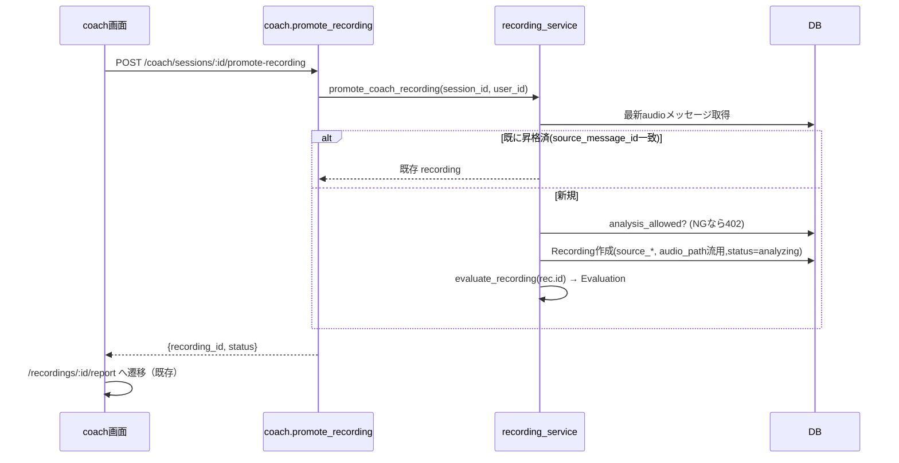

# 50. 設計書 — coach録音の詳細添削レポート接続（T-2）

> docs/48 論点4 / docs/49 T-2 の実装設計。会話型レッスン（coach）で録った歌から、
> 既存の「詳細添削レポート（課金資産）」へ地続きで入れるようにする。録音→FBの主役を
> coach に寄せても、課金の主価値を失わないための“橋渡し”。

- 作成: 2026-06-30 / アーキテクト
- 関連: docs/48, docs/49, docs/31（課金 FR-04）, docs/38（会話型FB）, PR #107

## 1. システム構成

### 現状の分断
| 系 | 録音の持ち方 | 評価 | レポート |
| --- | --- | --- | --- |
| coach | `chat_messages.audio_path`（type=audio）＋ `chat_sessions.last_analysis` | 会話型FB（スコア化しない） | なし |
| recordings | `recordings.audio_path` | `evaluations`（pitch/rhythm/expression/total＋feedback_text） | `evaluations.detailed_report`（課金） |

レポート生成 `generate_report(db, evaluation_id, title, note)` は **Evaluation を起点**にする。
coach 側には Evaluation が無いため、現状 coach から report に入れない。

### 方針：coach録音を Recording へ「昇格」して既存パイプラインに乗せる
```mermaid
flowchart LR
  CM[chat_messages(type=audio)\naudio_path] -->|promote| REC[recordings\n(source_message_id)]
  REC -->|evaluate_recording 再利用| EV[evaluations]
  EV -->|既存 generate_report| REP[detailed_report（課金）]
  REP --> UI[/recordings/:id/report]
```

## 2. アーキテクチャ判断

| 論点 | 採用 | 代替 | 理由 |
| --- | --- | --- | --- |
| 橋渡し方式 | **A: coach音声を Recording に昇格し `evaluate_recording` を再利用** | B: `last_analysis` から Evaluation を直接合成 | Aは既存の評価→レポート資産を無改修で再利用でき確実。Bは解析JSON形状に密結合し実装/回帰コスト大。CPU再解析はBへ将来最適化可 |
| 重複防止 | `recordings.source_message_id` を一意キーに dedup（既存あれば返す） | 毎回新規作成 | 二重作成・月次解析上限の二重消費を防ぐ（冪等） |
| トレーサビリティ | `source_session_id` / `source_message_id` を recordings に追加 | 持たない | どのレッスンの録音由来かを後追い可能に |
| 課金境界 | レポート閲覧は既存 `_require_report_access`（PREMIUM_REQUIRED）を踏襲 | 昇格自体を有料に | 既存の課金面（forbidden ティザー）に素直に乗る。無料は昇格→forbidden→アップグレード |

## 3. API設計

### 新規: coach録音の昇格
`POST /api/v1/coach/sessions/{session_id}/promote-recording`

- 認証: 必須（`get_current_user`）。session の所有者のみ。
- 対象: 当該セッションの **最新の audio メッセージ**（無ければ 409）。
- 冪等: 同 `source_message_id` の Recording があればそれを返す（新規作成しない）。
- 月次上限: 新規作成時のみ `analysis_allowed` を確認（超過は 402 LIMIT_REACHED）。

| 状態 | レスポンス |
| --- | --- |
| 新規/既存 | `200 {"recording_id": int, "status": "analyzing"|"done"}` |
| audioメッセージ無し | `409 {code: "NO_AUDIO", message: "このレッスンにはまだ録音がありません"}` |
| 月次上限 | `402 LIMIT_REACHED`（フロントはアップグレード導線） |
| 非所有/未存在 | `404` |

### 既存（無改修で再利用）
- `POST /api/v1/recordings/{id}/report` … 生成開始（premium gate）
- `GET  /api/v1/recordings/{id}/report` … 取得（premium gate）

## 4. DBスキーマ変更

`recordings` に2列追加（いずれも nullable・後方互換）:

| 列 | 型 | 制約 | 用途 |
| --- | --- | --- | --- |
| `source_session_id` | int FK(chat_sessions.id) | nullable, index | 由来レッスン |
| `source_message_id` | int FK(chat_messages.id) | nullable, **unique** | 由来音声＝冪等キー |

- **マイグレーション**: 新規 Alembic リビジョン（`down_revision = 'f3a9b1c2d7e8'`）。
  `op.add_column` × 2 ＋ unique 制約。既存行は NULL（単発アップロード由来）。

## 5. モジュール構成

- `app/api/v1/endpoints/coach.py`: `promote_recording` ハンドラ追加（薄い）。
- `app/services/recording_service.py`（既存 `evaluate_recording` の置き場）に
  `promote_coach_recording(db, session_id, user_id) -> Recording` を追加し、
  「最新audio取得 → dedup確認 → Recording作成（audio_path流用）→ evaluate_recording 呼び出し」を集約。
  - 層を守る: endpoint は service を呼ぶだけ。models 直接操作は service に閉じる。
- `app/models/recording.py`: 2列＋ relationship（任意）。

> 音声ファイルは **コピーせず audio_path を共有参照**（同一ユーザー資産・読み取りのみ）。
> 削除整合は将来課題（recordings 物理削除は docs/48 でスコープ外）。

## 6. シーケンス



## 7. エラーハンドリング
- 共通形式 `{code, message, details, request_id}` を踏襲（既存例外ハンドラ）。
- `NO_AUDIO`(409) / `LIMIT_REACHED`(402) / `404`。評価失敗は recording.status で表現（既存踏襲）。

## 8. 性能・可用性
- 再解析は `evaluate_recording`（BackgroundTasks）で非同期。昇格APIは即 `analyzing` を返す。
- 冪等キーで連打・再訪時の二重解析を防止（CPU保護）。

## 9. セキュリティ
- session/recording とも所有者チェック必須。audio_path はユーザー資産のみ参照。
- レポート本文は premium gate 維持（無料は内容を見せない）。

## 10. テスト方針（QA連携）
- TC: 昇格→recording+evaluation 生成（成功）。
- TC: 同セッション2回昇格で **recording_id 不変**（冪等・上限二重消費なし）。
- TC: audio無しセッション→409。月次上限→402。
- TC: 無料ユーザーで report は forbidden（PREMIUM_REQUIRED）、premium で ready。
- hermetic 化が難しい解析部は service の dedup/分岐を単体で、評価部は既存統合に委ねる。

## 11. 移行・後方互換
- 追加列は nullable。既存の単発アップロード recordings は `source_*`=NULL のまま不変。
- 既存 report エンドポイントは無改修。フロントの `/recordings/:id/report` も不変。
- T-1/T-3（PR #107）と非競合。本設計は別PR（backend）で実装するのが安全。

---

## 実装ハンドオフ
- **backend-engineer**: §4 マイグレーション ＋ §5 `promote_coach_recording` ＋ §3 エンドポイント。
- **frontend-engineer**: coach セッション詳細に「詳細添削する（プレミアム）」ボタン → promote → `/recordings/:id/report` 遷移。402時は UpgradeModal(`source="report"`)。
- **qa-engineer**: §10 をテスト計画化（冪等・課金境界が肝）。
