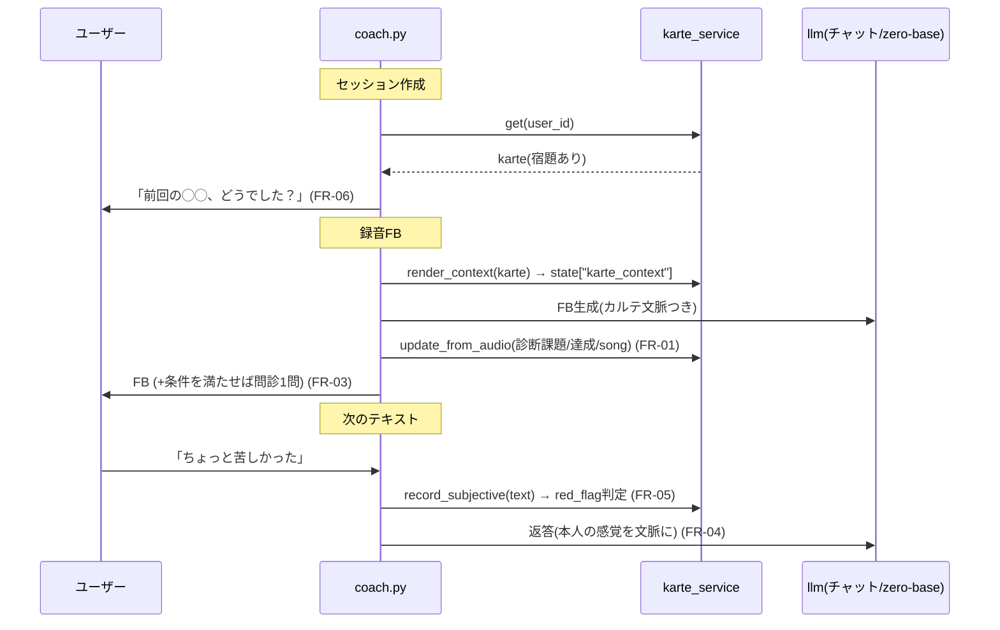

# 生徒カルテと主観問診 設計書

要件: docs/53（FR-01〜06 / AC-01〜09）。前提: docs/02（基本設計）, docs/42（FB品質・不変）, docs/43/52（zero-base FB）。

## 1. システム構成

| コンポーネント | 新規/改 | 責務 |
| --- | --- | --- |
| `app/models/karte.py` | 新 | `StudentKarte` モデル（user_id 一意・JSON中心） |
| `app/services/karte_service.py` | 新 | カルテの取得/アップサート/要約レンダリング/問診記録/レッドフラグ判定 |
| `app/api/v1/endpoints/coach.py` | 改 | 録音FB後のカルテ更新＋問診発火、テキスト受信時の問診回答取り込み、セッション作成時の引き継ぎ挨拶 |
| `app/coaching/llm.py build_session_context` | 改 | `state["karte_context"]` があれば「この生徒について」ブロックを注入（チャットと zero-base evidence の両方に効く単一注入点） |
| `app/coaching/rule_engine.py initial_messages` | 改 | カルテ（宿題・前回サマリ）を受けた引き継ぎ挨拶（LLM文・失敗時定型） |
| `app/models/coaching.py ChatSession` | 改 | 問診の会話状態 2カラム追加 |
| Alembic | 新 | `student_kartes` 作成＋ `chat_sessions` 2カラム追加（1リビジョン） |

### データフロー


## 2. アーキテクチャ判断
- **カルテは JSON カラム中心の1テーブル**: 項目は進化前提（docs/53 Q1-Q3 未決）。正規化テーブル群は過剰設計。既存の `baseline_analysis: JSON` と同じ流儀。SQLite(本番)/MySQL両対応の `sa.JSON`。
- **注入点は `build_session_context` の1箇所**: チャット・zero-base evidence の共通土台（docs/43 で DRY 済み）。両経路に同時に効き、docs/42 の接地ルール配下に入る。
- **問診の会話状態はセッションに持つ**（カルテでなく）: 「最大2回/連続ターン禁止/次のテキストを回答扱い」はセッション内の会話制御であり、永続の生徒情報ではない。
- **追加LLM呼び出しゼロ**（docs/53 非機能）: 集計・要約・問診文・レッドフラグは全てルールベース。引き継ぎ挨拶のみ既存 `_llm_or`（フォールバック定型つき）を許可。
- **feature flag**: `enable_student_karte: bool = True`。false で全フック無効＝現行動作（即ロールバック）。
- **代替案**: (a) ユーザー別ベクタDB/RAG → 過剰。(b) カルテ更新を非同期ジョブ → 単一コンテナ・低頻度で不要。同期1アップサートで足りる（FR-01 例外: 失敗はログのみ）。

## 3. API設計
新規エンドポイントなし（MVPはUI無し、docs/53 3.2）。既存 `/coach/sessions*` の応答形は不変。

## 4. DBスキーマ
### `student_kartes`（新規）
| カラム | 型 | 制約 | 内容 |
| --- | --- | --- | --- |
| id | INTEGER | PK | |
| user_id | INTEGER | FK users.id **UNIQUE** index, ondelete=CASCADE | 1ユーザー1件（AC-07） |
| voice | JSON | nullable | {f0_min_hz, f0_max_hz, voice_type} 実測の集約 |
| tendencies | JSON | nullable | {task_id: 回数} 診断課題の頻度 |
| practice_history | JSON | nullable | [{task_id, practice, result(pass/retry/switch), at}] 直近10件 |
| homework | JSON | nullable | {task_id, practice_name, assigned_at} |
| subjective_notes | JSON | nullable | [{at, note(≤120字), red_flag(bool)}] 直近5件 |
| last_summary | VARCHAR(300) | nullable | 前回サマリ（ルール生成1〜2行） |
| last_session_at | DATETIME | nullable | FR-06 の30日判定に使用 |
| created_at / updated_at | DATETIME | not null | 既存流儀 |

### `chat_sessions` 追加カラム
| カラム | 型 | 既定 | 内容 |
| --- | --- | --- | --- |
| checkin_count | INTEGER | 0 | このセッションで問診した回数（上限2, AC-05） |
| awaiting_checkin | VARCHAR(30) | NULL | 直前に出した問診の種類（null=待ちなし）。次のテキストを回答として取り込む |

### マイグレーション方針
1リビジョン（autogenerate + 手修正）。ロールバックは downgrade でテーブル/カラム削除。既存データ影響なし（додってすべて additive）。本番は自動適用（docs/55（本番運用メモ・旧35）の段取りどおり）。

## 5. モジュール構成（責務）
```
app/services/karte_service.py
  get_or_none(db, user_id) -> StudentKarte | None
  render_context(karte) -> str            # ≤500字「この生徒について」ブロック（FR-02）
  update_from_audio(db, user_id, *, diagnosed_task, achieved, song_title, analysis)  # FR-01
  assign_homework(db, user_id, task_id, practice_name)                               # FR-01
  record_subjective(db, user_id, text) -> {"red_flag": bool}                         # FR-03/05
  should_ask_checkin(session, context) -> str | None   # 発火判定→問診文の種類（FR-03）
  checkin_question(kind) -> str                        # 問診文（定型・1問）
  RED_FLAG_RE                                          # 痛い/ヒリヒリ/枯れ/かすれ/血/出なくなった 等
  session_opener_context(karte, now) -> dict | None    # FR-06（宿題 or 30日ぶり）
```
- `coach.py` はフックのみ（層を守る: endpoints → services）。カルテ更新は try/except で FB を止めない（AC-08）。
- `build_session_context`: `state.get("karte_context")` が truthy なら冒頭に注入。**過去の傾向は断定材料にしない**注意書きを添える（docs/53 FR-02）。
- 問診回答の red_flag 時: 返答は voice-health 方針の定型（休声＋2週間目安の受診案内）を優先し、当該セッションの `avoid_task` に高負荷系を設定（既存フィールド流用）。

## 6. シーケンス（問診の状態遷移）
`awaiting_checkin` が NULL 以外の状態で `send_message` が来たら: 回答として記録 → NULL に戻す → 通常のチャット返答（文脈に主観メモ入り）。ユーザーが録音や別話題を送ったら**取り込まず** NULL に戻す（深追いしない, FR-03 例外）。

## 7. エラーハンドリング方針
- カルテ read/write 失敗: WARNING ログ＋処理続行（FBは返す, AC-08）。
- JSON パース不整合（旧スキーマ）: 該当フィールドを None 扱いで自癒（書き戻し時に再構築）。
- レッドフラグ誤検知: 安全側（検知したら案内する）。医療断定はしない。

## 8. 性能・可用性
- 追加クエリ: セッション作成+1 SELECT、録音FB +1 SELECT/UPSERT、問診回答 +1 UPSERT。SQLite で問題ない規模。
- プロンプト増: ≤500字（docs/53 非機能）。zero-base のトークン増 ≒ 数百＝原価影響 ¥0.01 未満/回。

## 9. セキュリティ・プライバシー
- カルテは個人データ: FK ondelete=CASCADE でアカウント削除と連鎖（AC-07）。エクスポート・閲覧APIは作らない（MVP）。
- 主観メモは自由文を要旨化して 120字で切り詰め（生ログを溜めない）。

## 10. テスト方針（QA連携）
- hermetic（LLM/DB込みは sqlite in-memory）: karte_service の update/render（500字上限・傾向カウント・履歴10件切り）、should_ask_checkin（初回/力み/達成後・上限2・連続禁止）、RED_FLAG_RE、opener（宿題/30日/初回）。
- 回帰: `test_conversational_fb`（21件）と `test_zero_base_gate`（7件）を全パス維持。
- AC-01〜09 は docs/53 の受け入れ基準どおり QA が検証。

## 11. 移行 / 後方互換性
- 全て additive。カルテ未作成ユーザー＝現行動作（AC-03）。`enable_student_karte=false` で完全に現行へ（即ロールバック）。
- skill 版（vocal-trainer）には影響なし（Web専用、docs/53 3.2）。
