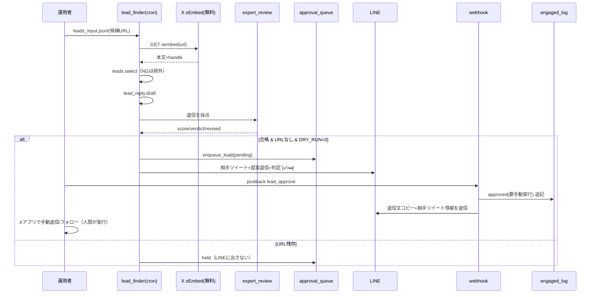

# Xリード獲得 半自動化 設計書

対象要件: `docs/55_機能要件書_Xリード獲得半自動化.md`
配置: 既存 `scripts/sns_autopost` の**双子パイプライン**として実装（投稿フローの資産を最大流用）。

> **改訂（ハイブリッド化）**: 初版は「有料検索を使わない（oEmbedのみ）」前提だったが、
> 2026年2月〜の従量課金（post read $0.005・user read $0.010・owned read $0.001・24h重複排除）を
> 外部ソースで確認し、**read＝従量APIで自動化 / write＝人間の手動**のハイブリッドに改訂。
> 候補ソースは安い順に ①運用者ペースト(oEmbed・¥0) ②エンゲージ起点(owned read) ③API検索。
> read課金は日次予算ガード（`LEAD_DAILY_READ_BUDGET_USD` 既定0.60）で暴走を防ぐ。

## 1. システム構成

### 1.1 コンポーネント（新規／流用）
| 種別 | ファイル | 役割 |
| --- | --- | --- |
| 🆕 新規 | `leads.py` | クエリSSOT(`LEAD_QUERIES`)・選別基準・除外ワード。`themes.py` と同格の静的定義 |
| 🆕 新規 | `lead_reply.py` | 相手ツイート文脈から返信下書きを生成（Gemini→テンプレfallback） |
| 🆕 新規 | `lead_finder.py` | エントリ。入力(候補)→選別→返信生成→expert_review→承認キュー投入 or DRY表示 |
| 🆕 新規 | `lead_metrics.py` | `engaged_log.jsonl` × 自フォロワー一覧 → クエリ別フォロバ率 |
| ♻ 流用 | `expert_review.py` | 返信下書きの採点ゲート（返信文脈で再利用。URL混入は即失格） |
| ♻ 拡張 | `approval_queue.py` | レコードに `kind`("post"/"lead") を追加。lead用フィールドを持たせる |
| ♻ 拡張 | `webhook.py` | postback action に `lead_approve` / `lead_skip` を追加 |
| ♻ 流用 | `line_client.py` | LINE push（承認カード送信・結果返信） |
| ♻ 流用 | `fetch_metrics.py` の OAuth基盤 | 自フォロワー一覧の取得（低コスト読取）にセッション生成を共用 |

### 1.2 データフロー
```mermaid
flowchart TD
  S1[①運用者ペースト: leads_input.jsonl\noEmbedで本文取得(¥0)] --> F[lead_finder.py]
  S2[②エンゲージ起点: 自投稿へのメンション\nowned read ≒$0.001/件] --> F
  S3[③API検索: LEAD_QUERIES 日替わりローテ\npost read $0.005/件] --> F
  F --> SEL{leads.select\n言語/文脈/相互除外/重複除外}
  SEL -->|本文通過(検索組)| HYD[遅延lookup: user read $0.010/件\nフォロワー数/bio→再選別]
  BUDGET[ReadMeter: 日次予算ガード\nLEAD_DAILY_READ_BUDGET_USD] -.超過で停止.-> F
  HYD --> GEN[lead_reply.draft\nGemini→テンプレ]
  SEL -->|通過(①②)| GEN
  GEN --> SIM{too_similar\n同文連投の検出}
  SIM -->|酷似| DROP2[破棄]
  SIM -->|OK| GATE{expert_review.review_lead_reply\n>=80? URL/誘導ワード無し?}
  GATE -->|合格/最良版| Q[(approval_queue\nkind=lead)]
  GATE -->|URL/誘導ワード| DROP3[破棄: LINEに出さない]
  Q -->|DRY_RUN=0| LINE[LINE: 相手ツイート+提案返信+判定\n✅返信する / ⏭スキップ]
  LINE -->|✅postback lead_approve| LOG[(engaged_log.jsonl\napproved: 要手動実行)]
  LOG --> COPY[LINEに返信文コピー+相手ツイート導線を返信]
  LINE -->|⏭postback lead_skip| SK[skipped記録]
  LOG -.週次.-> M[lead_metrics.py\nクエリ別フォロバ率]
  COPY --> HUMAN[運用者がXアプリで手動返信/フォロー ← 行為は常に人間]
```

## 2. アーキテクチャ判断

### 2.1 探索コストの最小化（ハイブリッドの中核判断）
- **事実（確認済み単価）**: 2026年2月〜のX APIは従量課金が既定。post read **$0.005/件**（検索は返ってきたポスト数で課金）・user read **$0.010/件**・owned read（自投稿/自フォロワー/メンション等）**$0.001/件**・同一リソースは24時間(UTC日)内で重複排除・月額下限なし（クレジット前払い最低$5）。旧Basic($200)/Pro($5000)は新規不可。
- **判断（コストを絞る3点セット）**:
  1. **エンゲージ起点を最優先ソースに**: 自投稿へのメンション/リプは owned read（検索の1/5のコスト）で読め、すでに興味を示した最高熱度のリード。
  2. **遅延lookup**: user read（$0.010）は本文選別を**通過した候補だけ**に実行。検索結果全員のプロフィールを引かない。
  3. **日次予算ガード**: `LEAD_DAILY_READ_BUDGET_USD`（既定0.60 ＝ 月上限≒$18）。概算メーター（`ReadMeter`）が `lead_reads_log.jsonl` に日別累計を記録し、到達したら以降の検索・lookupを止める。
- **oEmbed（無料・無認証）は運用者ペースト方式として存続**: API不調・予算消化時のフォールバック、およびXアプリで見つけた「これは」という候補の手動投入経路。oEmbedは本文＋handleのみでフォロワー数を含まないため、`followers` は任意入力（無ければ当該条件スキップ）。
- **代替案と却下理由**:
  - (a) 検索リクエストに expansions を付けてuser情報を同時取得 → 全候補分のuser readが載り、遅延lookupより高い。却下。
  - (b) HTMLスクレイピングでフォロワー数取得 → 規約リスク＆脆い。却下。
  - (c) フルAPI自動（write含む・案C）→ バン主因。恒久却下（要件§3.2）。

### 2.2 承認キューを分離せず `kind` で相乗り
- 既存 `approval_queue.py` / `webhook.py` / `line_client.py` を**そのまま拡張**し、レコードに `kind`("post"|"lead") を足す。理由: 承認・postback・LINE送信の実績あるコードを二重化しない。lead固有データは同レコードに `lead` オブジェクトで持たせる。
- トレードオフ: 1ファイルの分岐が増える。→ `_handle_postback` は先頭で `kind`/`action` により早期分岐し、投稿用ロジック(`approve`/`reject`)と混ざらないようにする。

### 2.3 行為の自動実行を持たない（設計上の不変条件）
- `lead_finder` / `webhook` は **X API への `POST /2/tweets`（返信）や follow エンドポイントを一切呼ばない**。`lead_approve` は `engaged_log` への記録＋返信文の再表示のみ。実際の返信/フォローは運用者がXアプリで手動。
- リード獲得系で許可するX API呼び出しは **readのみ**: 検索（`lead_finder`）・user lookup（遅延、`lead_finder`）・自アカウント読取＝メンション/フォロワー一覧（`lead_finder`/`lead_metrics`）。いずれも日次予算ガードの管理下。

## 3. インターフェース設計（CLI / postback）

### 3.1 `lead_finder.py`（cron/手動）
```
python lead_finder.py --dry-run                    # 生成のみ表示（既定の安全側）
python lead_finder.py --input leads_input.jsonl    # ペースト方式（¥0）を併用
python lead_finder.py                              # メンション＋API検索（要Xキー）
python lead_finder.py --no-search --no-mentions    # ソースを個別に無効化
```
- 候補ソースは安い順に ①`--input`（oEmbed・¥0）②メンション（owned read）③API検索（post read。クエリは日替わりローテーション、`LEAD_QUERIES_PER_RUN` 本/回）。
- 入力 `leads_input.jsonl`（運用者ペースト方式・1行1候補）:
  ```json
  {"url": "https://x.com/<user>/status/<id>", "query_id": "highnote", "followers": 420}
  ```
  `followers` は任意（省略可）。`query_id` は `LEAD_QUERIES` のid。
- 環境変数（既存規約に追加）:
  | 変数 | 既定 | 意味 |
  | --- | --- | --- |
  | `DRY_RUN` | 1 | 1で表示のみ（安全側） |
  | `MAX_LEADS_PER_DAY` | 10 | 当日LINE提示する上限（安全側の既定。要件Q-04） |
  | `LEAD_FOLLOWERS_MIN` | 30 | フォロワー下限（値が取れた候補のみ適用） |
  | `LEAD_FOLLOWERS_MAX` | 3000 | フォロワー上限（同上） |
  | `LEAD_EXCLUDE_KEYWORDS` | 相互,フォロバ100,相互フォロー | 相互狙い除外ワード（カンマ区切り） |
  | `LEAD_DAILY_READ_BUDGET_USD` | 0.60 | read課金の日次概算予算。到達で探索停止 |
  | `LEAD_QUERIES_PER_RUN` | 3 | 1回の実行で回す検索クエリ数 |

### 3.2 選別 `leads.select(candidate) -> (ok: bool, reason: str)`
判定順（1つでもNGで除外、理由を返す）:
1. 本文取得成功（oEmbed 200）か
2. 言語=日本語（かな/漢字比率の簡易判定）
3. `query_id.intent` と本文の整合（intentキーワード集合とのマッチ）
4. 相互狙いワード（本文/handle）に該当しない
5. `engaged_log` に同 handle が未記録（重複除外）
6. `followers` があれば `MIN<=followers<=MAX`（無ければ本条件スキップ＝理由に "followers:unknown(skipped)"）

### 3.3 postback（`webhook.py` 拡張）
| action | data例 | 処理 |
| --- | --- | --- |
| `lead_approve` | `action=lead_approve&id=<qid>` | `engaged_log` に `approved`(要手動実行)を追記→LINEに返信文コピー＋相手ツイートURL(運用者向け表示)を返す。**X APIは呼ばない** |
| `lead_skip` | `action=lead_skip&id=<qid>` | キュー該当を `skipped` に更新→LINEに「スキップしました」 |

## 4. データ設計

### 4.1 `approval_queue` レコード拡張（後方互換）
```jsonc
{
  "id": "…", "kind": "lead",          // 追加。既存postは "post"（未指定は "post" 扱い）
  "status": "pending|approved|skipped|held",
  "expert_note": "✅合格 84/80",
  "lead": {                            // kind=="lead" のときのみ
    "url": "https://x.com/…/status/…",
    "handle": "@user", "query_id": "highnote",
    "source_text": "高音がどうしても出ない…",   // oEmbed本文
    "followers": 420,                  // or null
    "reply_text": "…（URLなし・専門家ゲート通過版）"
  },
  "created_at": "…", "decided_at": ""
}
```
- 既存 `enqueue(...)` は `kind="post"` 既定の引数を追加し**シグネチャ後方互換**。lead投入用に薄い `enqueue_lead(lead: dict, expert_note, status)` を追加。

### 4.2 `engaged_log.jsonl`（新規・計測SSOT）
```jsonc
{"lead_id":"…","handle":"@user","query_id":"highnote",
 "reply_text":"…","status":"approved|skipped","approved_at":"…",
 "followed_back": null}   // lead_metrics が後日 true/false を埋める
```

## 5. モジュール責務
```
scripts/sns_autopost/
├── leads.py         # LEAD_QUERIES(SSOT), select(), 除外ワード, 言語/文脈判定
├── lead_reply.py    # draft()->(text, generated) (Gemini→テンプレ), strip_urls, too_similar(同文検出)
├── lead_finder.py   # 3ソース収集→select→遅延lookup→draft→同文検出→review_lead_reply→enqueue_lead/DRY表示, ReadMeter(予算)
├── lead_metrics.py  # engaged_log × 自フォロワー一覧(owned read) → query別フォロバ率
├── expert_review.py # [拡張] review_lead_reply(リード返信用ルーブリック。URL/誘導ワードはキー無しでも即失格)
├── approval_queue.py# [拡張] kind, enqueue_lead, engaged_log系(append/read/update), leads_today
├── line_client.py   # [拡張] push_lead_approval(承認カード), push_text(通知)
└── webhook.py       # [拡張] lead_approve / lead_skip 分岐（X書込みなし）
```
- **oEmbed取得**は `requests.get("https://publish.twitter.com/oembed", params={"url":url,"omit_script":1})`。無認証・無料。`author_url`/`html`(本文)を抽出。失敗時は当該候補を除外理由付きでスキップ。
- `lead_reply.draft` は返信に**歌手名を出さない**（正本外の名前をでっち上げるリスクの根絶）。生成物は必ず URL 除去フィルタを通す（保険）。

## 6. シーケンス（承認〜手動実行）


## 7. エラーハンドリング
| 事象 | 挙動 |
| --- | --- |
| oEmbed失敗(404/429) | 当該候補のみスキップ、理由ログ。実行は継続 |
| 通過0件 | 「本日は該当リードなし」をLINE通知して正常終了(exit 0) |
| `GEMINI_API_KEY`未設定/一時失敗 | 返信はテンプレ、expert_reviewは「未レビュー」明示でfail-open |
| LINE未設定/`DRY_RUN=1` | 標準出力に候補と返信を表示、記録・送信なし |
| 上限超過 | `MAX_LEADS_PER_DAY` で切り、切り捨て件数をlogに明示（無言trunc禁止） |

## 8. 性能・可用性
- 1実行の候補は数〜20件想定。oEmbed/Gemini/採点は逐次で十分（並列不要）。
- `webhook.py` は既存の常駐に相乗り（新プロセス不要）。

## 9. セキュリティ / 規約（バン安全性）
- **不変条件**: 探索・承認経路から X の書込みAPI（tweets/follow/DM）を**呼ばない**。grepで `api.twitter.com/2/tweets` 等の呼び出しが `lead_*` 経路に存在しないことをテストで固定（§10）。
- API利用は自フォロワー読取(`lead_metrics`)のみ。
- 1日提示上限・重複除外・相互狙い除外をコードで固定＝機械が暴走しない。
- oEmbedは公開エンドポイント（認証情報を渡さない）。`.env` の鍵は投稿/計測系のみ使用。

## 10. テスト方針（qa-engineer連携）
- **T-01(不変条件)**: `lead_finder`/`webhook`のlead経路が書込みX APIを呼ばない（monkeypatchで呼ばれたら失敗）。※AC-05
- **T-02(選別)**: 言語/フォロワーレンジ/相互ワード/重複の各NGケースが除外される。※AC-02
- **T-03(URL失格)**: 返信にURLを含む下書きが expert_review で reject され enqueueされない。※AC-03
- **T-04(上限)**: `MAX_LEADS_PER_DAY`超の入力で切捨て件数をlogに明示。※AC-04
- **T-05(DRY)**: `DRY_RUN=1` で副作用ゼロ。※AC-01
- **T-06(0件)**: 全除外時に exit 0＋通知。※AC-06
- **T-07(fail-open)**: Geminiキー無しで完走。※AC-07
- **T-08(計測)**: `lead_metrics` が query別率を出し、log外handleを混入しない。※AC-08
- **T-09(同文検出)**: 酷似返信の破棄・別文の通過。※FR-09
- **T-10(予算)**: ReadMeter の概算（post/user/owned の単価×件数）が正しい。※FR-08
- 実装済みハーネス: `tests/qa_leads.py`（27ケース。外部API/LINE/Gemini非依存で実行可）。

## 11. 移行 / 後方互換性
- `approval_queue` レコードに `kind` 追加。**未指定レコードは "post" 扱い**にフォールバックし既存投稿承認に影響なし。
- `webhook._handle_postback` は既存 `approve`/`reject` を変更せず、`lead_*` を新規分岐として追加。
- 新規env（`MAX_LEADS_PER_DAY`等）は既定値持ちで、未設定でも既存投稿フローに無影響。

---
**要約（1行）**: 既存 `sns_autopost` の承認・専門家ゲート資産を流用し、3ソース（ペースト/エンゲージ起点/API検索）＋遅延lookup＋日次read予算ガードで探索し、選別→返信生成→同文検出→採点→LINE承認→手動実行記録する「read従量・write人間」の双子パイプラインとして設計した。
**実装状況**: 実装済み（`leads.py`/`lead_reply.py`/`lead_finder.py`/`lead_metrics.py` 新規、`expert_review.py`/`approval_queue.py`/`line_client.py`/`webhook.py` 拡張、`tests/qa_leads.py` 27ケースPASS）。要件§9 Q-01〜Q-04は運用者確認済み。
