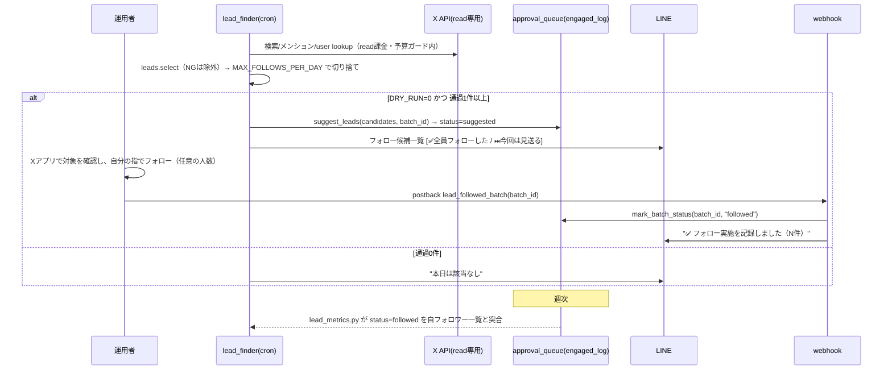

# Xフォロー候補 半自動化 設計書

対象要件: `docs/58_機能要件書_Xリード獲得半自動化.md`
配置: 既存 `scripts/sns_autopost` に同居（投稿フローのLINE/OAuth基盤を流用）。

> **改訂履歴**
> - 2026-07-02 初版: oEmbedのみ（有料検索なし）で「返信下書き＋専門家ゲート＋LINE個別承認」設計。
> - 2026-07-05 ハイブリッド化: 探索readを従量API併用に改訂（post read $0.005・user read $0.010・
>   owned read $0.001・24h重複排除）。候補ソースを①ペースト②エンゲージ起点③API検索の3段に。
> - **2026-07-06 方針転換（本改訂）**: 運用者フィードバックにより**返信文生成・返信用専門家ゲートを
>   廃止**。承認キュー(`approval_queue`)へのlead相乗りをやめ、**engaged_log.jsonlを直接SSOT**とする
>   バッチ提示方式に変更。1件ずつの[✅返信する/⏭スキップ]から、1日1回の
>   [✅全員フォローした/⏭今回は見送る]に変わった。`lead_reply.py`は削除、
>   `expert_review.review_lead_reply`系（`MAXES_LEAD`等）も削除済み。

## 1. システム構成

### 1.1 コンポーネント（新規／流用／削除）
| 種別 | ファイル | 役割 |
| --- | --- | --- |
| 🆕 新規 | `leads.py` | クエリSSOT(`LEAD_QUERIES`)・選別基準・除外ワード。`themes.py` と同格の静的定義 |
| 🆕 新規 | `lead_finder.py` | エントリ。3ソース収集→選別→バッチ生成→engaged_logへ記録→LINEダイジェスト送信 or DRY表示 |
| 🆕 新規 | `lead_metrics.py` | `engaged_log.jsonl`（status=followed）× 自フォロワー一覧 → クエリ別フォロバ率 |
| ❌ 削除 | ~~`lead_reply.py`~~ | 返信下書き生成。2026-07-06方針転換で廃止・ファイル削除 |
| ♻ 縮小 | `expert_review.py` | 投稿用ゲート(`review_and_gate`)のみ残存。リード返信用ルーブリックは削除済み |
| ♻ 拡張 | `approval_queue.py` | `enqueue_lead`系（旧kind="lead"）を削除し、`suggest_leads`/`suggested_today`/`mark_batch_status`（engaged_log直操作）を追加 |
| ♻ 拡張 | `webhook.py` | postback action を `lead_approve/lead_skip`（個別）から `lead_followed_batch/lead_skip_batch`（バッチ一括）に変更 |
| ♻ 拡張 | `line_client.py` | `push_lead_approval`（個別カード）を`push_lead_digest`（一覧＋チャンク分割）に置換 |
| ♻ 流用 | `fetch_metrics.py` の OAuth基盤 | 自フォロワー一覧の取得（低コスト読取）にセッション生成を共用 |

### 1.2 データフロー
```mermaid
flowchart TD
  S1[①運用者ペースト: leads_input.jsonl\noEmbedで本文取得(¥0)] --> F[lead_finder.py]
  S2[②エンゲージ起点: 自投稿へのメンション\nowned read ≒$0.001/件] --> F
  S3[③API検索: LEAD_QUERIES 日替わりローテ\npost read $0.005/件] --> F
  F --> SEL{leads.select\n言語/文脈/NEGATIVE_COMPOUNDS/相互除外/重複除外}
  SEL -->|本文通過(検索組)| HYD[遅延lookup: user read $0.010/件\nフォロワー数/bio→再選別]
  BUDGET[ReadMeter: 日次予算ガード\nLEAD_DAILY_READ_BUDGET_USD] -.超過で停止.-> F
  HYD --> CAP{MAX_FOLLOWS_PER_DAY\n上限で切り捨て}
  SEL -->|通過(①②)| CAP
  CAP --> REC[(engaged_log.jsonl\nsuggest_leads: status=suggested)]
  REC -->|DRY_RUN=0| LINE[LINEダイジェスト: 一覧+プロフィールリンク\n✅全員フォローした / ⏭今回は見送る]
  LINE -->|✅postback lead_followed_batch| MARK1[mark_batch_status: status=followed]
  LINE -->|⏭postback lead_skip_batch| MARK2[mark_batch_status: status=skipped]
  MARK1 -.週次.-> M[lead_metrics.py\nクエリ別フォロバ率]
  LINE --> HUMAN[運用者がXアプリで手動フォロー ← 行為は常に人間]
```

## 2. アーキテクチャ判断

### 2.1 探索コストの最小化（変更なし。ハイブリッド方式を継続）
- **事実（確認済み単価）**: 2026年2月〜のX APIは従量課金が既定。post read **$0.005/件**（検索は返ってきたポスト数で課金）・user read **$0.010/件**・owned read（自投稿/自フォロワー/メンション等）**$0.001/件**・同一リソースは24時間(UTC日)内で重複排除・月額下限なし（クレジット前払い最低$5）。
- **判断（コストを絞る3点セット、変更なし）**:
  1. **エンゲージ起点を最優先ソースに**: 自投稿へのメンション/リプは owned read（検索の1/5のコスト）で読め、すでに興味を示した最高熱度の候補。
  2. **遅延lookup**: user read（$0.010）は本文選別を**通過した候補だけ**に実行。
  3. **日次予算ガード**: `LEAD_DAILY_READ_BUDGET_USD`（既定0.60）。概算メーター（`ReadMeter`）が `lead_reads_log.jsonl` に日別累計を記録し、到達したら以降の検索・lookupを止める。
- **2026-07-06の副次効果**: 返信生成・専門家ゲート（Gemini SDK呼び出し）を廃止したことで、探索実行時にGemini SDKを一切読み込まなくなった。本番で発生していたOOM（exit 137。docs/60参照）の主要因が構造的に解消された。

### 2.2 承認キューを使わず engaged_log を直接SSOTに（方針転換の中核判断）
- **旧設計**: `approval_queue.pending_queue.jsonl` に `kind="lead"` レコードを1件ずつ積み、LINEで個別に[✅返信する/⏭スキップ]を出し、押下ごとに `webhook._handle_lead_postback` が該当1件を処理していた。
- **新設計**: 返信文がなくなり「1件ずつ意思決定する理由」が消えたため、**1日分をバッチとして一括提示**する方式に変更。
  1. `lead_finder.py` が選別後の候補全件を `approval_queue.suggest_leads(candidates, batch_id)` で**直接 `engaged_log.jsonl` に `status="suggested"` として記録**（承認キューは経由しない）。
  2. `line_client.push_lead_digest` が候補一覧を1〜数通のLINEメッセージ＋末尾ボタン1組で送る。
  3. ボタン押下で `webhook._handle_lead_batch` が `batch_id` 一致・`status="suggested"` の全件を一括更新する（`approval_queue.mark_batch_status`）。
- **理由**: 個別承認キューはUXの往復コスト（1件ずつのpostback）を生むが、返信文という「個別に見るべき情報」が無くなった以上、その往復は運用者の負担にしかならない。バッチ化で1日1回のタップに圧縮できる。
- **トレードオフ**: 一括操作のため「候補Aだけ見送ってBはフォローする」という粒度の記録はできない（フォロバ計測にわずかなノイズが入る）。実害は小さいと判断（運用者がXアプリで実際にフォローしなかった相手がいても、フォロバ計測の分母が多少甘くなるだけで、write安全性には影響しない）。

### 2.3 行為の自動実行を持たない（設計上の不変条件・変更なし）
- `lead_finder` / `webhook` は **X API への follow エンドポイントを一切呼ばない**。`lead_followed_batch` は `engaged_log` の `status` 更新のみ。実際のフォローは運用者がXアプリで手動。
- **一括確認ボタンであっても、X APIを介したフォロー実行は実装しない**。理由は要件書§1の一次原理（Xの自動化ポリシーはフォロー/アンフォローの機械的実行そのものを禁止しており、人間が起点でも同じ）。
- リード獲得系で許可するX API呼び出しは **readのみ**: 検索（`lead_finder`）・user lookup（遅延、`lead_finder`）・自アカウント読取＝メンション/フォロワー一覧（`lead_finder`/`lead_metrics`）。いずれも日次予算ガードの管理下。

## 3. インターフェース設計（CLI / postback）

### 3.1 `lead_finder.py`（cron/手動）
```
python lead_finder.py --dry-run                    # 生成のみ表示（既定の安全側）
python lead_finder.py --input leads_input.jsonl    # ペースト方式（¥0）を併用
python lead_finder.py                              # メンション＋API検索（要Xキー）
python lead_finder.py --no-search --no-mentions    # ソースを個別に無効化
```
- 候補ソースは安い順に ①`--input`（oEmbed・¥0）②メンション（owned read）③API検索（post read。クエリは日替わりローテーション、`LEAD_QUERIES_PER_RUN` 本/回）。
- 入力 `leads_input.jsonl`（運用者ペースト方式・1行1候補）:
  ```json
  {"url": "https://x.com/<user>/status/<id>", "query_id": "highnote", "followers": 420}
  ```
  `followers` は任意（省略可）。`query_id` は `LEAD_QUERIES` のid。
- 環境変数（既存規約に追加）:
  | 変数 | 既定 | 意味 |
  | --- | --- | --- |
  | `DRY_RUN` | 1 | 1で表示のみ（安全側） |
  | `MAX_FOLLOWS_PER_DAY` | 15 | 当日LINE提示するフォロー候補数の上限（要件Q-04。公式保証値ではない経験則） |
  | `LEAD_FOLLOWERS_MIN` | 30 | フォロワー下限（値が取れた候補のみ適用） |
  | `LEAD_FOLLOWERS_MAX` | 3000 | フォロワー上限（同上） |
  | `LEAD_EXCLUDE_KEYWORDS` | 相互,フォロバ100,相互フォロー | 相互狙い除外ワード（カンマ区切り） |
  | `LEAD_DAILY_READ_BUDGET_USD` | 0.60 | read課金の日次概算予算。到達で探索停止 |
  | `LEAD_QUERIES_PER_RUN` | 3 | 1回の実行で回す検索クエリ数 |

### 3.2 選別 `leads.select(candidate, engaged_handles) -> (ok: bool, reason: str)`
判定順（1つでもNGで除外、理由を返す）:
1. 本文取得成功か
2. 言語=日本語（かな/漢字比率の簡易判定）
3. `NEGATIVE_COMPOUNDS`（方向音痴・機械音痴等の非歌唱複合語）を含まない
4. `query_id` の keywords と本文の整合＋曖昧クエリは `require` 語必須（mentionソースは3-4をスキップ）
5. 相互狙いワード（本文/handle/bio）に該当しない
6. `engaged_handles` に同 handle が未記録（重複除外）
7. `followers` があれば `MIN<=followers<=MAX`（無ければ本条件スキップ＝理由に "followers:unknown(skipped)"）

### 3.3 postback（`webhook.py` 拡張）
| action | data例 | 処理 |
| --- | --- | --- |
| `lead_followed_batch` | `act=lead_followed_batch&batch=<batch_id>` | 対象バッチの`status="suggested"`全件を`followed`に更新→LINEに件数を返信。**X APIは呼ばない** |
| `lead_skip_batch` | `act=lead_skip_batch&batch=<batch_id>` | 対象バッチの`status="suggested"`全件を`skipped`に更新→LINEに件数を返信 |

## 4. データ設計

### 4.1 `engaged_log.jsonl`（フォロー候補のSSOT。返信文フィールドは廃止）
```jsonc
{
  "lead_id": "…",              // uuid
  "handle": "user",             // @なし
  "query_id": "highnote",
  "followers": 420,             // or null
  "source_text": "高音がどうしても出ない…",
  "url": "https://x.com/user/status/…",
  "batch_id": "20260706-100000", // 実行ごとのバッチID（YYYYMMDD-HHMMSS）
  "status": "suggested|followed|skipped",
  "suggested_at": "…",
  "decided_at": "",             // バッチ確定時刻（mark_batch_status時に記入）
  "followed_back": null         // lead_metrics が後日 true/false を埋める
}
```
- `approval_queue.pending_queue.jsonl` は**投稿承認(kind="post")専用**に戻り、リード関連レコードは一切書かない。

## 5. モジュール責務
```
scripts/sns_autopost/
├── leads.py         # LEAD_QUERIES(SSOT), NEGATIVE_COMPOUNDS, select(), 除外ワード, 言語/文脈判定
├── lead_finder.py   # 3ソース収集→select→遅延lookup→上限切り捨て→suggest_leads→push_lead_digest/DRY表示, ReadMeter(予算)
├── lead_metrics.py  # engaged_log(status=followed) × 自フォロワー一覧(owned read) → query別フォロバ率
├── approval_queue.py# [拡張] suggest_leads/read_engaged/engaged_handles/suggested_today/mark_batch_status/update_engaged
├── line_client.py   # [拡張] push_lead_digest(候補一覧をチャンク分割してpush。返信文は含まない)
└── webhook.py       # [拡張] lead_followed_batch / lead_skip_batch 分岐（X書込みなし）
```
- **oEmbed取得**は `requests.get("https://publish.twitter.com/oembed", params={"url":url,"omit_script":1})`。無認証・無料。`author_url`/`html`(本文)を抽出。失敗時は当該候補を除外理由付きでスキップ。
- **LINEダイジェストのチャンク分割**（`line_client._CHUNK_SIZE=8`, `_MAX_LIST_MSGS=4`）: LINEの1メッセージ文字数・1push=5メッセージ上限に対する安全マージン。候補一覧を複数メッセージに分け、最後にボタンを1通添える。

## 6. シーケンス（提示〜計測）


## 7. エラーハンドリング
| 事象 | 挙動 |
| --- | --- |
| oEmbed失敗(404/429) | 当該候補のみスキップ、理由ログ。実行は継続 |
| 通過0件 | 「本日は該当なし」をLINE通知して正常終了(exit 0) |
| LINE未設定/`DRY_RUN=1` | 標準出力に候補一覧を表示、記録・送信なし |
| 上限超過 | `MAX_FOLLOWS_PER_DAY` で切り、切り捨て件数をlogに明示（無言trunc禁止） |
| バッチ二重確定 | `mark_batch_status` は対象`status="suggested"`が0件なら0を返し、LINEに「すでに処理済みです」 |
| 旧形式のpostback（`lead_approve`/`lead_skip`） | 2026-07-06以前の古いLINEカードを押した場合、該当分岐が無いため「⚠️ 不明な操作です」で無害に終わる |

## 8. 性能・可用性
- 1実行の候補は数〜15件想定。oEmbed/選別は逐次で十分（並列不要）。Gemini呼び出しが無くなったため実行時間・メモリ使用量ともに縮小。
- `webhook.py` は既存の常駐に相乗り（新プロセス不要）。

## 9. セキュリティ / 規約（バン安全性）
- **不変条件**: フォロー候補経路から X の書込みAPI（follow/tweets/DM）を**呼ばない**。`tests/qa_leads.py` の monkeypatch テストで、`lead_followed_batch`/`lead_skip_batch` 処理中に `post_to_x` が呼ばれたら即FAILする形で固定。
- API利用は自フォロワー読取(`lead_metrics`)・検索・user lookup（すべてread）のみ。
- 1日提示上限・重複除外・相互狙い除外・非歌唱複合語除外をコードで固定＝機械が暴走しない。
- oEmbedは公開エンドポイント（認証情報を渡さない）。`.env` の鍵は投稿/計測系のみ使用。

## 10. テスト方針（qa-engineer連携）
- **T-01(不変条件)**: `webhook._handle_lead_batch` が書込みX APIを呼ばない（monkeypatchで呼ばれたら失敗）。※AC-05
- **T-02(選別)**: 言語/文脈/非歌唱複合語/フォロワーレンジ/相互ワード/重複の各NGケースが除外される。※AC-02
- **T-03(返信文なし)**: LINEダイジェスト本文に返信文相当の記述が含まれない。※AC-03
- **T-04(上限)**: `MAX_FOLLOWS_PER_DAY`超の入力で切捨て件数をlogに明示。※AC-04
- **T-05(DRY)**: `DRY_RUN=1` で副作用ゼロ。※AC-01
- **T-06(0件)**: 全除外時に exit 0＋通知。※AC-06
- **T-07(計測)**: `lead_metrics` が `status=followed` のみを対象にquery別率を出し、対象外handleが混入しない。※AC-07
- **T-08(バッチ範囲)**: `mark_batch_status` が対象バッチのみ更新し他バッチ・他日に影響しない。※AC-08
- **T-09(予算)**: ReadMeter の概算（post/user/owned の単価×件数）が正しい。※FR-04
- **T-10(廃止確認)**: `lead_reply.py` が存在しない・`expert_review.review_lead_reply` が存在しない（方針転換の後戻り防止）。
- 実装済みハーネス: `tests/qa_leads.py`（33ケース。外部API/LINE/Gemini非依存で実行可）。

## 11. 移行 / 後方互換性
- **破壊的変更**: `approval_queue.enqueue_lead`/`leads_today`/`recent_lead_reply_texts` は削除。呼び出し元は `lead_finder.py` のみで、同時に書き換え済み。
- **本番データの扱い**: 2026-07-05の本番実行で作成された`kind="lead"`の`pending_queue.jsonl`レコード（10件）はそのまま残置（読み捨て）。対応する旧postback（`lead_approve`/`lead_skip`）を運用者が押しても「⚠️ 不明な操作です」を返すのみで実害はない（§7）。
- `webhook._handle_postback` の投稿用ロジック（`approve`/`reject`）は無変更。

---
**要約（1行）**: 返信文生成・専門家ゲートを廃止し、探索・選別した「フォローすべき人」をengaged_log直接記録→LINE一覧提示→1日1回のバッチ確認ボタン（X書込みなし）で運用する設計に改訂した。read従量APIによる探索とMAX_FOLLOWS_PER_DAYの上限運用は維持。
**実装状況**: 実装済み（`leads.py`/`lead_finder.py`/`lead_metrics.py`、`approval_queue.py`/`line_client.py`/`webhook.py`/`expert_review.py`拡張・縮小、`lead_reply.py`削除、`tests/qa_leads.py` 33ケースPASS）。デプロイ待ち。
