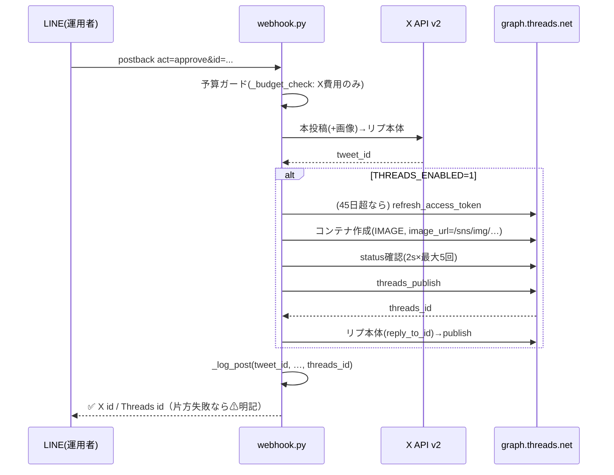

# Threads自動投稿 設計書

- 文書番号: 64
- 作成: アーキテクト
- 要件: docs/63_機能要件書_Threads自動投稿.md（FR-01〜05 / AC-01〜08）

## 1. システム構成

```
generate_and_post.py ──┐
                       ├─ post_all() ──┬─ post_to_x()            → X API v2
webhook.py ────────────┘   (新設)      └─ threads_client.post()  → graph.threads.net
                                              │
                                              ├─ threads_token.json（SNS_DATA_DIR、自動リフレッシュ）
                                              └─ 画像URL = SNS_PUBLIC_BASE_URL + /sns/img/{name}
                                                （既存 webhook GET /sns/img/ が配信。変更なし）
```

- 新規: `scripts/sns_autopost/threads_client.py`
- 変更: `generate_and_post.py`（`post_all()` 新設・`_log_post()` 拡張）、`webhook.py`（呼び出し置換・LINE返信文）、`.env.example`、`README.md`
- 変更なし: `approval_queue.py`、`line_client.py`、`expert_review.py`、Docker/Caddy構成、cron

## 2. アーキテクチャ判断

| 判断 | 選択 | 理由 / 代替案 |
| --- | --- | --- |
| 統合ポイント | `post_all()` を `generate_and_post.py` に新設し、即投稿経路と webhook 承認経路の両方がこれを呼ぶ | X→Threads の順序・失敗分離ロジックを1箇所に集約。代替案の「webhook と main で各々2回呼ぶ」は分岐が二重管理になり却下。`distribute.py` 新設は現状2配信先ではファイル過剰（MVP原則） |
| クライアント形状 | `post_to_x()` と同形 `(text, reply, link, post_link, image_path) -> (ok, id, info)` | 要件6（保守性）。将来の配信先追加も同形を踏襲 |
| トークン保存 | `{SNS_DATA_DIR}/threads_token.json`。`.env` はシードのみ | 自動リフレッシュで値が変わるため env（読み取り専用）に置けない。SNS_DATA_DIR は既に永続volume。代替案のDB管理は sns コンテナにDBが無く過剰 |
| リフレッシュ契機 | 投稿実行時に lazy 判定（45日経過で更新） | 専用cronを増やさない。1日2回の投稿で必ず踏むため45日→60日期限に対し十分な余裕。失敗時は次回投稿時に再試行される |
| コンテナ処理待ち | 公開前に `GET /{container_id}?fields=status` をポーリング（2秒間隔・最大5回）。`FINISHED` 以外でも最終的に publish を1回試す | Meta推奨はステータス確認。画像は通常数秒で完了。固定30秒待機は承認→LINE返信の体感を悪化させるため却下 |
| Threads の reply 失敗 | 本投稿成功なら ok=True のまま info に追記 | X側の既存挙動（リプ失敗でも本投稿は成立）と揃える |

## 3. API設計（外部API呼び出し仕様）

ベースURL: `https://graph.threads.net/v1.0`（リフレッシュのみ `https://graph.threads.net`）

| # | 呼び出し | 用途 |
| --- | --- | --- |
| 1 | `POST /{THREADS_USER_ID}/threads` | コンテナ作成。TEXT: `{media_type:"TEXT", text}` / IMAGE: `{media_type:"IMAGE", image_url, text}` / リプ: 上記+`reply_to_id` |
| 2 | `GET /{container_id}?fields=status,error_message` | 処理待ちポーリング（`IN_PROGRESS`→`FINISHED`） |
| 3 | `POST /{THREADS_USER_ID}/threads_publish` | `{creation_id}` で公開。レスポンス `{id}` が投稿ID |
| 4 | `GET /refresh_access_token?grant_type=th_refresh_token&access_token=...` | 長期トークン延命（応答 `{access_token, expires_in}`） |

- 認証: すべて `access_token` パラメータ（クエリ or フォーム）で付与
- タイムアウト: 各20秒（X側と同水準）
- 自社APIのエンドポイント追加・変更は無し

## 4. DBスキーマ

DBなし。JSONLファイルのみ:

- `posts_log.jsonl`: レコードに `threads_id: str`（成功時ID / 失敗・無効時 `""`）を追加。読み手（`_budget_check`, `fetch_metrics.py`）は `.get()` 参照のため既存レコードと後方互換
- `threads_token.json`（新規）: `{"access_token": str, "refreshed_at": "YYYY-MM-DDTHH:MM:SS"}`。初回は env `THREADS_ACCESS_TOKEN` から自動生成

## 5. モジュール構成

### threads_client.py（新規）
| 関数 | 責務 |
| --- | --- |
| `enabled() -> bool` | `THREADS_ENABLED` が truthy かつ `THREADS_USER_ID` とトークン（env or json）がある |
| `_load_token() -> dict \| None` | json優先で読み、無ければ env をシードに json を書いて返す |
| `_maybe_refresh(tok: dict) -> str` | `refreshed_at` から45日超なら API#4 で更新し json 上書き。失敗時は旧トークンを返す（warn出力） |
| `_image_url(image_path) -> str \| None` | `SNS_PUBLIC_BASE_URL` + `/sns/img/{basename}`。base未設定なら None（テキストのみにフォールバック） |
| `_create_container(user_id, token, text, image_url=None, reply_to=None) -> str \| None` | API#1 |
| `_wait_ready(container_id, token) -> None` | API#2 を2秒×最大5回。FINISHEDで即抜け |
| `_publish(user_id, token, container_id) -> str \| None` | API#3 |
| `_clip(text, limit=500) -> str` | 500字超を「…」付きで切り詰め（FR-01/AC-06） |
| `post(text, reply, link, post_link, image_path=None) -> (ok, threads_id, info)` | 本投稿→（あれば）リプ本体→（post_link時）URLリプ。`post_to_x()` と同じスレッド構造 |

### generate_and_post.py（変更）
- `post_all(text, reply, link, post_link, image_path) -> (ok, tweet_id, threads_id, info)`（新設）:
  1. `post_to_x(...)` — 失敗なら `(False, "", "", info)` で終了（Threadsは呼ばない）
  2. `threads_client.enabled()` なら `threads_client.post(...)` — 失敗でも ok は True のまま、`info += " / Threads失敗: ..."`
  3. 無効時は `threads_id=""`・info 変更なし（AC-01: API呼び出しゼロ）
- `_log_post(tweet_id, pillar, had_link, had_reply, threads_id="")`: 引数追加
- `main()` の即投稿経路: `post_to_x` 呼び出しを `post_all` に置換

### webhook.py（変更）
- `_handle_postback()` の承認分岐: `post_to_x` → `post_all` に置換
- LINE返信: Threads有効時のみ結果を追記
  - 両方成功: `✅ 投稿しました！\nX id={tweet_id} / Threads id={threads_id}（{why}）`
  - Threadsのみ失敗: `✅ Xに投稿しました（id={tweet_id}）\n⚠ Threadsは失敗: {threads_info}`
  - 無効時: 現行文言のまま

### .env.example（追記）
```
# --- Threads 自動投稿（無料。X承認と同じ1回の承認で両方に投稿）---
# Meta for Developers でアプリ作成 → ユースケース「Threads API」追加 →
# 自分のThreadsアカウントを連携 → 長期アクセストークン(約60日)を発行。
# トークンは投稿時に自動リフレッシュされ /data/threads_token.json に保存される。
THREADS_ENABLED=0
THREADS_ACCESS_TOKEN=
THREADS_USER_ID=
```

## 6. シーケンス図（LINE承認→両チャネル投稿）



## 7. エラーハンドリング方針

| 事象 | 挙動 |
| --- | --- |
| X 投稿失敗 | 現行どおり `failed`。Threads は呼ばない |
| Threads キー未設定（有効時） | X のみ投稿。info に `THREADS_KEYS_MISSING` |
| Threads コンテナ/公開失敗 | X 成功なら全体 `posted`。info とLINE返信に失敗理由（HTTPコード+本文200字） |
| Threads リプ本体失敗 | 本投稿は成立。info に `リプ失敗` 追記 |
| トークンリフレッシュ失敗 | 旧トークンで続行を試行。401なら上記「公開失敗」と同経路で通知 |
| 画像URL不可（base未設定） | テキストのみで Threads 投稿（画像はXのみ） |
| 全例外 | 捕捉して `(False, "", "EXC: ...")`。webhook プロセスを落とさない |

## 8. 性能・可用性考慮

- Threads追加の所要: コンテナ作成〜公開で通常3〜10秒、最悪 約25秒（ポーリング上限+publish）。LINE replyToken 期限（約60秒）内に収まる
- Threads API 障害時も X 投稿と承認フローは無影響（呼び出しは try/except で分離）
- レート: 250投稿/24h に対し 1日2投稿×3リクエスト相当で余裕。レート監視は実装しない（MVP）

## 9. セキュリティ考慮

- トークンは `.env`（git除外済）と `SNS_DATA_DIR/threads_token.json`（永続volume内）のみ。ログ・LINE通知・info 文字列にトークンを含めない（URLパラメータをそのままログしない）
- `/sns/img/` は既存のまま（basename限定・.png限定）。Threads(Meta)がフェッチする画像は元々LINEプレビュー用に公開済みのものだけ
- `threads_token.json` の書き込みは `approval_queue._write_all` と同様に一時ファイル→`os.replace` で原子的に行う

## 10. テスト方針（QA連携）

既存 `scripts/sns_autopost/tests/` の流儀（requests をモンキーパッチ）に合わせる。

- TC-01: `THREADS_ENABLED=0` で `post_all` が Threads 関数を一切呼ばない（AC-01/07）
- TC-02: 有効+モックAPIで text/image/reply の3ステップ呼び出し順・ペイロードを検証（AC-02/03）
- TC-03: X成功+Threadsモック失敗 → `(ok=True, threads_id="")`・info に失敗理由（AC-04）
- TC-04: `refreshed_at` 46日前のトークンでリフレッシュAPIが呼ばれ json が更新される／45日未満では呼ばれない（AC-05）
- TC-05: 501字の本文が500字+「…」に切り詰められる（AC-06）
- TC-06: `_log_post` に `threads_id` が記録される・旧レコード読み取りが壊れない（後方互換）
- 実機確認: `--dry-run` → `THREADS_ENABLED=1` + DRY_RUN=0 でテスト投稿1件（手動、本番キー設定後）

## 11. 移行 / 後方互換性

- 既定 `THREADS_ENABLED=0` のため、デプロイ直後は挙動不変（AC-01）。有効化は .env 編集+コンテナ再起動のみ
- `posts_log.jsonl` / `pending_queue.jsonl` のスキーマ変更は追加キーのみで、既存行・既存読み手と互換
- ロールバック: `THREADS_ENABLED=0` に戻すだけ。コード巻き戻し不要
