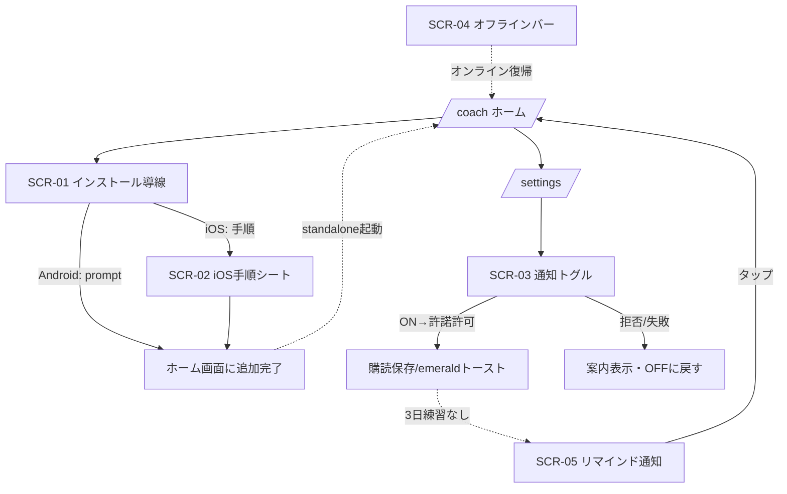

# PWA化 デザイン仕様

- 作成: 2026-07-17（UXデザイナー）
- 対象要件: docs/73_機能要件書_PWA化.md（FR-01〜05 / AC-01〜08）
- 制約: docs/61 デザインシステムv2「引き算の規律」に準拠（アクセントは brand-600 単色、5段タイポ、成功=emerald / エラー=rose、8ptグリッド、全インタラクティブ要素に5状態）

## 1. ユーザーゴール
- 気に入ったソラ先生を**ホーム画面に置いて**、次からアプリのように1タップで開く。
- **練習リマインド通知**を自分の意思でONにして、続けられるようにする。
- 電波が弱くてもアプリ枠が開き、「今はオフライン」だと迷わず分かる。

## 2. 画面一覧
| ID | 画面/要素名 | パス | 目的 |
| --- | --- | --- | --- |
| SCR-01 | インストール導線バナー | 全画面下部（`/coach` 主軸） | ホーム画面追加を控えめに促す |
| SCR-02 | iOS 追加手順シート | モーダル | iOS Safari向けに「共有→ホーム画面に追加」を図解 |
| SCR-03 | 通知設定セクション | `/settings` | 練習リマインド通知のON/OFF |
| SCR-04 | オフライン状態表示 | 全画面（グローバル） | オフラインであることと解析不可を明示 |
| SCR-05 | プッシュ通知（OS側の見た目） | OS通知 | リマインド本文とタップ先 |

## 3. 画面ごとの仕様

### SCR-01: インストール導線バナー（FR-02）
- **目的**: 押し付けず、でも見逃さない。ホーム画面追加を1タップで開始。
- **配置**: 画面下部に固定の細いバナー（`fixed bottom` / セーフエリア考慮）。`/coach`（ホーム）到達時のみ表示。
- **主要要素**: ソラ先生の小アイコン＋見出し＋「追加」ボタン＋「×」閉じる。
- **アクション**:
  - Android/Chrome系: 「追加」→ `beforeinstallprompt.prompt()` を発火。
  - iOS/Safari: 「追加」→ SCR-02（手順シート）を開く。
- **状態（5状態）**:
  - default: バナー表示。
  - loading: なし（即時遷移のためスピナー不要）。
  - installed（`display-mode: standalone`）: **非表示**（バナー自体を出さない）。
  - dismissed: ×で閉じたら **7日間は再表示しない**（localStorageに閉じた日時を記録）。
  - unsupported: `beforeinstallprompt` 非発火かつ非iOS → 出さない（機能デグレなし）。
- **文言**:
  - 見出し: 「ホーム画面に置いて、毎日サッと練習」
  - ボタン: 「追加する」
  - 閉じる: aria-label「あとで」
- **トランジション**: 下からスライドイン（200ms / ease-out）。過度な動きは避ける。

### SCR-02: iOS 追加手順シート（FR-02）
- **目的**: iOSは `beforeinstallprompt` 非対応。共有メニュー経由の手順を迷わせない。
- **主要要素**: ボトムシート。3ステップの図解＋テキスト。
  1. 下の**共有アイコン**（□に↑）をタップ
  2. メニューを下にスクロールして「**ホーム画面に追加**」
  3. 右上の「**追加**」をタップ
- **アクション**: 「閉じる」ボタン。CTAは無し（OS操作を案内するだけ）。
- **状態**: default のみ（静的説明）。
- **文言**: タイトル「ホーム画面への追加方法（iPhone）」／補足「追加すると通知も受け取れるようになります」。
- **アクセシビリティ**: 各ステップに序数（1/2/3）とアイコンの代替テキスト。フォーカストラップ、Escで閉じる。

### SCR-03: 通知設定セクション（FR-04）
- **目的**: 既存 `/settings`（プラン管理カードと同トーン: `rounded bg-white p-5 shadow`）に、通知トグルカードを1枚追加。
- **主要要素**: 見出し「練習リマインド通知」＋説明1行＋トグルスイッチ＋補足文。
- **アクション**: トグルON → `Notification.requestPermission()` → 許可で `PushManager.subscribe()` → サーバー保存。OFF → 購読解除。
- **状態（5状態・許諾状態を網羅）**:
  - default（未購読・許諾未要求）: トグルOFF。補足「最後の練習から少し空いたら、そっとお知らせします（1日1回まで）」。
  - loading: トグル操作中はスピナー＋トグル無効化（二重要求防止）。
  - success: 購読完了 → emerald トースト「通知をオンにしました」。トグルON固定。
  - error（購読作成失敗/ネットワーク）: rose 文言「通知の設定に失敗しました。時間をおいてお試しください」。トグルはOFFに戻す。
  - denied（ブラウザでブロック済み）: トグルは操作不可（薄表示）＋案内「ブラウザの設定で通知が拒否されています。サイトの設定から許可してください」。
  - unsupported（Push非対応ブラウザ / iOS未追加）: セクションを出さない or 「この端末では、まずホーム画面に追加すると通知が使えます」（iOS向け導線 SCR-01/02 へ）。
- **文言原則**: 「適切に通知」ではなく「1日1回まで」「最後の練習から3日」など具体で。
- **重要ルール**: **ページ読み込み直後に自動で許諾ダイアログを出さない**（AC-05）。必ずトグル操作起点。

### SCR-04: オフライン状態表示（FR-03）
- **目的**: オフラインでアプリ枠は開くが、解析はできないことを無言にしない（AC-04）。
- **主要要素**:
  - グローバル: 画面上部に細いバー「オフラインです」（slate系・控えめ）。オンライン復帰で自動消去。
  - 録音/解析アクション時: 実行ボタン押下をブロックし、インライン説明を表示。
- **状態**:
  - online: バーなし。
  - offline（閲覧のみ）: 上部バー表示。
  - offline＋解析操作: rose ではなく **slate/注意** トーンで「解析にはネット接続が必要です。電波のよい場所で試してください」。録音ボタンは無効化（disabled）。
- **文言**: バー「オフラインです」／解析ブロック「解析にはネット接続が必要です」。
- **トーン**: エラー(rose)ではなく「一時的な状態」として扱う（ユーザーの失敗ではない）。

### SCR-05: プッシュ通知の見た目（FR-05）
- **目的**: ソラ先生のペルソナで、練習に戻りたくなる短文。
- **要素**: タイトル＋本文＋アイコン（192pxアプリアイコン）。タップで `/coach` を開く。
- **文言（MVP・ソラ先生監修は docs/73 Q-04 で vocal-trainer に依頼）**:
  - タイトル: 「そろそろ声、出してみよ🎤」
  - 本文: 「1日ぶり以上かも。3分でいいから、今日の声を録ってみない？」
  - タップ先: `/coach`
- **制約**: 1ユーザー1日1通まで（うるさくしない）。

## 4. 画面遷移図

## 5. デザイントークン（v2準拠）
- **カラー**: アクション/CTA = brand-600 単色。成功トースト = emerald-600系。エラー = rose-600系。オフラインバー = slate系（中立）。装飾色（fuchsia/cyan等）は使わない。
- **カード**: 既存 `/settings` に合わせ `rounded bg-white p-5 shadow`。角丸は3段スケール内。
- **タイポ**: セクション見出し=title（text-lg〜xl / font-bold / Zen Maru Gothic）、本文=body（Noto Sans JP / leading-relaxed）。
- **スペーシング**: 8ptグリッド。バナー内余白・シート内ステップ間隔を統一。
- **トグル**: 既存UIに無ければ v2 のアクション色でシンプルなスイッチを1型として定義（ON=brand-600）。

## 6. アクセシビリティ要件
- コントラスト比: テキスト4.5:1以上、バナー/シートの文字と背景を担保。
- キーボード操作: SCR-02 シートはフォーカストラップ＋Escで閉じる。トグルは Space/Enter で操作可能、`role="switch"` ＋ `aria-checked`。
- スクリーンリーダー: インストールバナーに `aria-live` は使わず（うるさくなる）、閉じるは aria-label「あとで」。オフラインバーは `role="status"`（丁寧に1回読み上げ）。
- 通知許諾: 視覚だけに依存せず、トグルの状態変化をテキストでも通知（success/error文言）。
- 動きの配慮: `prefers-reduced-motion` でスライドイン等のアニメーションを無効化。

## 7. 状態網羅サマリ（QAへの申し送り）
- SCR-01: default / installed非表示 / dismissed7日 / unsupported非表示
- SCR-03: default / loading / success / error / denied / unsupported の6状態（許諾状態を含む）
- SCR-04: online / offline閲覧 / offline解析ブロック
- 共通: iOS（16.4+・要ホーム追加）と Android/PC の分岐、`prefers-reduced-motion` 対応
