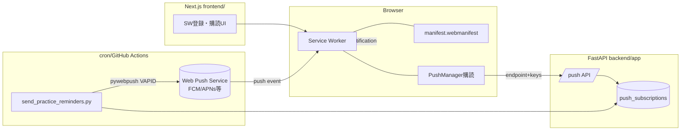
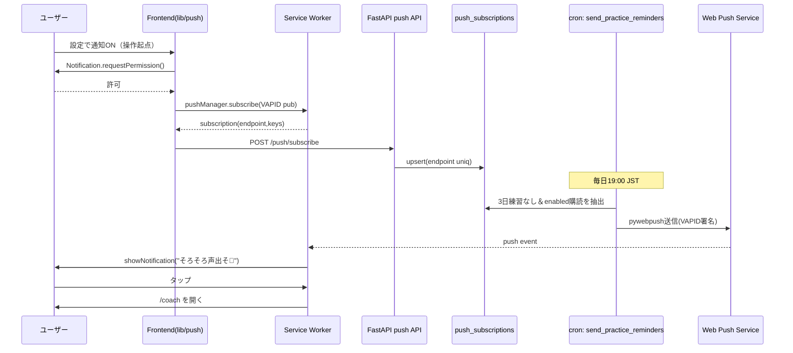

# PWA化 設計書

- 作成: 2026-07-17（アーキテクト）
- 対象要件: docs/73_機能要件書_PWA化.md（FR-01〜05）／UI: docs/74_デザイン仕様_PWA化.md
- 前提: docs/02 基本設計・現行実装（`frontend/` Next 13.5.6 App Router、`backend/app/` FastAPI + SQLAlchemy + Alembic）と整合。docs/72 の「固定費ほぼ¥0・solo運営」哲学を維持。

## 1. システム構成

- **frontend**: manifest（FR-01）、SW登録＋アプリシェルキャッシュ（FR-03）、インストール導線UI（FR-02）、通知購読UI（FR-04）。
- **backend**: 購読の保存/削除API（FR-04）。
- **配信（Ops）**: 既存 `scripts/sns_autopost` と同じ **cron+スクリプト** 方式で `scripts/ops/send_practice_reminders.py` を1日1回実行（FR-05）。新たに常駐スケジューラ（APScheduler/Celery）は**入れない**。

## 2. アーキテクチャ判断

### 2-1. SW/PWA実装ライブラリ（Q-01の回答）
| 案 | 内容 | 判定 |
| --- | --- | --- |
| **A: `@serwist/next`（推奨）** | next-pwaの後継。App Router対応・Workboxベース・precache/runtime cache宣言的 | ◎ 採用 |
| B: `next-pwa`（`@ducanh2912`版） | 実績あるが App Router 対応が後手・メンテ鈍化 | △ |
| C: 手書きSW | 依存ゼロだが precache manifest 手管理が保守負債 | △ フォールバック |
- **決定: A（serwist）**。理由: Next 13.5 App Router 互換、precache自動生成でアプリシェルキャッシュ（FR-03）が宣言的に書ける。統合摩擦が出た場合のみ C（最小手書きSW）にフォールバック。
- トレードオフ: ビルド時に SW を生成するため `next.config.js` を serwist ラッパで包む。開発時は SW を無効化（`disable: dev`）してHMRを壊さない。

### 2-2. プッシュ送信ライブラリ・配信基盤（Q-03の回答）
- **送信**: `pywebpush`（VAPID対応・軽量）。FCMサーバーキー不要、VAPID鍵ペアのみで標準Web Push Protocolを話す（Chrome/Firefox/Edge/iOS16.4+）。
- **配信トリガー**: `scripts/ops/send_practice_reminders.py` を **cron（VPS）** で1日1回（例: 毎日19:00 JST）実行。既存 `sns_autopost` のcron運用に一本化コストを合わせる。GitHub Actions案は外形監視（既存）と混ぜず、DBアクセスするためVPS cron側が素直。
- 理由: solo運営・固定費¥0を守るため、常駐プロセスを増やさない。配信は「1日1バッチ」で十分（リマインドは分単位の即時性不要）。

### 2-3. VAPID鍵の管理
- 鍵ペアはビルド時でなく**環境変数**で供給（`docs/34` の鍵管理方針に準拠）。
  - `VAPID_PUBLIC_KEY`（frontendにも公開）/ `VAPID_PRIVATE_KEY`（backend/ops のみ）/ `VAPID_SUBJECT`（`mailto:` 連絡先）。
- 公開鍵は frontend に `NEXT_PUBLIC_VAPID_PUBLIC_KEY` として渡す（購読時に必要）。秘密鍵はサーバー専用。

## 3. API設計
新規ルーター `backend/app/api/v1/endpoints/push.py`（既存の endpoints 構成に追加）。認証は既存JWT（ログインユーザー単位）。

### エンドポイント一覧
| メソッド | パス | 目的 | 認証 |
| --- | --- | --- | --- |
| POST | `/api/v1/push/subscribe` | 購読を登録（冪等） | 要 |
| POST | `/api/v1/push/unsubscribe` | 購読を解除 | 要 |

> VAPID公開鍵はAPIで配らず、frontendのビルド時環境変数 `NEXT_PUBLIC_VAPID_PUBLIC_KEY` を使う（往復を1回減らす）。

### POST /api/v1/push/subscribe
- request:
```json
{ "endpoint": "https://fcm.googleapis.com/...", "keys": { "p256dh": "...", "auth": "..." } }
```
- response: `200 { "status": "subscribed" }`
- 冪等性: `endpoint` を一意キーにし、同一endpointは upsert（user_id更新のみ）。二重購読を作らない。
- error: `400`（keys欠落）/ `401`（未認証）。

### POST /api/v1/push/unsubscribe
- request: `{ "endpoint": "..." }`
- response: `200 { "status": "unsubscribed" }`（該当なしでも200＝冪等）。

## 4. DBスキーマ
新テーブル `push_subscriptions`。マイグレーションは Alembic（`Dockerfile.prod` が `alembic upgrade head` 自動実行）。

| 列 | 型 | 制約 | 備考 |
| --- | --- | --- | --- |
| id | Integer | PK, autoincrement | |
| user_id | Integer | FK(users.id), index, not null | 購読者 |
| endpoint | String(500) | **unique**, not null | Web Push endpoint（冪等キー） |
| p256dh | String(200) | not null | 公開鍵 |
| auth | String(100) | not null | 認証シークレット |
| enabled | Boolean | not null, default true | OFF時はfalse（履歴保持）or 物理削除。MVPは物理削除でも可 |
| created_at | DateTime | not null | |
| updated_at | DateTime | not null, onupdate | |

- インデックス: `endpoint` unique、`user_id` index（配信時のユーザー結合）。
- SQLite制約: 既存 recording 同様、必要なら FK はアプリ側整合で担保（`docs/50` の前例に倣う）。
- モデル: `backend/app/models/push.py`（`Base` 継承。`models/__init__.py` に登録）。

## 5. モジュール構成
```
backend/app/
  models/push.py                # PushSubscription
  schemas/push.py               # SubscribeIn / UnsubscribeIn
  api/v1/endpoints/push.py      # subscribe / unsubscribe
  services/push_sender.py       # pywebpush ラッパ（send_web_push(subscription, payload)）
scripts/ops/
  send_practice_reminders.py    # cron: 3日練習なしユーザー抽出→services.push_sender で送信
frontend/
  next.config.js                # serwist ラップ
  src/app/sw.ts (or app/~)      # serwist SW定義（precache + runtime cache）
  public/manifest.webmanifest   # FR-01
  public/icons/                 # 192/512/maskable
  src/components/pwa/InstallPrompt.tsx   # SCR-01/02
  src/components/pwa/OfflineBar.tsx      # SCR-04
  src/lib/push.ts               # 購読/解除クライアント（subscribe→POST）
  src/app/settings/page.tsx     # SCR-03 通知トグル追加
```
- **責務**:
  - `services/push_sender.py`: 送信の単一責務。410/404（endpoint失効）を検知して呼び出し側へ返す。
  - `send_practice_reminders.py`: 対象抽出（下記クエリ）＋レート（1ユーザー1日1通）＋失効クリーンアップ。
  - `lib/push.ts`: `NEXT_PUBLIC_VAPID_PUBLIC_KEY` で購読、APIへ送信。許諾は必ずユーザー操作起点（FR-04・AC-05）。

### 対象抽出クエリ（FR-05）
- 「`enabled=true` の購読を持ち、`recordings` の最新 `created_at` が N日（既定3日）以上前、または録音ゼロ」のユーザー。
- 1バッチにつき各ユーザー最大1通（`sent_at` を日次で管理 or バッチが1日1回なので実質担保）。

## 6. シーケンス図（購読〜配信）


## 7. エラーハンドリング方針
- 購読API: keys欠落=400、未認証=401、DB失敗=500（frontendはSCR-03のerror状態へ）。
- 配信: `pywebpush` が `WebPushException` 410/404 → 該当購読を削除/disable（失効クリーンアップ）。その他一時エラーはログのみ、次バッチで再試行。
- frontend SW: 登録失敗しても通常Webとして動作（プログレッシブ・エンハンスメント、AC-08）。
- オフライン: 解析APIはキャッシュせず、SCR-04でネット必須を明示（AC-04）。

## 8. 性能・可用性考慮
- SWのアプリシェルキャッシュで初回以降の表示高速化。runtime cacheは不変アセット=CacheFirst、ナビゲーション=NetworkFirst（フォールバックでシェル）。
- **キャッシュ戦略の改訂（2026-08-08、キャッシュ名 `sora-shell-v2`）**: 初版（v1）は同一オリジンGET全部をCacheFirstにしており、(a) App RouterのRSCペイロード（`?_rsc=`）が固定されデプロイ後もアプリ内遷移で旧UIが出続ける、(b) devの安定名チャンクが固定され開発中の変更が反映されない欠陥があった。改訂後:
  - RSCフェッチ（`_rsc` クエリ or `RSC: 1` ヘッダ）はSWが関与せず素通し（常にネットワーク）。
  - CacheFirstは「URLが変われば中身も変わる」不変パス（`/_next/static/`・`/icons/`）に限定。
  - navigateのキャッシュ保存は `res.ok` のみ（エラーページをシェルとして残さない）。
  - SW登録は本番ビルドのみ。devでは既存登録を解除し `sora-shell*` キャッシュを削除（自己修復）。
  - 更新検知: タブ復帰時に `registration.update()`、新SW有効化時は `controllerchange` で1回だけ自動リロード（初回インストールの `clients.claim()` では発火させない）。
- 配信は1日1バッチ・低volume。購読数が数百規模まではVPSで無問題。増えたら送信をチャンク＋並列度制御。
- 常駐プロセス増設なし＝可用性面の運用負荷を増やさない。

## 9. セキュリティ考慮
- `VAPID_PRIVATE_KEY` はサーバー環境変数のみ（frontend露出禁止）。公開鍵のみ `NEXT_PUBLIC_*`。
- 購読は認証ユーザーに紐付け。他ユーザーのendpointを操作できないよう、unsubscribeは「自分の購読 or endpoint一致」に限定。
- CORSは既存 `cors_origins` 設定を流用（本番ドメイン追加）。
- SWのスコープは `/`。信頼できる自ドメインのみ。

## 10. テスト方針（QAと連携）
- 受け入れ基準 AC-01〜08 をテスト計画へ（QA）。特に:
  - Lighthouse Installability（AC-02）
  - オフライン起動でシェル表示（AC-03）／解析ブロック文言（AC-04）
  - 通知トグルの6状態（default/loading/success/error/denied/unsupported）
  - 配信の1日1通上限・失効クリーンアップ（410）
  - 非対応ブラウザでの機能デグレなし（AC-08）
- 送信は `scripts/` のユニット（対象抽出クエリ）＋ pywebpush はモックで検証。

## 11. 移行 / 後方互換性
- 追加のみ（既存API・画面・FBロジックへ影響なし。docs/42 不変）。
- マイグレーションは新テーブル追加のみ（既存データ無影響）。`alembic upgrade head` は本番デプロイで自動。
- 環境変数追加（VAPID×3、`NEXT_PUBLIC_VAPID_PUBLIC_KEY`）→ `docs/34` 鍵管理メモと本番 `.env` に追記が必要（SRE連携）。

## 12. 未決事項の解消状況
- Q-01（SW実装）→ §2-1: `@serwist/next` 採用（フォールバック手書き）。
- Q-03（スケジューラ配置）→ §2-2: VPS cron + `scripts/ops/send_practice_reminders.py`。
- Q-02（配信閾値）・Q-04（通知文面）は運用/ソラ先生側で確定（本設計は既定値=3日・1日1通で実装可能）。
