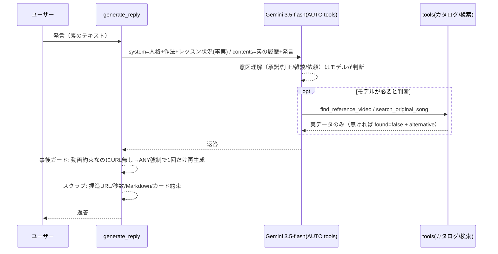

# 会話レイヤー刷新（意図理解をLLMに返す） 設計書

- 作成日: 2026-08-07（アーキテクト）
- 関連: docs/42（FB品質・単一ソース）/ docs/44（ツール化）/ docs/65（提案済み練習の注入）/
  docs/66（会話モードと格上げ測定）/ docs/71（動画オファー承諾のツール強制）/
  docs/72（曲名からの原曲解決）/ docs/91・92（Geminiモデル世代対応・バージョン固定）
- 発端: 実会話スクショ（2026-08-07 運用者報告）。「よろ」が承諾と通じない →
  エッジボイスの実演を頼んだらリップロール動画が出る → 「リップロールやん」の抗議が
  雑談扱いされる → 謝りながら同じ誤URLを再提示、の4連鎖で「全然会話が噛み合わない」。

## 0. 問題の構造（なぜ噛み合わないか）

スクショの事故は単発バグではなく、**3層の設計問題の連鎖**である。

| # | 層 | 問題 | スクショでの現れ |
| --- | --- | --- | --- |
| 1 | 意図理解 | 承諾・訂正・雑談の判別を**正規表現**が行い、LLMの言語理解を上書きしている（`_VIDEO_ACCEPT_RE` に「よろ」が無い／12文字未満は一律「相槌・雑談」扱い） | 「よろ」→挨拶返し。「リップロールやん」「いや動画が。」→軽い相槌指示が注入され、抗議の意味を取り違え |
| 2 | 事実カタログ | エッジボイスの実演動画がカタログに**存在しない**のに、話題→課題→★練習の写像で**別練習（ストロー/リップロール）の動画が found=true** で返る。同一URLが2課題で共用 | 「声帯の閉じ方を試してね」と言いながらリップロール動画を提示。指摘後も同じURLを再提示 |
| 3 | モデル格 | 会話ターンが最安ティア（flash-lite）。docs/66 の blind head-to-head で ChatGPT級に18連敗（会話力の差）。弱いモデルを補うために層1の正規表現が増殖した | 会話全体の「察しの悪さ」 |

docs/66 の測定が示した重要な事実: **モデル格上げ（2.5-flash）単独では直らなかった**
（カジュアル改善・多ターン悪化）。層1のゲートがモデルと喧嘩する構造のまま
モデルだけ替えても意味がない。**層1〜3を同時に刷新する**のが本設計。

## 1. 方針 — 「事実はDSP/ツール、言葉と意図理解はモデル」

docs/42 §5・docs/92 §5.7 で確立した原則を、会話パイプラインに全面適用する。

- **モデルに返すもの（撤去）**: 発言が承諾か・訂正か・雑談か・感情かの判別。
  返答の長さ・トーンの選択。ツールを呼ぶタイミングの一次判断。
- **コードに残すもの（安全網・事実）**: 解析事実の注入、実在URLのカタログ供給、
  返答後の決定論ガード（URL捏造除去・秒数捏造除去・Markdown除去・カード約束除去）、
  「約束したのにURLが無い」の**事後検知→強制リトライ**。
- **格上げ**: 会話モデルを `gemini-3.5-flash`（バージョン固定・docs/92 準拠）へ。
  2026-07-12 の「flash-lite据え置き」CEO判断は、2026-08-07 の運用者決定
  （「予算のことは考えずに進める」）により**撤回**。

## 2. アーキテクチャ判断

| 判断 | 採用 | 理由・代替案 |
| --- | --- | --- |
| 意図判定ゲートの扱い | **撤去**（`_detect_conversation_mode` / `_AIZUCHI` / `_EMOTION_RE` / `_EXPLICIT_REQUEST_RE` / `_VIDEO_ACCEPT_RE` / `_VIDEO_DECLINE_RE` / `_accepts_video_offer`） | 判別はモデルの本業。SYSTEM_PROMPT「# 会話モード」節が既に作法を規定しており、二重制御が誤発火源だった。代替案「語彙を足す」（よろ等）は、いたちごっこの継続なので不採用 |
| 動画URLの到達保証（docs/71 の狙い） | **事後検知に置換**: 返答が動画を約束（`_VIDEO_PROMISE_RE`）しているのにURLが無く、ツールも未呼び出しなら、`find_reference_video` を ANY 強制して**1回だけ再生成** | 事前の承諾判定（正規表現）は「よろ」を落とす。事後検知なら意図理解はモデル、到達保証はコード、と責務が分離する |
| 明示的な動画依頼の強制（`_wants_reference`） | **維持** | 「動画出して」に語彙が含まれるのは決定論で安全（誤検出しても found=false で無害・docs/44）。スクショでも正しく発火しており、問題はカタログ側だった |
| 原曲曲名の決定論ヒント（`_names_song_title`・docs/72） | **維持**（強制ANYも維持） | 「原曲 ◯◯」形式は精密パターンで誤爆しない。会話モード注入との競合は、会話モード撤去により消滅 |
| 状況コンテキストの置き場 | ユーザー発言のラッパーをやめ、**system_instruction 側に移す** | 現行は毎ターン「# このターンについて…# ユーザーの発言」の指示書に発言を埋め込み、会話の連続性を損なう。system 側なら履歴が素の対話として残る |
| 提案済み練習・動画オファー済みの事実注入（docs/65） | **維持**（system 側コンテキストへ） | LLMは自分の履歴の自己監査が苦手（docs/65 で実測）。照合可能な事実の注入は「モデルと喧嘩しない」設計 |
| 会話モデル | `llm_chat_model = "gemini-3.5-flash"`（固定） | docs/92 で唯一、地声/裏声を聞き分けた世代の最上位。同 §2-2 実測で thinking_budget=0 を受理（応答速度・出力枠を守れる）。エイリアス禁止・固定IDは docs/92 の再発防止方針 |
| thinking ガード | `_thinking_off` の対象に `gemini-3.5-flash`（完全一致）を追加。あわせて `_complete` / `_complete_with_tools` に `_safe_max_tokens` を適用 | thinking を切れないモデルへ env 載せ替えた時、出力枠400では本文が切れる（docs/92 §2-3）。チャット経路にも同じ保険を張る |
| カタログの正直化 | `find_reference_video` を**練習単位マッチ**に改修。話題が課題にしか対応しない場合は `found=false` ＋ **alternative（同課題の★練習動画）** を返す | 「エッジボイスの動画」が無いなら無いと言い、代わりに閉じを育てる別練習を**別練習と明示して**提案する。found=true で別物を返す現行は事実忠実性（docs/42 §5）違反 |

### 検討して不採用にした代替案
- **プロバイダ乗り換え（Claude API 等）**: docs/66 の head-to-head で Claude級が18-0 であり
  品質面の魅力はあるが、APIキー調達・課金・VPS配線・世代ガードの再構築が別プロジェクト規模。
  まず Gemini 内の最新世代＋本設計で再測定し、それでも会話力が不足するなら次段として起案する。
- **casual/emotion ゲートの「緩和」**（閾値調整・語彙追加）: 事故のたびにルールが増える
  構造自体が原因なので、調整ではなく撤去する。

## 3. モジュール構成（変更マップ）

| ファイル | 変更 | 内容 |
| --- | --- | --- |
| `backend/app/core/config.py` | 改 | `llm_chat_model = "gemini-3.5-flash"`（固定理由・実測をコメントに記録） |
| `backend/app/coaching/llm.py` | 大改 | ①`_build_contents` → 素の履歴＋素の発言。状況は system 側へ ②会話モード関連の関数・正規表現を削除 ③`_accepts_video_offer` 削除、`generate_reply` に事後検知→強制リトライを追加 ④`_thinking_off` / max_tokens ガード拡張 |
| `backend/app/coaching/tools.py` | 改 | `find_reference_video` 練習単位マッチ＋alternative 返却。宣言文も正直化 |
| `backend/app/coaching/taxonomy.py` | 改 | 各 practice に `aliases`（呼び名）を追加（リップロール・ストロー・ハミング等） |
| `backend/app/coaching/rule_engine.py` | 小改 | `TOPIC_KEYWORDS` はタスク写像として維持（tools-off フォールバック用）。コメント更新 |
| `backend/tests/` | 改 | 会話モード系テストを削除/置換。カタログ正直化・事後検知のテストを追加 |

## 4. 新しい会話ターンのフロー



### 4.1 system_instruction の組み立て
`SYSTEM_PROMPT`（人格・作法・事実忠実性）＋ 毎ターン動的に:

```
# 現在のレッスン状況（事実。ここに無い数値・秒数・URLは作らない）
（build_session_context の出力＝従来どおり）
- この会話でこれまでに提案した練習: …（docs/65）
- 動画オファー済みか（docs/65）
- このターンは録音なしのテキスト会話（解析事実は過去録音の再掲）
（原曲曲名の提示を検出した時のみ）- search_original_song を query=「◯◯」で呼ぶ…（docs/72）
```

ユーザー発言はラッパー無しでそのまま最後の user turn になる。

### 4.2 ツール呼び出し
- 常時 AUTO（両ツール宣言）。ANY 強制は次の2つだけ:
  1. `_wants_reference(user_text)`（明示的な動画依頼語彙）
  2. 事後検知リトライ（4.3）
  ＋ `_names_song_title` 該当時の `search_original_song`（docs/72 現行維持）
- ツール往復 `coach_tool_loop_max` は 2 → **3**（AUTO化で「呼ぶ→結果を見て言い直す」が1往復増えるケースに備える）

### 4.3 URL到達保証（docs/71 の置換）
```
reply 生成後:
  if _VIDEO_PROMISE_RE.search(reply) and URLなし and ツールが動画URLを返していない:
      reply, tool_urls = _complete_with_tools(force_tool="find_reference_video") で1回だけ再生成
```
- 再生成でも出せなければそのまま返す（ツールが found=false を返し、モデルは
  「手元に無い」と正直に言い直す。宣言文がそう指示している）。

### 4.4 find_reference_video の新仕様
```python
# 返り値
{found: true,  match: "practice", task_label, practice_name, steps, video_title, video_url}
{found: false, alternative: {task_label, practice_name, steps, video_title, video_url} | None}
```
- マッチ順序: ①practice の `aliases`/名前に topic 語が一致（練習単位・これのみ found=true）
  ②task の話題キーワードに一致 → その課題の★練習を **alternative** として返す
  ③どちらも無し → alternative 無しの found=false
- 宣言文: 「found=false で alternative がある時は、『topicそのものの動画は手元に無い』と
  正直に伝えた上で、alternative を**別の練習だと明示して**提案してよい。
  alternative を topic の実演だと偽って出すのは禁止」
- `_complete_with_tools` の決定論URL付与は found=true の時のみ。alternative の URL は
  スクラブ許可リスト（tool_urls）に載せる（モデルが本文で提案した場合に消えないように）。

### 4.6 カタログ外は「無い」で止めず、YouTube実検索へ（2026-08-07 運用者指摘で追加）
運用者レビューで「カタログに無ければ正直に謝る、では会話としてまだ弱い。普通に探しに
行けばいい（Geminiはそうする）」との指摘。原曲検索（docs/72）と同じ実在保証つき検索を
練習動画にも開放する。

- 新ツール `search_practice_video(query)`: `search_youtube`（yt-dlp・実在URLのみ）で
  練習・実演動画を最大3件検索して返す。返却キーは `videos`
  （`candidates` は原曲確認アンカーの決定論が拾うため使い分ける）。
- 呼び時: `find_reference_video` が found=false の時／カタログ動画をユーザーが不満とした時。
  宣言文で「カタログ外なので質は保証できない。タイトル・チャンネル名だけを根拠に語る」
  「検索でも無ければ正直に伝えて文章で説明」を明示。
- 捏造防止の不変条件は不変: 返るURLは検索が実際に返したものだけで、
  `tool_urls` 許可リスト経由でスクラブを通過する。モデルがURLを創作しても従来どおり消える。
- 優先順位: カタログ（品質保証済み・練習単位マッチ）→ YouTube実検索（実在保証のみ）。

### 4.7 特別経路のツール化と状態汚染の停止（2026-08-07 第二次監査→実装。docs/94）
第二次監査で実証した誤爆（「母音って何？」→発音分析、「昨日カラオケで90〜95点出た！」→
比較区間汚染、「原曲の45秒から重ねて診断して」→残り全体を曲名として検索、等）への対処:

- **セッション文脈ツール**（endpoint がクロージャ提供・宣言は `tools.CONTEXT_TOOL_DECLS`）:
  `listen_register(question)` / `listen_pronunciation(question)` / `rediagnose_with_reference(区間)` /
  `set_lesson_focus(topic)`。正規表現ルーティング（is_register_question 等）は撤去し、
  呼ぶかどうかはモデルの文脈判断。ツール所見は facts_sink 経由で秒数許可リストに入る
  （所見の秒数がスクラブで消えない）。tool_ctx があるターンは system 側に使いどころを明示
  （モデルは放っておくと聴けるのに聴かずヘッジする実測があったため）。
- **parse_phase_a**: 主訴キーワード抽出（FOCUS_KEYWORDS）を撤去（主訴は set_lesson_focus へ）。
  区間は「時刻形式 1:05〜1:20」「秒明示 30〜45秒」のみ受理（裸の数字レンジは拾わない）。
- **URL定型返し廃止**: 原曲URLターンは「受け取った事実」を注入してモデルが会話として応答
  （添えられた相談を無視しない）。
- **曲名プレフィックス是正**: 「原曲/曲名」の直後に助詞(は/が/を)か区切りを必須化＋
  再診断語彙（秒/診断/採点/重ね/比べ）を曲名から除外。
- **オファー済み正規表現の撤去**: 言い換えで構造的にすり抜けるため（実測）。繰り返し抑制は
  履歴＋SYSTEM_PROMPT に任せる。
- 検査: `tests/test_state_pollution.py`（雑談で state が汚れない＋撤去ガード）、
  soar_eval multiturn に video-accept-repair / smalltalk-numbers ケースを追加。
- スモーク（実API・2026-08-07）: 声区質問→listen_register を呼び所見を統合（2.8s）／
  主訴表明→set_lesson_focus（2.5s）／用語質問・雑談→ツール不使用で自然応答／
  再診断依頼→rediagnose_with_reference(ref_start_sec=45) を呼び report の数値だけで応答（2.6s）。

### 4.5 スクショ会話の期待動作（受け入れシナリオ）
| ユーザー発言 | 旧動作 | 新動作 |
| --- | --- | --- |
| （エッジボイス説明後のオファーに）「よろ」 | 「よろしくね！」 | 承諾と理解し動画を出そうとする → エッジボイスは found=false+alternative → 「エッジボイスそのものの動画は無いけど、同じ閉じを育てるストロー発声の動画ならあるよ」 |
| 「いや動画出して」 | リップロール動画を実演と偽って提示 | 同上（正直な代替提案） |
| 「リップロールやん」 | 「リップロールのイメージだったんだね」 | 訂正と理解し、誤りを認めて修復（雑談指示の注入が無いため） |
| 「いや動画が。」 | 同じ誤URLを再提示 | 文脈から不満を理解して対応 |

## 7. エラーハンドリング方針
- LLM失敗時のフォールバック連鎖（tools付き→tools無し→正直な聞き返し）は現行維持。
- 事後検知リトライは**1回のみ**（レイテンシ上限: 通常1往復＋最悪1再生成）。
- env でモデルを載せ替えた場合も `_thinking_off` / `_safe_max_tokens` 拡張が
  400 INVALID_ARGUMENT・本文切れを防ぐ（docs/92 世代ガードのチャット適用）。

## 8. 性能・コスト
- レイテンシ（実測 2026-08-07・ローカル→実API・gemini-3.5-flash・tb=0）:
  ツール無し会話ターン **1.3〜1.8s**、ツールあり（動画提示）**2.6〜3.4s**。
  flash-lite 実測 1.1s から悪化は最大 +2.3s。20s タイムアウト・リトライ1回の枠内。
- コスト: lite → flash で単価数倍。運用者決定（2026-08-07）で許容済み。

### 8.1 実装後スモーク（実API・2026-08-07）
スクショ会話の再現（「よろ」→「いや動画出して」→「リップロールやん」→「いや動画が。」）:
- 「よろ」を承諾と理解し、動画を**ストロー発声の動画として正直に**提示（旧: 「よろしくね！」）
- 「リップロールやん」を訂正と理解して修復（旧: 雑談扱いで意味を取り違え）
- 「いや動画が。」に「手元の動画はこれだけ。専用動画は無い」と正直に認め、
  文章での説明を代替提案（旧: 同じ誤URLを謝りながら再提示）
トーン確認: 相槌「うん」→レッスン継続の一言（講義化なし）、「もうやめようかな」→共感先行、
「こんにちは！」→42字の軽い挨拶。正規表現ゲート無しでも SYSTEM_PROMPT の作法だけで成立。
動画の内容構成をデータ外の粒度で断定する事象が1回出たため、宣言文に
「タイトルと練習名だけを根拠に語る」を追記済み。

§4.6 追加後の再スモーク（実API・同日）: エッジボイス文脈の「よろ」に対し YouTube 実検索で
エッジボイス解説動画（実在確認済み: yt-dlp メタデータでタイトル・チャンネル一致）を提示。
「リップロールやん、エッジボイスのが見たい」→ 別の実在動画を再検索して提示。
「いや動画が。」→ さらに別の実在動画。**「カタログに無いので無い」で止まる会話が消えた。**
ツール2段（カタログ→検索）ターンのレイテンシは 4.4〜5.3s。

## 9. セキュリティ・事実忠実性（不変条件）
以下は本刷新でも**一切緩めない**:
1. URLはツール経由の実在データのみ（`_scrub_foreign_urls` 許可リスト方式）
2. 解析に無い秒数を作らない（`_scrub_invented_seconds`）
3. カード約束の除去・Markdown除去・歌詞非引用
4. 提案済み練習・動画オファー済みの事実注入（docs/65）
5. 原曲確認アンカーと確定フロー（docs/72）
6. モデルIDはバージョン固定・エイリアス禁止・世代ガード（docs/92）

## 10. テスト方針（QA連携）
- ユニット: 会話モード系テスト（test_proposed_practices.py の該当分・
  test_conversational_fb.py の `_accepts_video_offer` 系）を新仕様に置換。
  追加: ①エッジボイス topic → found=false+alternative ②練習単位マッチ
  ③事後検知リトライの発火条件 ④`_thinking_off("gemini-3.5-flash")` == tb=0
- 回帰（eval）: `scripts/soar_eval` にスクショ会話を多ターンケースとして追加し、
  naturalness / h2h を再測定（本設計の効果測定。実APIのため別途実行）。
- docs/92 の教訓: モックだけで通さず、切替後モデルの**実API疎通**を確認してから本番へ。

## 11. 移行・後方互換
- DB変更なし。エンドポイント互換（send_message の I/O 不変）。
- tools-off フォールバック（`coach_tools_enabled=false` → `handle_video_request`）は現行維持。
- 削除する内部関数はプライベート（`_` 付き）のみで、外部参照は tests と soar_eval driver のみ。
- ロールバック: env `LLM_CHAT_MODEL=gemini-3.5-flash-lite` で旧モデルへ即時復帰可
  （パイプライン自体のロールバックは revert で行う）。
