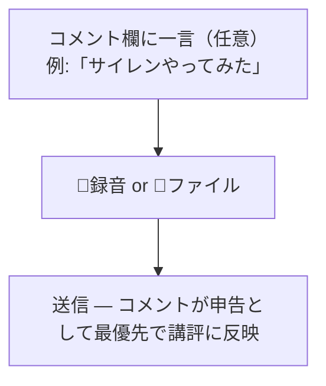

# 録音の申告UX（コメント誘導・(A)案） デザイン仕様

対応要件: docs/95 FR-03（US-02, US-03 / AC-03, AC-06）

> **改訂履歴**: 初版はタグ選択UI（select）の仕様だったが、(1) 過去の「送信種類トグル廃止」の巻き戻しになる、(2) 会話レイヤー刷新（意図理解をLLMに返す）の思想と逆行する、(3) 申告に毎送信タップが必要、の3点により、プロトタイプ比較の上で**専用UIを置かず既存コメント欄へ誘導する (A)案** に転換した（2026-08-08 ユーザー決定）。

## 1. ユーザーゴール
録音を送るとき「これは何の録音か」を、普段の会話と同じ動作（一言添える）で伝えられる。伝えなくても今までどおり送れる。

## 2. 画面一覧
| ID | 画面名 | パス | 目的 |
| --- | --- | --- | --- |
| SCR-01 | コーチチャット入力欄（Composer） | /coach/[sessionId] 下部 | コメント欄の placeholder で申告を誘導 |

## 3. 画面ごとの仕様
### SCR-01: コメント欄の申告誘導
- **変更点は placeholder の文言のみ**。新規UI要素は追加しない。
- **文言**:
  - 変更前: `質問や一言を書いてから録音・アップロードするとコメント付きで送れます（⌘+Enterで文章のみ送信）`
  - 変更後: `質問や「サイレンやってみた」のような一言を添えて録音・アップロードすると、そこから聴きます（⌘+Enterで文章のみ送信）`
  - 意図: 「何の録音かを先に言う」という使い方を、具体例1つで示す（説明文を足さない）。
- **状態**: loading / error / success は既存 Composer のまま（変更なし）。
- **チャット表示**: コメントは従来どおりユーザー発言として扱われ、講評の冒頭で拾われる（docs/42 §8）。

## 4. 操作フロー

## 5. 将来の拡張（実装しない・メモ）
- ワンタップ挿入チップ（「サイレンやってみた」等）: プロトタイプで検証済み。ブラインド聴取（docs/95 FR-01）の精度が不足した場合の次弾として温存。
