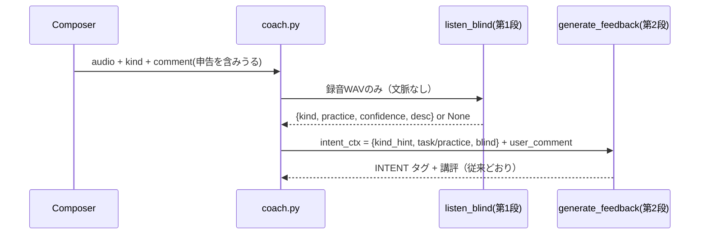

# 聴いてから答えるフロー（ブラインド2段階判定＋コメント申告） 設計書

> **改訂 2026-08-08（(A)案）**: 専用タグUI・`user_tag` フィールドは撤去し、申告は既存コメント欄（`comment`）の自然言語で受ける（docs/95 FR-03 改訂・docs/96 参照）。

対応要件: docs/95（FR-01〜04）／ UI仕様: docs/96

## 1. システム構成
関係コンポーネント: `frontend Composer` → `POST /coach/{id}/audio`（coach.py）→ `llm.listen_blind()`（新設・第1段）→ `llm.generate_feedback()`（既存・第2段）→ `rule_engine.handle_audio()`（ルーティング・既存）

## 2. アーキテクチャ判断
- **第1段は独立関数・独立呼び出し**（1リクエスト2コール）。単一コール内で「まず判定→続けて講評」させる代替案は、同一コンテキストに宿題名が載る限りアンカリングが残るため不採用（docs/95 の本質）。
- **ブラインド段に会話文脈を渡さない**のが要件の核。渡してよいのは録音と既知練習語彙（メニュー）だけ。
- **フロントに練習名リストは持たない**（(A)案でタグ select を撤去したため不要。申告は自由文で、解釈は講評モデルが行う）。
- **INTENT タグ契約（docs/52 FR-04）は不変**。ブラインド判定は「事実の注入」であり最終判定は第2段が行う（判定強制にすると第2段が聴かなくなる逆効果リスク）。

## 3. API設計
### POST /api/v1/coach/{session_id}/audio（変更なし）
- 新規フィールドは追加しない。申告は既存 `comment` の自然言語で受ける（(A)案）。
- リクエスト・レスポンス形式は現行と同一（AC-06 は自明に成立）。

## 4. DBスキーマ
変更なし。

## 5. モジュール構成
### backend/app/core/config.py（追加設定）
| 設定 | 既定値 | 用途 |
| --- | --- | --- |
| `enable_blind_listen: bool` | `True` | FR-01 のON/OFF（AC-08） |
| `blind_listen_max_tokens: int` | `256` | 第1段の出力上限 |
| `blind_listen_timeout_sec: float` | `30.0` | 第1段タイムアウト（性能要件） |
| `blind_listen_est_jpy_per_call: float` | `0.5` | 原価概算（FR-04。音声入力が主、出力は小） |

### backend/app/coaching/llm.py（新設・変更）
- `BLIND_PRACTICE_MENU`: 既知練習語彙（`_KNOWN_PRACTICES` 相当を再利用）＋「歌」「不明」。
- `listen_blind(user_wav: bytes) -> dict | None`（新設）
  - プロンプト: 録音のみ添付。「この録音が (a)歌 か (b)発声練習 か、練習なら次のメニューのどれに一番近いか、を聴いて判定」＋出力形式指定。
  - **禁止事項をコードで保証**: 引数に state・履歴・コメント・課題名を受け取らない設計（AC-01 を構造で担保）。
  - 出力形式（厳密4行）: `KIND: song|practice` / `PRACTICE: <メニューの1語 or 不明>` / `CONFIDENCE: high|mid|low` / `DESC: <聴こえた特徴1文>`。正規表現でパースし、KIND が取れなければ None（フォールバック）。
  - 生成設定: `blind_listen_max_tokens`、thinking_budget=0、temperature=0.1、タイムアウト `blind_listen_timeout_sec`。モデルは `llm_analysis_model`。
- `generate_feedback()` の intent_block 拡張:
  - `user_comment` がある場合、comment_block に「コメントで『何の録音か』を伝えている場合は最優先の事実として講評する（明らかに食い違う時だけ、決めつけずに正直に一言確認する）」を追加（申告 > ブラインド聴取 > 文脈）。
  - `intent_ctx["blind"]` があれば「ブラインド聴取の判定（文脈なしで録音だけを聴いた結果）: {practice}（確信度 {confidence}）— {desc}。この聴取事実を宿題名より優先する」。
  - 既存の第三分岐指示（docs/52 AC-09）は維持。

### backend/app/api/v1/endpoints/coach.py（変更）
1. zero-base 実行ブロック内:
   - 予算判定を `_est = llm_analysis_est_jpy_per_call + (blind_listen_est_jpy_per_call if enable_blind_listen else 0)` で行い、成功時はこの合計を `record()`（FR-04/AC-05）。
   - `enable_blind_listen` のとき `blind = llm.listen_blind(_uw)` を実行（try/except、失敗は None）し `_ictx` に設定。
2. ブラインドの `kind` は `_ictx["kind_hint"]` の置き換えには使わず、注入事実としてのみ扱う（ルーティングは従来どおり INTENT 書き戻しで揃う）。

### frontend（docs/96 準拠）
- `Composer`: placeholder を申告誘導文言に変更するのみ（docs/96）。API・props の変更なし。

## 6. エラーハンドリング方針
- 第1段の例外・タイムアウト・パース不能 → `blind = None` として第2段へ（FBを止めない。AC-04）。
- 第2段の失敗 → 従来どおりルールベースFBへ（既存）。

## 7. 性能・可用性
- 追加レイテンシは第1段の1呼び出し分（出力小・thinking 0 で軽量、上限30秒）。直列実行とする（第2段のプロンプトが第1段の結果に依存するため並列化不可）。
- 概算コスト: 講評 ¥1.5＋ブラインド ¥0.5 ≒ ¥2.0/回（`llm_analysis_est_jpy_per_call` 現行値基準）。無料上限 ¥2,000/月 の枠内で自動制御（FR-04）。

## 8. セキュリティ考慮
- 申告は既存 `comment` 経由のため新たな入力面は増えない（comment は従来からプロンプトに注入されており、docs/42 の役割逸脱ガードが防壁）。

## 9. テスト方針（QA連携）
- AC-01: `listen_blind` が組むプロンプトを捕捉し、宿題名・課題ラベル・コメント文字列が含まれないこと（構造上引数にも無いことを型で確認）。
- AC-02/03: `generate_feedback` のプロンプト捕捉で blind 注入とコメント申告優先の指示文言を検証。
- AC-04: `listen_blind` が例外を投げるモックで FB が返ること。
- AC-05: 予算 record が合計値であること。
- AC-08: `enable_blind_listen=False` で `listen_blind` が呼ばれないこと。
- 既存 `test_zero_base_gate.py`（docs/52 AC-09 回帰）がパスし続けること。

## 10. 移行 / 後方互換性
- API変更なし。`ENABLE_BLIND_LISTEN=false` で完全に現行挙動。ロールバックは env 1つ。
